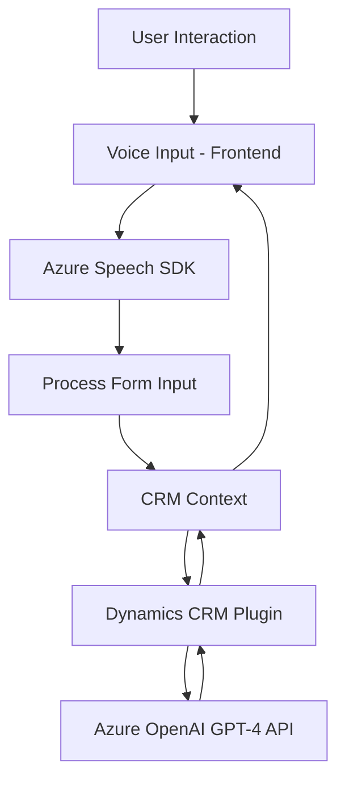

### Breve resumen técnico

El repositorio GitHub detalla una solución compuesta por tres componentes principales: un frontend en JavaScript que interactúa con un SDK externo y un backend basado en un plugin .NET integrado en Dynamics CRM. La funcionalidad central implica el reconocimiento de voz, la síntesis de texto y la transformación de contenido con Azure AI. 

### Descripción de arquitectura
La solución sigue una **arquitectura de n capas**, que separa las responsabilidades en tres niveles principales:
1. **Frontend** (Archivos: `readForm.js`, `speechForm.js`): Proporciona una interfaz para capturar datos, interactuar con el usuario y procesar voz con **Azure Speech SDK**. También administra formularios en el CRM, integrándose con APIs internas y externas.
2. **Backend en Dynamics CRM** (Archivo: `TransformTextWithAzureAI.cs`): Implementa transformaciones avanzadas mediante **Azure OpenAI GPT-4** usando un plugin que opera como una capa adicional en el CRM.
3. **Servicios externos**: Usa SDKs y APIs de Azure (Speech y OpenAI) para la funcionalidad de síntesis de voz y procesamiento avanzado de texto.

### Tecnologías usadas
- **Frontend**:
  - JavaScript.
  - **Azure Speech SDK** para reconocimiento de voz y síntesis.
  - Integración con Dynamics CRM mediante `Xrm.WebApi`.
- **Backend**:
  - `.NET Framework` y **Microsoft Dynamics CRM Plugins**.
  - **Azure OpenAI Service** para procesamiento avanzado de texto.
  - `Newtonsoft.Json.Linq` para manejo JSON en .NET.
  - REST APIs de Azure para comunicación con servicios externos.
  
### Patrones
- Separación de responsabilidades en capas: frontend para interacción con el usuario, backend para lógica empresarial y servicios externos para procesamiento avanzado.
- **Integración basada en SDKs y APIs**: Uso de **Azure Speech SDK** y **Azure OpenAI Service** para desacoplar funcionalidades específicas.
- **Reusable components**: Funciones individuales con responsabilidades bien definidas en los archivos frontend (`startVoiceInput`, `applyValueToField`, etc.).

### Dependencias o componentes externos
1. **Azure Speech SDK**: Utilizado para procesamiento de voz.
2. **Azure OpenAI GPT-4**: Servicio externo que transforma texto según reglas específicas.
3. **Dynamics CRM**: Base de contexto para los formularios y plugins.
4. **Interacción HTTP (REST)**: Se crean solicitudes personalizadas al servicio de OpenAI para procesamiento.
5. **Newtonsoft.Json**: Manejo de estructuras JSON complejas.

### Diagrama Mermaid

### Conclusión final
La solución implementa una **arquitectura de n capas** con fuerte integración de servicios externos. Utiliza un enfoque modular y basado en eventos para soportar funciones avanzadas como el reconocimiento de voz y procesamiento de texto. Los patrones empleados aseguran escalabilidad y mantenimiento, alineándose con buenas prácticas de desarrollo y desacople. Sin embargo, podrían mejorarse ciertos aspectos como la gestión de claves y regiones de Azure mediante variables de entorno.

