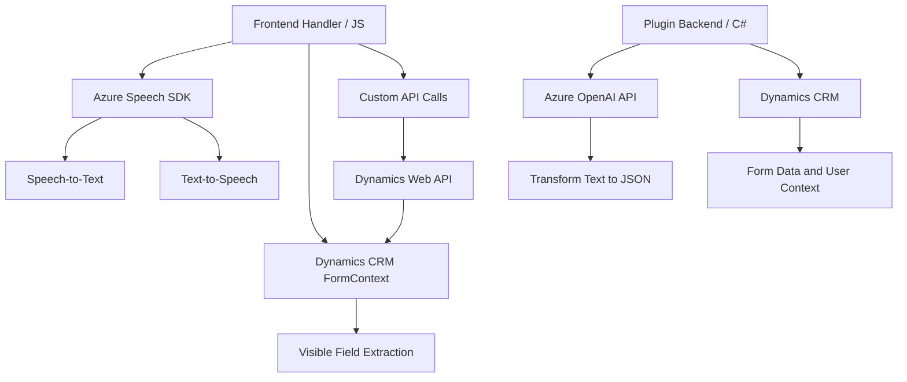

### Breve Resumen Técnico

El repositorio parece estar diseñado para formular una solución interactiva que integra entrada de datos basada en voz y capacidades de inteligencia artificial. Los archivos muestran módulos utilitarios para un sistema más grande, probablemente relacionado con Dynamics CRM, que incorpora Azure Speech SDK, una API personalizada, y Azure OpenAI para transformar y gestionar datos en formularios y plugins.

---

### Descripción de Arquitectura

La solución presenta una arquitectura modular orientada hacia una integración con servicios externos, especialmente dentro del ecosistema Dynamics CRM. Utiliza diferentes modelos de interacción:

1. **Frontend JavaScript:**
   - Modularizado en funciones específicas para manejo de voz y manipulación de datos visibles en formularios.
   - Directamente acoplado con servicios como Azure Speech SDK y una API externa.
   
2. **Plugin Backend (C#):**
   - Implemetación de un plugin para Dynamics CRM.
   - Enfoque de transformación de texto con patrones centrados en externalización (Azure OpenAI API).
   
El diseño de los módulos está orientado hacia arquitectura **en capas**, donde:
- **Frontend (JS)** interactúa con formularios y APIs para entrada y procesamiento de voz o texto (presentación y logíca ligera).
- **Plugin Backend (C#)** actúa como una capa orientada a lógica empresarial y procesamiento externo (servicios de IA).

Sin embargo, debido al desacoplamiento evidente entre diferentes módulos y su dependencia de servicios externos, la solución tiende hacia **arquitectura de microservicios**, especialmente si los componentes están diseñados para ser independientes entre sí.

---

### Tecnologías, Frameworks y Patrones Utilizados

1. **Front-End (JavaScript):**
   - **Azure Speech SDK**: Gestión de voz (text-to-speech & speech-to-text).
   - **Xrm.WebApi**: Utilización en gestión de relaciones con entidades de Dynamics CRM.
   - Patrones usados:
     - Modularización: Funciones encapsuladas con responsabilidades únicas.
     - Dinámica de dependencias cargadas automáticamente (`ensureSpeechSDKLoaded`).

2. **Plugins (C#):**
   - **Azure OpenAI API**: Transformación avanzada mediante IA.
   - **Newtonsoft.Json & System.Net.Http**: manejo de JSON y consumo de APIs externas.
   - Patrones principales:
     - **Responsabilidad úinca (SRP)**: Cada clase o método tiene un propósito específico.
     - **Consumo de servicios externos**: Delegación de tareas complejas mediante APIs disponibles.

3. **Datastores y contextos:**
   - Dynamics CRM como interfaz de datos y formularios.
   - Manipulación de entidades locales y remotas dentro del ecosistema del cliente.

---

### Diagrama Mermaid

---

### Conclusión Final

La solución está diseñada para una integración estrecha dentro del ecosistema Microsoft Dynamics CRM, proporcionando capacidades avanzadas de interacción por voz y transformación inteligente de textos. La arquitectura modular, junto con los servicios externos, la clasifica como cercana a **microservicios** debido al desacoplamiento de dependencias y responsabilidades. Para evolucionar la solución, sería óptimo evaluar la escalabilidad de los servicios y la gestión eficiente de errores al consumir SDKs o servicios como OpenAI.