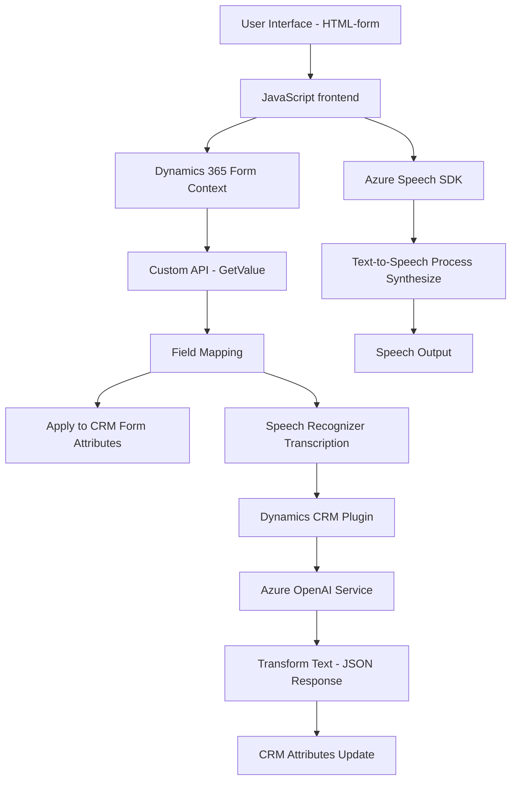

### Breve Resumen Técnico
El repositorio contiene tres importantes módulos integrados:
- **Frontend**: Implementa funcionalidades de síntesis de voz, transcripción de texto por voz y procesamiento de datos visibles desde formularios usando Azure Speech SDK.
- **Plugins de Dynamics CRM**: Extiende la funcionalidad estándar mediante un plugin que utiliza Azure OpenAI para transformar texto según reglas específicas y procesar las respuestas en formato JSON.
Estos módulos están destinados principalmente a integrarse con Dynamics 365, ofreciendo una capa de inteligencia artificial y una experiencia interactiva basada en voz y procesamiento de datos en formularios.

---

### Descripción de Arquitectura
La solución sigue una arquitectura orientada a servicios (**Service-Oriented Architecture - SOA**). Cada componente aborda un caso específico:
1. **Capa de Presentación**:
   - El frontend maneja la interacción con el usuario mediante formularios y procesamiento en Dynamics 365.
   - Usa **Azure Speech SDK** para habilitar entrada y salida de voz.
2. **Capa de Aplicaciones (Middleware)**:
   - El plugin opera como un middleware entre Dynamics CRM y Azure OpenAI para la transformación de texto.
   - Consume APIs externas y usa métodos HTTP para generar las respuestas.
3. **Backend**:
   - Dynamics CRM actúa como un backend y motor de datos donde se registran los resultados procesados, integrando APIs personalizadas como parte de los flujos.

La solución logra explícitamente separar responsabilidad y modularidad, permitiendo flexibilidad y escalabilidad en un entorno de micro-interacciones mediante servicios conectados.

---

### Tecnologías Usadas
1. **Lenguajes de programación**:
   - **JavaScript** (frontend): Procesamiento de voz y manipulaciones de entradas visuales.
   - **C#** (plugin en backend): Extensiones de Dynamics CRM con conectividad a Azure OpenAI.
2. **Cloud Platforms**:
   - **Microsoft Azure**:
     - Speech SDK: Para síntesis y transcripción de voz.
     - OpenAI API: Procesamiento avanzado de texto.
3. **Frameworks y Librerías**:
   - **Microsoft.Xrm.Sdk**: Operaciones de integración directa con Dynamics CRM.
   - **System.Net.Http & Newtonsoft.Json**: Para la comunicación y manipulación JSON en .NET.
4. **Patrones de diseño**:
   - **Plugin Pattern**: Extensiones de Dynamics CRM.
   - **ETL** (en el frontend): Extrae datos del formulario, los transforma y los carga en la capa de presentación/formulario.
   - **Service Integration**: Uso de servicios externos para procesamiento.

---

### Diagrama **Mermaid**

---

### Conclusión Final
Esta solución está diseñada para mejorar la interacción en sistemas Dynamics CRM utilizando capacidades avanzadas de inteligencia artificial en Azure y módulos frontend basados en JavaScript. Combina patrones modernos como SOA, modularidad y event-driven design para conectar funcionalidades de voz, procesamiento de texto y sincronización de datos en formularios. Su arquitectura facilita escalabilidad, integración externa y una experiencia de usuario interactiva.