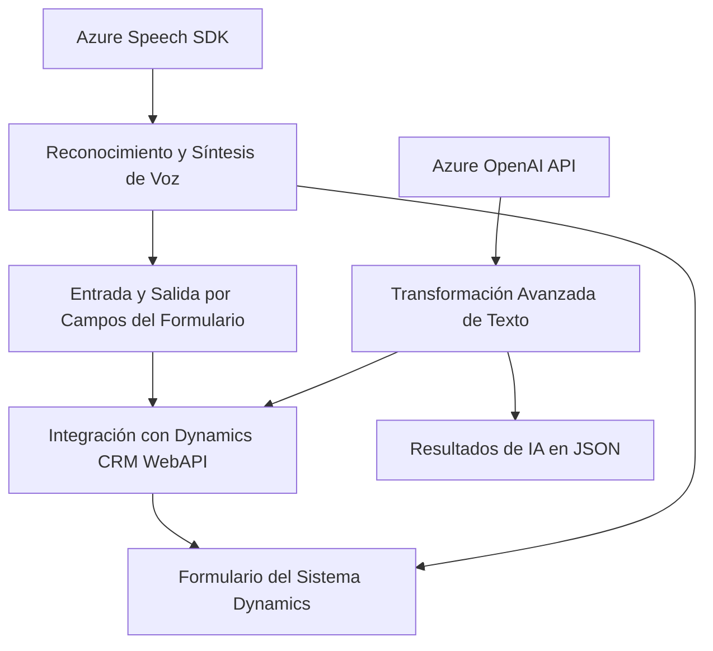

### Breve Resumen Técnico

Los archivos analizados pertenecen a un sistema que utiliza reconocimiento y síntesis de voz mediante el Azure Speech SDK, así como inteligencia artificial (Azure OpenAI) para procesar texto y estructurarlo en objetos JSON. El sistema está integrado en un entorno de Microsoft Dynamics CRM que gestiona formularios y datos. Su propósito es aportar accesibilidad mediante comandos de voz y aprovechar capacidades de IA para la transformación de información.

---

### Descripción de Arquitectura

La arquitectura combina varios patrones y estilos, lo cual sugiere un enfoque híbrido:

1. **N Capas (Layered Architecture):** 
    - Divide la lógica en capas claras como presentación (manipulación del formulario), negocio (procesamiento de datos con grabación/reconocimiento de voz) y acceso a datos (interacción con APIs externas y CRM).

2. **Integración con Microservicios:**
    - Utiliza servicios externos como Azure Speech SDK y Azure OpenAI API para funcionalidades específicas (síntesis de voz y transformación de texto). Esto promueve modularidad y desacoplamiento.

3. **Complemento (Plugin Architecture):**
    - **Dynamics CRM:** Extensiones que se ejecutan dentro del contexto del sistema CRM mediante plugins.

4. **Event-driven Architecture:**
    - Los métodos en los archivos se activan en respuesta a eventos del sistema (voz detectada, carga de SDK, clic en formularios, etc.).

---

### Tecnologías Usadas  

1. **Frontend/JavaScript:**
    - **Azure Speech SDK:** Reconocimiento y síntesis de voz.
    - **API personalizada:** Procesamiento complejo de texto transcrito.
    - **Microsoft Dynamics WebAPI:** Para manipulación directa de datos del sistema CRM.

2. **Backend/.NET:**
    - **Microsoft Dynamics CRM SDK:** Para el desarrollo de plugins que interactúan con el entorno CRM.
    - **Azure OpenAI API:** Procesamiento avanzado de texto con IA en el backend.
    - **System.Net.Http + JSON:** Para comunicación con servicios externos y manipulación de datos estructurados.

3. **Arquitectura Modular:**
    - Funciones separadas por tareas específicas aseguran la reutilización y claridad en la lógica.

---

### Diagrama **Mermaid**

---

### Conclusión Final  

Este sistema utiliza tecnologías modernas y patrones de diseño bien definidos para cumplir funciones críticas de accesibilidad (voz) y transformación avanzada con inteligencia artificial. Su arquitectura híbrida combina un enfoque de n-capas con integración mediante microservicios, lo cual permite la escalabilidad, robustez y adaptabilidad. Sin embargo, es necesario garantizar la seguridad de las credenciales en los servicios de Azure mediante almacenamiento seguro o mecanismos de configuración externos.