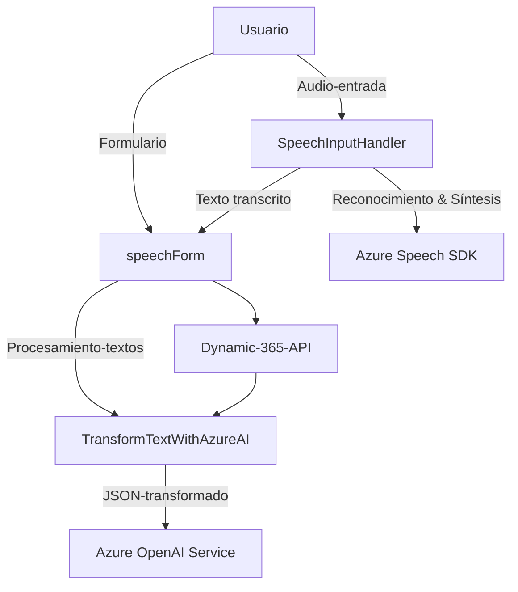

# Análisis técnico del repositorio

## Resumen técnico
El repositorio contiene archivos diseñados para implementar funcionalidades asociadas al reconocimiento de voz y la síntesis de texto a voz con el SDK de Azure Speech y la transformación avanzada de texto con Azure OpenAI, todos integrados con formularios dinámicos de Dynamics CRM.

Principalmente, la solución parece destinada al desarrollo de una **funcionalidad centralizada** para una aplicación CRM. Los archivos en "FRONTEND/JS" se centran en el manejo de formularios interactivos basados en entrada/salida de voz. El archivo "Plugins/TransformTextWithAzureAI.cs" representa una extensión de lógica de negocio avanzada mediante un plugin de Dynamics CRM.

## Descripción de arquitectura
La arquitectura del sistema puede clasificarse como **arquitectura de capas**. Consta de capas como:
- **Presentación (Frontend/JS)**: Encargada de la interacción directa con el usuario (manejo de formularios y reconocimiento/síntesis de voz).
- **Lógica de negocio (Dynamics Plugins)**: Procesa los datos utilizando las APIs y normas definidas, ejecutándose en el contexto específico del CRM.
- **Integración con APIs externas**: Realiza llamadas a servicios externos como **Azure Speech SDK** y **Azure OpenAI**.

Además, la implementación en el Plugin utiliza un patrón **Plugin Pattern**, típico para la extensión de funcionalidad en Dynamics CRM, complementada por un **Wrapper Pattern** para interactuar con Azure OpenAI.

## Tecnologías usadas
1. **Frontend (JavaScript)**:
   - **Azure Speech SDK**: Reconocimiento de voz y síntesis de texto a voz.
   - Frameworks y librerías (posiblemente): 
     - Dynamics CRM (control de formularios e interfaces).
     - Xrm en Dynamics para servicios web.

2. **Backend (.NET)**:
   - **Microsoft Dynamics CRM**: Integración como parte de las extensiones de la plataforma CRM.
   - **Azure OpenAI API**: Para procesamiento de texto con inteligencia artificial.
   - **C# y .NET Framework**: Desarrollo de plugins y comunicación con APIs.
   - **Libraries for JSON processing**: `Newtonsoft.Json` y `System.Text.Json`.

3. **Web**:
   - Uso directo de servicios HTTP mediante Azure SDK (bibliotecas para cliente web).

## Componentes externos y dependencias
- **SDK de Azure Speech**: Biblioteca necesaria para el reconocimiento de voz y síntesis de texto a voz.
- **Azure OpenAI Service**: API para procesamiento y transformación avanzada de texto.
- **HTTP Client**: Comunicación con servicios externos mediante solicitudes RESTful.
- **Newtonsoft.Json y System.Text.Json**: Serialización y extracción de datos JSON manejados desde APIs externas.
- **Dynamics CRM SDK**: APIs internas (`Xrm.WebApi`) y entornos proporcionados por Dynamics para integración directa y manipulación de formularios.
- **Custom CRM API**: API interna personalizada conectada con Dynamics CRM para funcionalidad extendida.

## Diagrama Mermaid de la arquitectura

### Descriptores del diagrama:
1. **Nodo A (Usuario)**: Representa la interacción directa entre el usuario y el sistema mediante la voz y el formulario.
2. **Nodo B (SpeechInputHandler)**: Módulo que gestiona el reconocimiento y la síntesis de voz.
3. **Nodo C (Azure Speech SDK)**: Componente externo utilizado para entrada y salida de audio en forma de texto.
4. **Nodo E (speechForm)**: Módulo que procesa formularios con reconocimiento y síntesis de voz.
5. **Nodo F (TransformTextWithAzureAI)**: Plugin para Dynamics CRM encargado del procesamiento de texto y comunicación con Azure OpenAI.
6. **Nodo G (Azure OpenAI Service)**: Servicio externo que realiza transformación avanzada de texto en JSON estructurado.
7. **Nodo H (Dynamic-365-API)**: API interna de Dynamics 365 para acceso a sus datos y manipulación.

## Conclusión final
Este repositorio representa una solución integrada para un entorno CRM, aprovechando servicios avanzados de Microsoft Azure como el Speech SDK y OpenAI. El diseño sigue una **arquitectura en capas**, dividiendo la lógica entre la capa de presentación (frontend modular con JavaScript y Azure Speech SDK), una capa de lógica de negocio (Plugins y Dynamics CRM SDK), y una capa de integración con servicios externos como Azure APIs.

Las mejores prácticas incluyen modularidad y patrones como los callbacks para carga asíncrona, API Gateway para comunicación con servicios externos, y Plugin Pattern para extensibilidad en Dynamics CRM. El sistema ilustra un enfoque combinado que permite simplificar la experiencia del usuario en la gestión de formularios y automatizar tareas mediante IA y reconocimiento de voz.