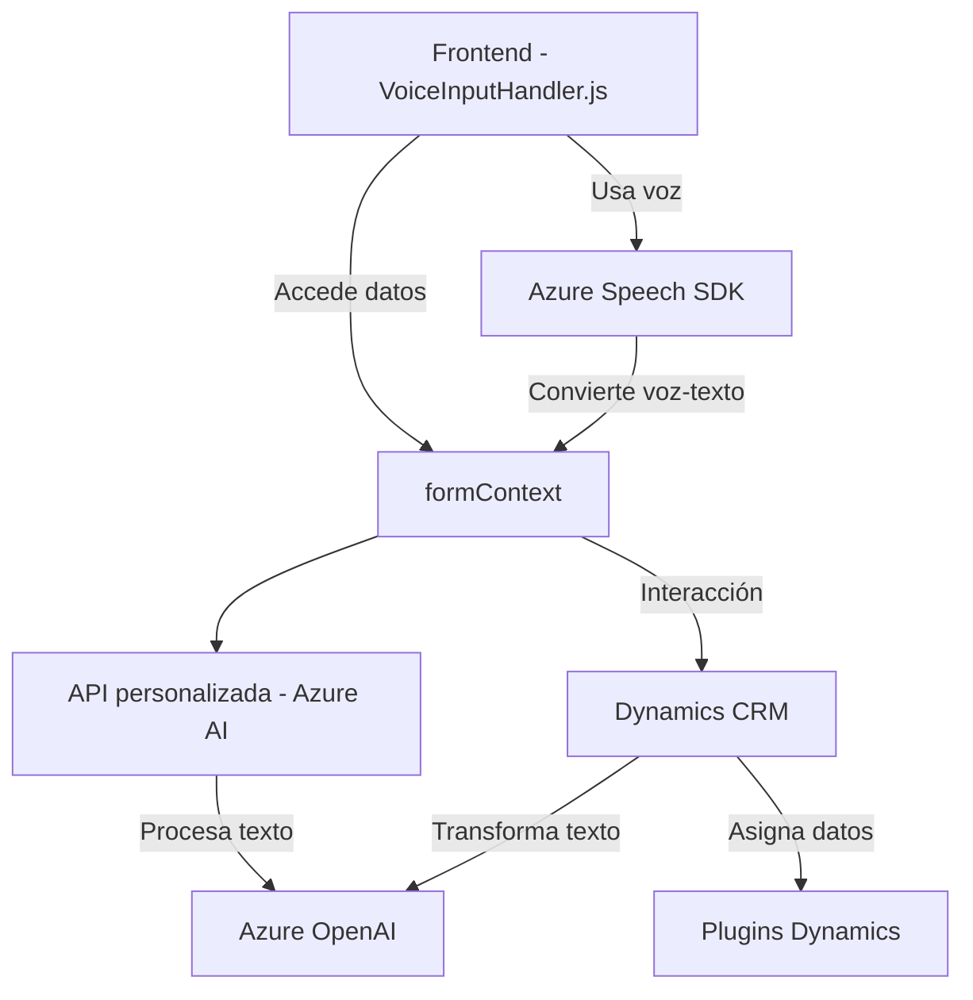

# Análisis del Repositorio

### **Resumen Técnico**
El repositorio parece contener componentes de varios sistemas relacionados con aplicaciones web y CRM. Los archivos de código mencionados permiten deducir una solución que integra:
- Una **interfaz de usuario web (frontend)** que recoge datos o comandos de usuario.
- Capacidades de **procesamiento de voz e inteligencia artificial (IA)** a través de Microsoft Azure Speech SDK y Azure OpenAI.
- **Plugins** de Microsoft Dynamics CRM para integración con sistemas empresariales.

---

### **Descripción de Arquitectura**
La solución tiene características propias de una arquitectura **híbrida** que combina:
1. **Separación de capas**: Componentes frontend interactúan con APIs y servicios, mientras que la lógica empresarial (Microsoft Dynamics Plugin) se encuentra desacoplada mediante servicios Azure.
2. **Integración de servicios externos**: Uso de Azure Speech SDK y Azure OpenAI muestra una arquitectura basada en **servicios distribuidos**.
3. **Eventos asincrónicos**: El frontend usa patrones asociados a cargas dinámicas de SDK y webhook (reconocimiento de voz/síntesis).

Aunque no es una arquitectura estrictamente de microservicios o hexagonal, se inclina hacia un sistema modular enfocado en servicios externos.

---

### **Tecnologías Usadas**
1. **Frontend (VoiceInputHandler.js & SpeechInputProcessor.js)**:
   - JavaScript como lenguaje principal.
   - **Microsoft Azure Speech SDK**: Para la síntesis y reconocimiento de voz.
   - **Dynamics CRM APIs**: Para interacción con formularios y datos del CRM.
   - Modularización del código en funciones.

2. **Backend Plugin (TransformTextWithAzureAI.cs)**:
   - Microsoft Dynamics CRM SDK (`IPlugin`): Framework para extensiones empresariales.
   - **Azure OpenAI**: API para procesamiento avanzado de texto.
   - Framework .NET en C#.
   - Patrón de comunicación con APIs RESTful (patrón proxy).

---

### **Dependencias o Componentes Externos**
1. **Azure Speech SDK**: Gestión de síntesis y reconocimiento.
2. **Custom APIs**: APIs personalizadas para interacción con Dynamics.
3. **Azure OpenAI Service**: Procesamiento de texto estructurado.
4. **Dynamics CRM SDK**: Ecosistema ERP/CRM de Microsoft para la manipulación de datos empresariales.
5. **Bibliotecas y Frameworks**:
   - Frontend: No se mencionan frameworks específicos; presume uso de vanilla JavaScript.
   - Backend: `Microsoft.Xrm.Sdk`, `System.Net.Http`, `System.Text.Json`.

---

### **Diagrama Mermaid (GitHub Markdown Compatible)**

---

### **Conclusión Final**
El repositorio documentado representa una solución avanzada que conecta un frontend basado en **procesamiento de voz** (Azure Speech SDK) con un backend de **integración empresarial** (Dynamics CRM). También utiliza **inteligencia artificial** a través de Azure OpenAI para ampliar las capacidades de procesamiento de texto y asignación semántica de datos.

**Fortalezas:**
- Uso eficiente de servicios externos (Azure).
- Modularización del código.
- Fuerte integración con sistemas empresariales como Dynamics CRM.

**Recomendaciones:**
1. Refactorizar la gestión de credenciales (usar configuraciones protegidas).
2. Ampliar las pruebas y/o documentación para asegurar trazabilidad y manejo de errores.
3. Evaluar la transición hacia una arquitectura hexagonal para mayor flexibilidad de componentes y desacoplamiento.