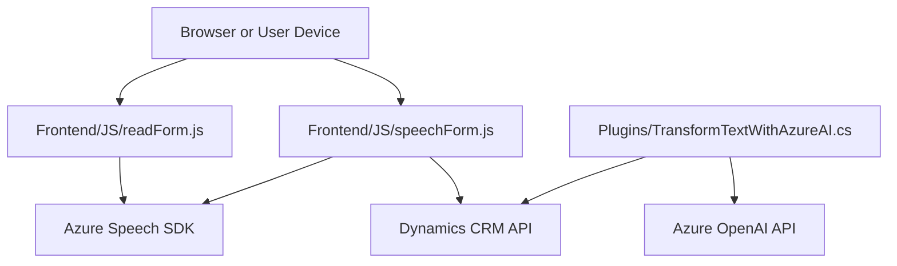

### Breve resumen técnico
El repositorio define una solución de software destinada a interactuar con formularios y servicios relacionados con Microsoft Dynamics CRM y Azure, mediante tecnologías como JavaScript en el Frontend y plugins en C# para extender la funcionalidad del CRM. La solución utiliza reconocimiento y síntesis de voz, IA para transformación de texto, y mapeo dinámico de datos entre formularios y APIs externas.

### Descripción de arquitectura
La solución sigue un enfoque modular y dependiente de servicios externos, como Azure Speech SDK y Azure OpenAI Service, para enriquecer la experiencia de interacción con formularios en Dynamics CRM. La arquitectura general combina elementos de diseño de n capas y microservicios:
- **N capas:** Separación de las responsabilidades en distintos archivos/modulos, con componentes diferenciados de presentación (Frontend), lógica de aplicación (C# Plugin y JavaScript de procesamiento), y comunicación con servicios externos (Azure API y SDK).
- **Microservicios:** Algunos componentes se comunican con servicios HTTP externos como Azure OpenAI, que encapsulan la lógica de procesamiento de datos en un entorno externo a la aplicación.

### Tecnologías usadas
- **Frontend:** JavaScript.
  - Integración con **Azure Speech SDK** para entrada/salida de voz.
  - Uso de APIs de Microsoft Dynamics CRM.
- **Backend:** Plugin escrito en C# para Dynamics CRM.
  - Usando `Microsoft.Xrm.Sdk` para interacción con formularios del CRM.
  - Uso de **Azure OpenAI REST API** para procesamiento inteligente de datos.
- **Patrones:** Callback Pattern, DTO, External SDK Integration.

### Diagrama Mermaid válido para GitHub

### Conclusión final
La solución presentada en este repositorio combina tecnologías avanzadas de Azure y Microsoft Dynamics para proporcionar cierta inteligencia artificial y mantener una arquitectura modular basada en n capas, con integración de servicios externos. La dependencia de SDKs y APIs externas, como Azure Speech y Azure OpenAI, habilita funcionalidades avanzadas como reconocimiento de voz y procesamiento de lenguaje, pero también introduce ciertas complejidades relacionadas con la gestión de credenciales, disponibilidad de servicios y sus costos asociados.