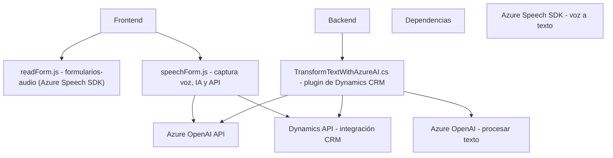

### Resumen técnico
Este repositorio contiene archivos relacionados con la implementación de integraciones de Microsoft Dynamics CRM con servicios de Azure, específicamente Speech SDK y OpenAI. La solución se enfoca en usar el reconocimiento de voz y la inteligencia artificial para trabajar con formularios dinámicos y transformar cadenas de texto en configuraciones estructuradas.

### Descripción de la arquitectura
La arquitectura general del repositorio puede categorizarse como **n capas con elementos SOA (Service-Oriented Architecture)**. Los archivos están claramente separados por función y nivel:
1. **Frontend (JS)**: Contiene archivos para la interacción del cliente. Implementan solicitudes, eventos, transformación de datos y llamadas a APIS externas para actualizar formularios.
2. **Backend / Plugins**: Implementa lógica empresarial para extensiones de Dynamics CRM con integración REST y Azure OpenAI.
3. **Dependencias externas**: Usa Azure Speech SDK, Azure OpenAI y servicios nativos de Dynamics 365 para realizar funciones avanzadas de reconocimiento de voz y transformación de texto a través de IA.

### Tecnologías usadas
1. **Frontend:**
   - Lenguaje: JavaScript.
   - Biblioteca: Azure Speech SDK.
   - Dinámica de datos: Event-Driven Programming (JavaScript).
   - Arquitectura de patrones: Facade, Adapter y Dependency Injection para simplificar el flujo del SDK y el formulario.
2. **Backend:**
   - Lenguaje: C# (.NET Framework).
   - Librerías:
     - Newtonsoft.Json (manejo de JSON).
     - System.Net.Http (comunicación HTTP/S con Azure OpenAI).
     - System.Text.Json (serialización/deserialización JSON).
   - Patrón: Plugin Pattern, Factory, SOA (Azure API usage).

### Dependencias y componentes externos
1. **Azure Speech SDK**: 
   - Utilizado para sintetizar texto y realizar reconocimiento de voz en la capa de cliente.
2. **Azure OpenAI**: 
   - Se usa en el plugin backend para transformar texto ingresado en el CRM a un formato JSON según las reglas predefinidas.
3. **Dynamics CRM API**:
   - `WebApi.online.execute` y `WebApi.retrieveMultipleRecords` para interactuar con los datos y estructuras del formulario CRM.

### Diagrama Mermaid (estructura del repositorio)

### Conclusión final
Este repositorio implementa una solución híbrida con capas bien estructuradas que incluyen:
1. **Frontend:** Con JavaScript para la interacción directa con el usuario (voz y formularios del CRM) y comunicación con servicios externos como Azure Speech SDK y APIs.
2. **Backend:** Un plugin altamente especializado en C# que integra Dynamics CRM y Azure OpenAI, empleando patrones de diseño como Plugin Pattern y Factory.
 
La arquitectura modular permite la alta flexibilidad, escalabilidad y reutilización de componentes. Es ideal para empresas que requieren mejoras tecnológicas sobre la dinámica tradicional de formularios en CRM, utilizando reconocimiento de voz e inteligencia artificial.