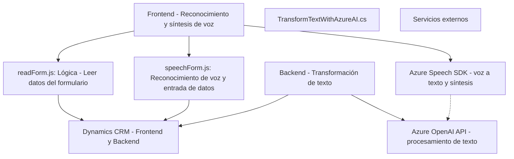

### Breve resumen técnico
El repositorio describe una solución que parece ser una combinación de frontend y backend diseñada para integrar funciones de reconocimiento y transformación de voz basadas en **Azure Speech SDK** y **Azure OpenAI API**. Está orientada a soportar aplicaciones empresariales relacionadas con **Dynamics CRM**, enfocándose en la interacción usuario-aplicación a través de voz y generación de contenido estructurado.

---

### Descripción de la arquitectura
1. **Tipo de solución:** La solución incluye una combinación de frontend y backend para soportar un sistema de interacción con voz, junto con un plugin que extiende las capacidades de **Dynamics CRM** mediante una integración con **Azure OpenAI API**.
   
2. **Arquitectura**: La arquitectura general combina dos enfoques principales:
   - **Frontend modular:** Código organizado mediante funciones independientes, con una lógica específica por funcionalidad. Esto facilita la integración con Dynamics CRM.
   - **Backend basado en plugin:** Incorporación de lógica empresarial mediante un patrón **Plugin** en Dynamics 365, con integración API hacia servicios externos (Azure OpenAI).
   - **SOA (orientación a servicios):** Uso de servicios externos (Azure Speech SDK y OpenAI API) para delegar funciones especializadas, integrados mediante patrones orientados a servicios.
   
3. **Patrones arquitectónicos presentes:**
   - **Modularidad:** Fragmentación funcional (frontend). Cada aspecto del procesamiento de datos y voz es manejado en una función dedicada.
   - **Adaptadores:** Traducción entre datos generados por la entrada de voz y los campos del formulario en Dynamics CRM.
   - **Plugin:** Extiende las capacidades de Dynamics 365 mediante un punto de extensión que realiza tareas específicas.
   - **Event-driven Loading:** SDK de Azure se carga dinámicamente al ejecutarse ciertas funciones.
   - **API:** En el backend se utiliza un microservicio externo basado en Azure OpenAI API para transformar texto.

---

### Tecnologías usadas
1. **Frontend:**
   - **Tecnologías principales:** JavaScript.
   - **Frameworks o APIs:** 
     - Azure Speech SDK (para lograr reconocimiento y síntesis de voz).
     - Dynamics CRM Frontend API (`Xrm.WebApi`).
   - **Dependencias externas:** 
     - Integración directa con el SDK de voz de Azure (URL: `https://aka.ms/csspeech/jsbrowserpackageraw`).

2. **Backend (Plugins):**
   - **Lenguaje:** C#.
   - **Framework:** `Microsoft.Xrm.Sdk` (Dynamics 365 SDK).
   - **Dependencias externas:** 
     - **Azure OpenAI API:** Transformación de texto.
     - **Newtonsoft.Json.Linq** y **System.Text.Json** para manejo de JSON.
     - **System.Net.Http** para realizar comunicaciones HTTP.

---

### Diagrama Mermaid válido para GitHub

---

### Conclusión final
1. **El repositorio representa una solución híbrida y modular**, compuesta por un frontend basado en **JavaScript** y un backend basado en un **plugin de Dynamics 365 implementado en C#**. Está diseñado para habilitar la interacción entre un usuario y un sistema empresarial (CRM), utilizando principalmente reconocimiento de voz y síntesis de texto.
  
2. **Una arquitectura orientada a servicios (SOA):** Se apoya fuertemente en APIs externas para enriquecer las capacidades del sistema como servicios especializados (Azure Speech SDK y OpenAI API).

3. **Escalabilidad:** La solución tiene el potencial de evolucionar hacia una arquitectura de microservicios más modular, integrando funcionalidades específicas como módulos independientes para mejorar el mantenimiento y extender la funcionalidad.

4. **Integración con Dynamics CRM:** Tanto en el frontend como en el backend se observa un uso intensivo del SDK de Dynamics (XRM + plugin). Esto asegura que los datos transcritos puedan ser procesados, asignados y transformados de manera automática.

En general, la solución es adecuada para escenarios empresariales donde la interacción a través de interfaces habladas y procesos automáticos basados en AI son críticos. La elección de Azure Speech SDK y Azure OpenAI API garantiza fiabilidad y soporte amplio de idiomas.