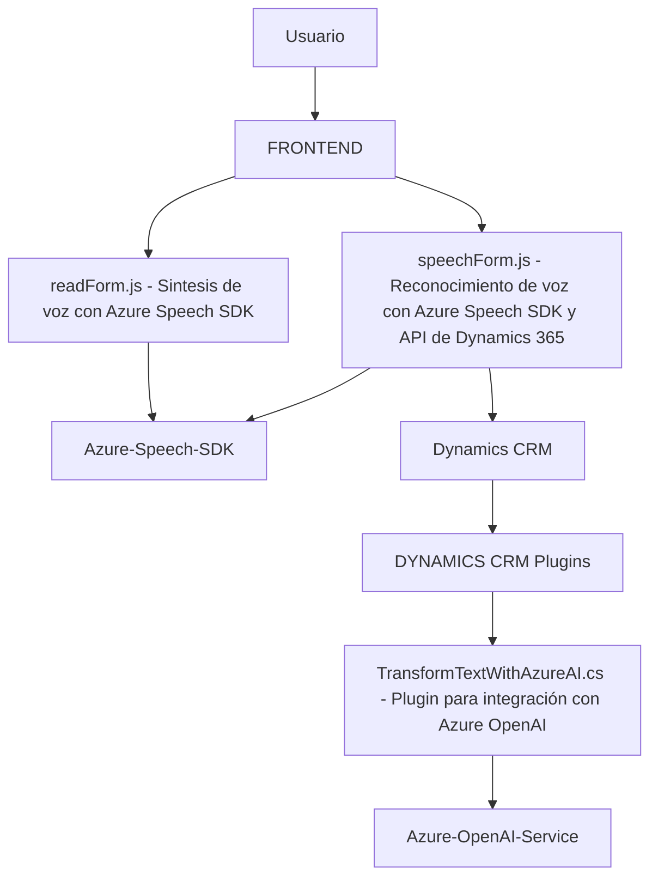

### Breve resumen técnico
El repositorio tiene varios archivos que implementan diferentes funcionalidades relacionadas con la integración de servicios de procesamiento de lenguaje natural y síntesis de voz usando **Azure Speech SDK** y **Azure OpenAI Service**. Los archivos están diseñados para trabajar en conjunto con **Microsoft Dynamics 365**, utilizando el modelo de plugins.

---

### Descripción de arquitectura
1. **Tipo de solución**:  
   - Este repositorio representa una integración de servicios (Azure SDK) y un plugin de **Microsoft Dynamics 365** para proporcionar capacidades avanzadas como reconocimiento y síntesis de voz, procesamiento de texto con **Azure OpenAI**, y manipulación de formularios en Dynamics CRM.
  
2. **Arquitectura del sistema**:  
   - El diseño general parece corresponder a una **n-capas** y **plugin-based architecture**, donde la lógica de negocios está distribuida entre los componentes del frontend y los plugins del backend de Dynamics 365. El sistema también integra servicios externos como Azure Speech y Azure OpenAI, lo que lo hace funcionalmente cercano a un **event-driven architecture** y hace uso de **gateway patterns** para abstraer la lógica de interacción con estos servicios.

3. **Modularización**:  
   - Tanto los archivos JavaScript como los plugins están organizados en módulos (funciones individuales en el frontend y métodos en el backend) que cumplen roles específicos. Esto simplifica su reutilización y mantenimiento.

---

### Tecnologías usadas
1. **Frontend**:
   - **JavaScript**: Lenguaje principal para implementar la lógica de reconocimiento de voz, síntesis y manipulación del DOM.
   - **Azure Speech SDK**: Para realizar las operaciones de síntesis y reconocimiento de voz (Text-to-Speech y Speech-to-Text).
   - **Dynamics 365 Xrm.WebApi**: Manipulación de datos del formulario de Dynamics 365 desde el frontend.

2. **Backend**:
   - **Microsoft Dynamics CRM**: Integración mediante plugins que implementan la interfaz `Microsoft.Xrm.Sdk.IPlugin`.
   - **Azure OpenAI Service**: Para realizar transformaciones inteligentes de texto usando modelos de lenguaje IA avanzados como GPT.
   - **.NET Framework / C#**: El backend usa la plataforma .NET, junto con librerías como `System.Text.Json` para manejar estructuras de datos JSON.

### Patrones usados
- **Modular programming**: Código dividido en funciones/métodos con responsabilidades definidas.
- **Gateway Pattern**: Las llamadas a APIs externas se encapsulan en funciones específicas para abstraer la lógica.
- **Dependency injection**: Uso de `IServiceProvider` para obtener dependencias en el plugin de Dynamics CRM.
- **Event-driven architecture**: Los eventos en el CRM (como cambios en el formulario) disparan funciones específicas del plugin o del frontend.
- **Asynchronous programming**: Promesas y callbacks para operaciones que dependen de servicios externos.

---

### Dependencias o componentes externos presentes
1. **Azure Speech SDK**:
   - Cargado dinámicamente para realizar síntesis y reconocimiento de voz.
   - Requiere API Key y región especificada.
   - Es una dependencia crítica.

2. **Azure OpenAI Service**:
   - Utilizado en el backend con métodos como `GetOpenAIResponse`.
   - Requiere configuración adicional para endpoint, deployment y API Key.

3. **Dynamics 365 API (Xrm.WebApi)**:
   - Usada para interactuar con formularios y manipular datos en Dynamics.

4. **Otros componentes**:
   - Librerías como `System.Text.Json` y `Newtonsoft.Json.Linq` para manejo de JSON.
   - `System.Net.Http` para manejo de llamadas HTTP REST en el plugin.

---

### Diagrama de arquitectura Mermaid 100 % compatible con GitHub Markdown

---

### Conclusión final
Este repositorio implementa una solución basada en **Azure services** (Speech SDK y OpenAI) para extender las capacidades de **Microsoft Dynamics 365**. Está configurado como un sistema **n-capas con modularidad y dependencias orientadas a servicios externos**, donde la capa frontend proporciona reconocimiento/síntesis de voz y la capa backend usa un plugin para transformar texto con inteligencia artificial.

Aunque las funcionalidades son bien estructuradas, hay dependencias estáticas que deben gestionarse para facilitar productos más flexibles y escalables. Una recomendación sería utilizar **variables de entorno o contenedores** para configurar las interacciones con los servicios externos.