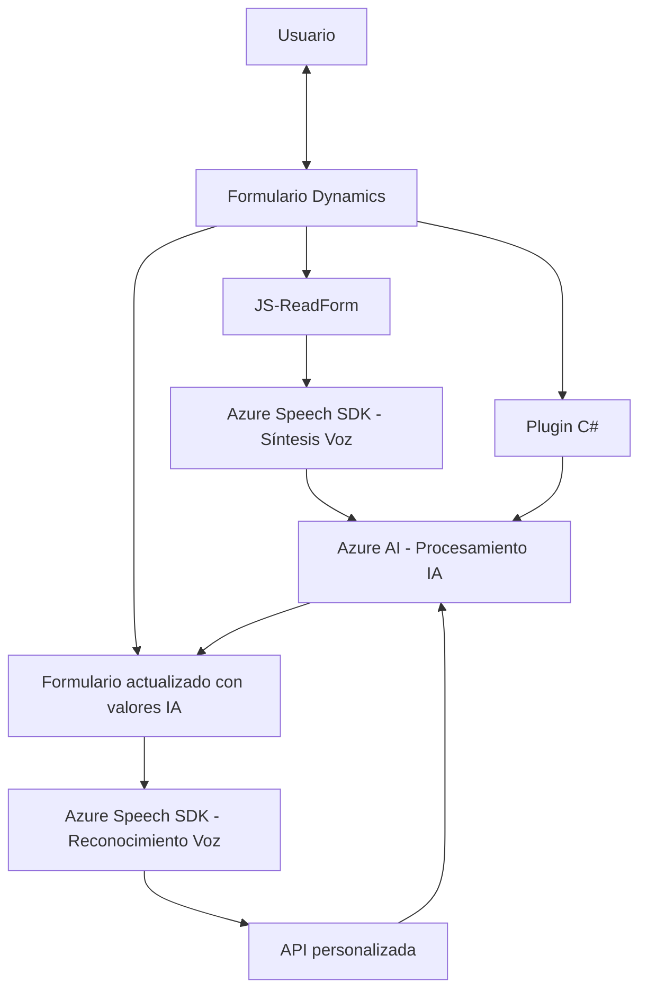

### Breve resumen técnico
La solución representa una integración entre Dynamics 365 y servicios en la nube de Azure (Speech SDK y OpenAI). Está diseñada como una extensión de un sistema CRM y se divide en dos partes principales:
1. **Frontend (readForm.js & speechForm.js):** Maneja la lectura, procesamiento y transformación de datos basados en formularios, integrando funcionalidades de reconocimiento y síntesis de voz.
2. **Plugin en C# (TransformTextWithAzureAI.cs):** Extiende las capacidades del CRM mediante un plugin que procesa datos textuales y los transforma usando Azure OpenAI.

### Descripción de arquitectura
La arquitectura está orientada al uso de servicios externos y extensiones específicas de Dynamics CRM:
- **Frontend** (Javascript): Implementa funciones para el procesamiento asíncrono de voz a texto mediante Azure Speech SDK, con integración a API personalizada.
- **Backend (Plugin en C#):** Sigue el patrón de Plugins de Dynamics CRM para interceptar e insertar lógica en procesos nativos de la plataforma. Además, consume microservicios como Azure OpenAI para procesamiento avanzado de texto.
- **Arquitectura orientada a servicios:** Utiliza servicios de nube como Azure Speech SDK y OpenAI API para implementar funcionalidades, encapsulando lógica especializada.

### Tecnologías usadas
- **Frontend (JS):**
  - **Azure Speech SDK:** Para procesamiento de voz (reconocimiento y síntesis).
  - **Dynamics 365 API:** Para manipulación dinámica de formularios y gestión de datos.
- **Backend (C#):**
  - **Microsoft Dynamics CRM SDK:** Interacción con el CRM.
  - **Azure OpenAI:** Uso de modelos GPT para transformación de datos.
  - **Newtonsoft.Json:** Procesamiento JSON.
- **Software Patterns:**
  - **Plugin Pattern:** En C#, para ampliar funcionalidades en CRM.
  - **Factory Pattern:** Asignación dinámica de mapeo en formularios.
  - **Load On-Demand:** Carga dinámica del Speech SDK.

### Diagrama Mermaid

### Conclusión final
La solución es una extensión de Dynamics 365 CRM que integra funciones avanzadas de reconocimiento y síntesis de voz (frontend) y procesamiento de texto por medio de inteligencia artificial (backend). La arquitectura es modular y orientada a servicios, con fuertes dependencias en Microsoft Azure (Speech SDK, OpenAI) y Dynamics APIs. Está bien diseñada para su propósito, con un enfoque en programación asincrónica y el uso de servicios escalables en la nube.

