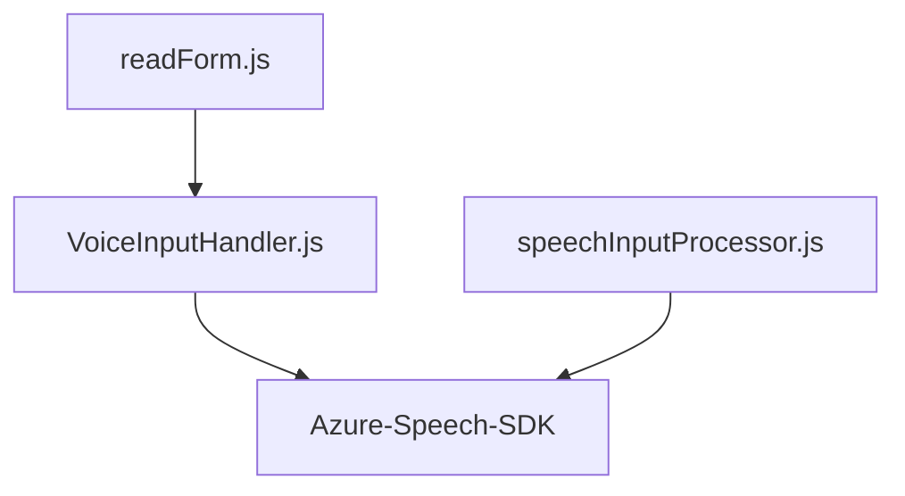
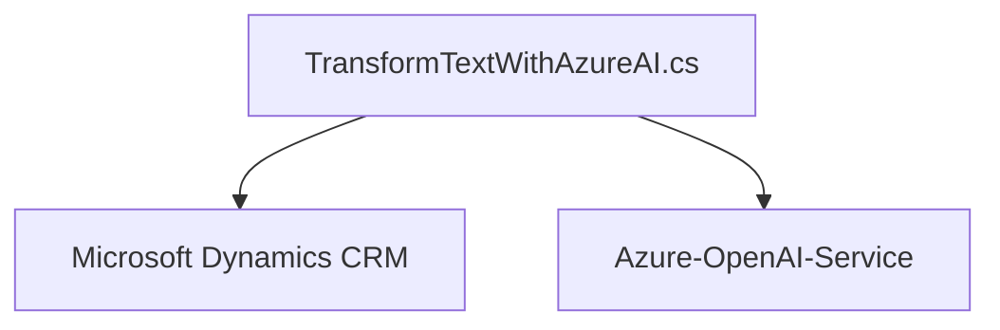
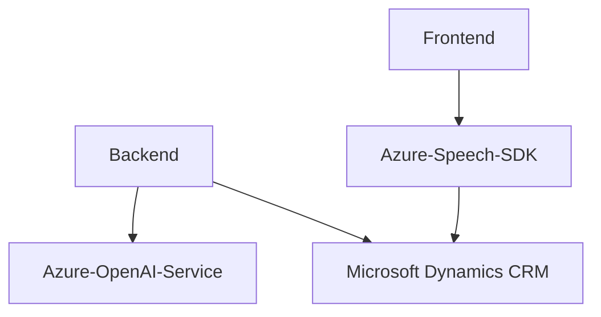

### Breve resumen técnico
Este repositorio parece ser una solución híbrida que integra un sistema frontend basado en JavaScript, ligado al reconocimiento de voz y síntesis de texto utilizando el Azure Speech SDK, y un backend para Microsoft Dynamics CRM que se conecta con Azure OpenAI Service para procesar texto y generar datos estructurados en formato JSON. La arquitectura permite interacción fluida entre el frontend y plugins en el backend del CRM.

---

### Descripción de arquitectura
La solución se basa en una arquitectura **n capas**, que contiene tres capas principales:
1. **Frontend**: Permite la síntesis de voz y el reconocimiento de voz en tiempo real con el SDK de Azure Speech.
2. **Backend (plugins)**: Ejecuta lógica de negocio en Dynamics CRM usando eventos específicos, invocando servicios externos como Azure OpenAI mediante API REST.
3. **Servicios externos**:
    - Azure Speech Service integra funcionalidad avanzada de voz.
    - Azure OpenAI Service realiza procesamiento de texto para reglas de negocio.

Se usa el patrón **adaptador** y **procesamiento dividido** en el frontend para mapear campos del formulario y manejar los datos de entrada, mientras que los plugins usan el patrón **Observer** para operar bajo eventos de CRM.

---

### Tecnologías usadas
1. **Frontend**:
   - **JavaScript**: Para manejar la lógica del cliente.
   - **Azure Speech SDK**: Procesos de síntesis y reconocimiento de voz.
   - APIs de navegador: Interacciones con DOM (`document`, `window`).

2. **Backend**:
   - **.NET Framework**: Desarrollo de plugins para Dynamics CRM.
   - **Microsoft Dynamics SDK**: Gestión de datos y eventos propios del sistema CRM.
   - **Newtonsoft.Json**: Manipulación de objetos JSON.

3. **Servicios externos**:
   - Azure Speech API.
   - Azure OpenAI API para procesamiento de texto.

---

### Diagramas Mermaid válidos para GitHub

#### Procesos principales: Frontend

#### Procesos principales: Backend

#### Diagrama global (Frontend + Backend)

---

### Conclusión final
Este repositorio representa una solución **híbrida y escalable** con procesamiento en **n capas**, integrando tecnologías modernas como servicios de Azure (Speech y OpenAI) para tareas avanzadas de voz y texto. El frontend basado en JavaScript está diseñado con modularidad y facilidad de integración al servicio de voz, mientras que los plugins del backend aprovechan la robustez del SDK de Dynamics CRM para eventos y extensiones. 

Los diagramas proporcionan una vista clara de los procesos y dependencias entre los componentes, lo que permite analizar y extender la solución eficazmente.