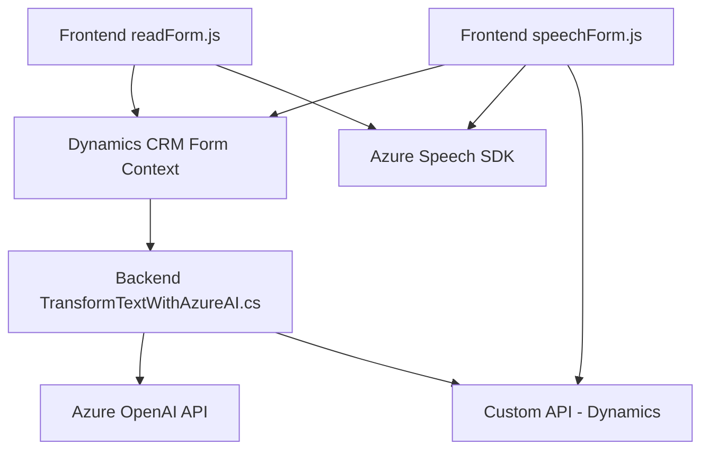

### Breve resumen técnico:
El repositorio contiene tres principales archivos con funciones específicas:
1. **FRONTEND**: `readForm.js` y `speechForm.js` implementan integraciones entre formularios de Dynamics CRM y el Azure Speech SDK, relacionadas con síntesis y reconocimiento de voz. Además de interactuar con el SDK, procesan datos de formularios y realizan mapeos entre UI y atributos internos.
2. **Plugin**: `TransformTextWithAzureAI.cs` añade una capa de procesamiento de texto mediante Azure OpenAI, que normaliza o estructura entradas textuales basadas en normas específicas, funcionando en el backend de Dynamics CRM.

---

### Descripción de arquitectura:
La solución está construida con una arquitectura **n-capas** extendida:
- **Capa de presentación**: Representada por los formularios de Dynamics CRM manipulados por JavaScript en los frontend, utilizando el DOM y el Speech SDK de Azure.
- **Lógica de negocio**: Implementada principalmente en los plugins de Dynamics CRM (`TransformTextWithAzureAI.cs`), donde se encapsula la interacción con servicios externos (Azure OpenAI).
- **Capa de integración**: Representada por el uso de APIs REST (Azure OpenAI y Speech SDK), llamando a servicios externos desde Dynamics CRM.
- **Capa de datos**: Se puede inferir que utiliza bases de datos internas de CRM, para gestión de contextos, mapeos y valores.

La arquitectura exhibe patrones como:
- **Integrador}: Los frontend integran formularios CRM con Azure Speech.
- **MVC extendido**: En el plugin y frontend, los datos y lógica de controlador interactúan fuertemente con los datos del modelo CRM.
- **Microservicio funcional**: Las funciones del frontend pueden ser extrapoladas para funciones independientes, aprovechando la modularidad.

---

### Tecnologías usadas:
1. **Frontend**:
   - **JavaScript** estándar (sin frameworks JS adicionales).
   - **Azure Speech SDK**: Para texto-a-voz y reconocimiento de voz.
   - **APIs de Dynamics CRM**: Contextos de formularios y conexión con datos del sistema.
2. **Plugin (backend)**:
   - **C#** (.NET Framework).
   - **Azure OpenAI**: Procesamiento de texto con modelos GPT.
   - **Dynamics CRM SDK**: Interacción con objetos y datos del sistema interno.
   - **JSON libraries**: `Newtonsoft.Json` y `System.Text.Json`.

---

### Diagrama Mermaid (GitHub Markdown compatible):

---

### Conclusión final:
La arquitectura y estructura del código demuestran una solución basada en **integraciones multicapas** y una fuerte dependencia de servicios de Azure. Los archivos de frontend actúan como integradores entre el SDK de Speech y los formularios dinámicos de CRM mientras encapsulan lógica modular, facilitando escalabilidad. El plugin del backend gestiona el procesamiento de texto avanzado con Azure OpenAI y amplía las capacidades del sistema CRM para aplicaciones empresariales.