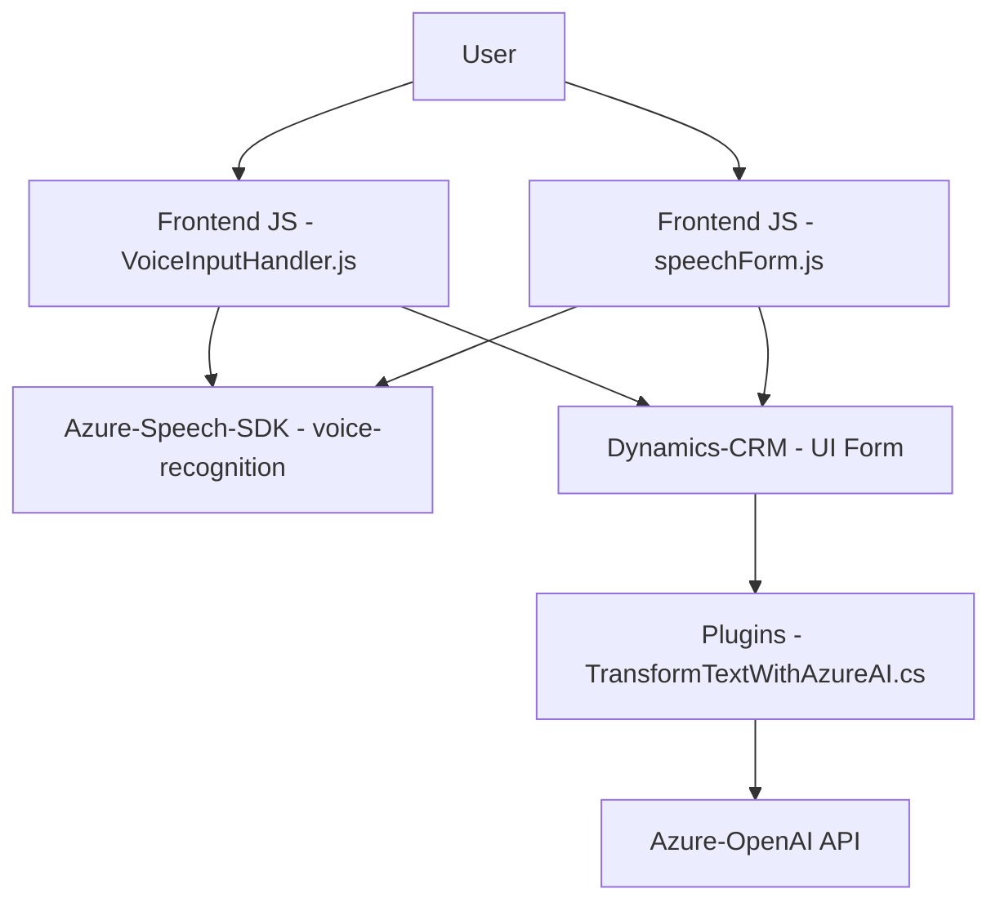

### Breve Resumen Técnico
El repositorio analiza la integración de sistemas que emplean tecnologías de reconocimiento de voz y transformación de texto. Los documentos revisados implementan funcionalidades de reconocimiento y síntesis de voz mediante el **Azure Speech SDK**, mientras que los plugins para **Dynamics CRM** extienden las capacidades mediante el uso de la **Azure OpenAI API**. Las estructuras del código sugieren una solución orientada a la interacción con formularios o sistemas CRM, con capacidades para análisis de datos mediante servicios en la nube, integración de APIs, y soporte de inteligencia artificial.

---

### Descripción de Arquitectura
La arquitectura general de esta solución parece estar orientada a una **Arquitectura de Integración en N Capas**, donde se dividen las responsabilidades de interacción con vistas (frontend - JavaScript), lógica de negocio (plugins en C#), y servicios externos (APIs de Azure).
La interacción entre el frontend y los plugins sugiere la presencia de una capa de integración entre los componentes (probablemente Dynamics WebAPI), y el código backend actúa como un mediador entre el CRM y los servicios de IA de Azure.

1. **Frontend**: Funcionalidades usando **Azure Speech SDK** y la integración de reconocimiento de voz puede ser parte de un frontend que trabaja dentro del entorno Dynamics CRM, posiblemente configurado para usarse en la vista del usuario.
   
2. **Backend/Plugins**: Los plugins **C#** implementan la extensibilidad de la lógica de CRM, utilizando el patrón de plugin de Dynamics para manipular atributos y datos en forma programática.
   
3. **Servicios externos**:
   - **Azure Speech Service**: Sintetización y transcripción de voz.
   - **Azure OpenAI API**: Procesamiento avanzado de texto usando servicios de OpenAI en la nube.
   
En general, esta arquitectura permite realizar operaciones distribuidas en tiempo real entre cliente, servidor y servicios de terceros.

---

### Tecnologías Usadas
1. **Frontend**:
   - **JavaScript**: Lenguaje principal para la lógica encargada de interactuar con el formulario.
   - **Azure Speech SDK**: Software Development Kit para reconocimiento de voz y síntesis de sonido.
   - **Dynamics CRM SDK**: Enlace entre el frontend y el CRM, proporciona los objetos necesarios para interactuar con los formularios.

2. **Backend**:
   - **C#**: Lenguaje de programación usado para el desarrollo de plugins.
   - **Microsoft Dynamics Plugins** (via `IPlugin`): Habilita extensibilidad en el sistema CRM.
   - **Newtonsoft.Json.Linq** y **System.Text.Json**: Para el procesamiento y generación de JSON.
   - **Azure OpenAI**: Servicio de transformación de texto basado en inteligencia artificial.
   - **HTTP Client**: Como mecanismo de comunicación entre el backend y la API de Azure.

---

### Diagrama **Mermaid**

---

### Conclusión Final
Esta solución es una **integración en N capas** que tiene como propósito ampliar las capacidades de **Microsoft Dynamics CRM** para admitir interacción por reconocimiento de voz y síntesis, con el objetivo de facilitar la entrada y procesamiento de datos en escenarios corporativos o administrativos. La combinación de **frontend dinámico** (JavaScript y SDK de Azure Insights), **backend programático** (C# plugins) y servicios de **IA en la nube** habilita una experiencia avanzada centrada en el usuario y su interacción por voz.

Los patrones arquitectónicos empleados, como la modularización, integración de APIs y separación de preocupaciones, brindan una solución extensible y mantenible, que puede escalarse fácilmente para adaptarse a más servicios o funcionalidades dependiendo de los requisitos empresariales.