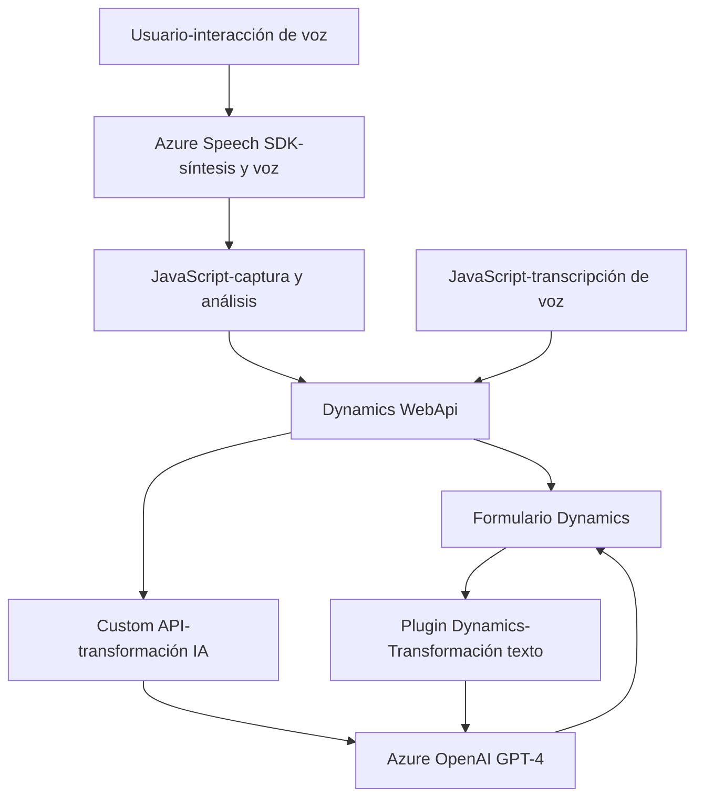

### Breve resumen técnico:
El repositorio contiene tres archivos principales: dos relacionados con el frontend (JavaScript) y uno con el backend (C# para Dynamics CRM). Este sistema es una solución híbrida que integra reconocimiento y síntesis de voz utilizando Azure Speech SDK, procesamiento avanzado de texto mediante Azure OpenAI, y optimiza la interacción con formularios en Dynamics CRM. Los objetivos clave incluyen la automatización de entrada de datos y la generación de respuestas estructuradas utilizando inteligencia artificial.

---

### Descripción de arquitectura:
1. **Tipo de solución:**  
   - Es un sistema compuesto que incluye una **API backend** para procesamiento IA, un **frontend** en JavaScript que interactúa con el usuario mediante voz, y un **plugin de Dynamics CRM** que actúa como middleware.
   
2. **Arquitectura:**  
   - **Frontend:** Sigue una arquitectura modular orientada a funciones.  
   - **Backend:** Está basado en un patrón típico de **plugin Dynamics CRM**, integrado con servicios externos.  
   - **Global:** Es una arquitectura **n capas**, con separación entre la presentación (frontend), lógica de negocio (plugin backend), y los servicios externos (API de Speech SDK y OpenAI vía Azure).

---

### Tecnologías usadas:
1. **Frontend:**  
   - **Librerías/SDK:** Azure Speech SDK (sintetización de texto a voz y reconocimiento de voz).  
   - **Integración con API interna:** Dynamics `WebApi` y custom APIs.  
   - **Dinámica:** Lazy loading para optimizar recursos (cargando el SDK solo cuando es necesario).
   
2. **Backend:**  
   - **Tecnología:** C# para plugins de Dynamics CRM.  
   - **Servicios externos:** Azure OpenAI para procesamiento de texto avanzado.  
   - **Frameworks:** Microsoft.Xrm.SDK para interacciones con Dynamics CRM.  

3. **Servicios externos:**  
   - Azure Speech SDK.  
   - Azure OpenAI (GPT-4).  

4. **Patrones usados:**  
   - **Frontend:** Modularidad y separación de responsabilidades.  
   - **Backend:** Gateway (acceso a Azure OpenAI) y repositorio (gestión de atributos de Dynamics CRM).  

---

### Dependencias o componentes externos:
1. **Directos:**
   - Azure Speech SDK (implementación cliente mediante paquetes CDN).
   - Dynamics API (`Xrm.WebApi`).
   - Custom API.
   - Azure OpenAI con modelo específico (`gpt-4o`) para procesamiento IA.

2. **Indirectos:**  
   - Servicio de reconocimiento y síntesis de voz de Microsoft Azure Speech.  
   - Servicios de Inteligencia Artificial para transformación de texto (Azure OpenAI).  
   
---

### Diagrama **Mermaid** válido para GitHub:

---

### Conclusión final:
Este repositorio implementa un sistema bien diseñado para automatizar la interacción con formularios basados en Dynamics CRM mediante reconocimiento de voz y procesamiento de texto con IA. La arquitectura modular y la integración de servicios externos (Azure Speech SDK y Azure OpenAI) aseguran una solución escalable y eficiente. Sin embargo, algunas mejoras pueden incluir manejo más sólido de las claves API en el backend para entornos seguros.