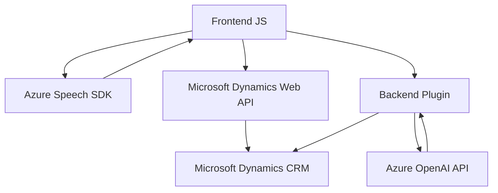

## Breve resumen técnico

El repositorio proporciona solución en tres niveles interconectados con capacidades avanzadas de procesamiento de voz, IA y formulación dinámica en un entorno de Microsoft Dynamics CRM. Incluye integración con servicios externos como Azure Speech SDK y Azure OpenAI, estructurada desde componentes frontend (JavaScript) para operaciones cliente y plugins backend (C#) para servicios del CRM.

---

## Descripción de arquitectura

El repositorio sigue una **arquitectura híbrida**. Se distingue por su separación lógica:
1. **Frontend (Javascript):** Implementa la capa de interacción con el usuario. Se enfoca en el reconocimiento de voz, la captura y extracción de datos del formulario, y la transformación y aplicación de valores procesados.
2. **Backend (C# Plugin):** Encargado de orquestar la interacción con servicios externos como Azure OpenAI y las funcionalidades principales del CRM.

Su diseño es modular con múltiples funciones dedicadas a tareas específicas, integradas bajo el patrón de delegación y diseño orientado a eventos, que es tradicional en entornos de Microsoft Dynamics CRM. Aunque no se emplea explícitamente un patrón como Hexagonal o n capas debido a la naturaleza del sistema, utiliza una **arquitectura basada en eventos** para los plugins y una estructura **modular en sus componentes frontend**.

---

## Tecnologías usadas

### Frontend:
1. **Azure Speech SDK (`csspeech/jsbrowserpackageraw`)**:
   - Para el reconocimiento de voz y síntesis de texto.
2. **JavaScript**:
   - Modularidad basada en funciones para estructurar lógica.
3. **Microsoft Dynamics Web API**:
   - Carga dinámica de dependencias; uso de funciones de API interna del CRM.
   
### Backend:
1. **Microsoft Dynamics CRM (IPlugin)**:
   - Plataforma del proyecto con plugins para extender funcionalidades.
2. **Azure OpenAI con REST API**:
   - Para procesar instrucciones de texto en JSON mediante IA.
3. **C#:**
   - Para implementar lógica de procesamiento del plugin.
4. **Newtonsoft.Json y System.Text.Json**:
   - Manipulación directa de JSON para la integración con OpenAI.

### Patrones:
1. **Delegación:** Cada función se especializa en una tarea, delegando subtareas a funciones subyacentes.
2. **Modularidad:** Código bien encapsulado, facilitando su mantenimiento a nivel funcional y de componente.
3. **Arquitectura orientada a eventos:** Diseño común en Dynamics CRM, donde las extensiones se activan mediante acciones específicas del sistema.

---

## Diagrama Mermaid válido para GitHub

Aquí el diagrama conceptual que detalla los flujos y componentes:

---

## Conclusión Final

El repositorio contiene una solución arquitectónica que une **procesos de voz y lenguaje natural** con un enfoque en la **automatización del CRM** mediante la integración de herramientas de **Azure Cloud**. Combina componentes frontend (para interacción directa) con un backend basado en plugins, utilizando servicios REST y SDK dinámicas para extender funcionalidades. Este diseño es modular y puede adaptarse fácilmente para añadir capacidades adicionales, pero podría beneficiarse de mejoras en manejo de errores y escalabilidad transversal para entornos más críticos.