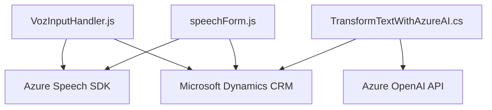

### Breve resumen técnico
El repositorio contiene tres componentes principales que implementan funcionalidades relacionadas con el uso de **Azure Speech SDK** y **Azure OpenAI Services**. El primer componente maneja la síntesis de voz para formularios (`readForm.js`), el segundo la entrada y procesamiento de comandos de voz sobre formularios (`speechForm.js`), y el tercero es un plugin que utiliza **Azure OpenAI** para transformar texto siguiendo normas predefinidas (`TransformTextWithAzureAI.cs`). El concepto general es una integración de servicios de voz y procesamiento de texto inteligente con plataformas como Dynamics CRM.

---

### Descripción de arquitectura
1. **Tipo de solución**
   - La solución puede clasificarse como una combinación de **integraciones API** y componentes que se relacionan con una aplicación de **Dynamic CRM**.
   - El archivo `readForm.js` implementa una **capa de síntesis de voz**, mientras que `speechForm.js` se encarga de la **entrada de comandos de voz** y la lógica para actualizar formularios. Ambos forman parte de una solución **frontend** para una interfaz basada en formularios. Adicionalmente, el plugin en `.cs` incluye lógica backend para procesamiento con **Azure OpenAI**, que se ejecuta como un componente **backend** de Dynamics CRM.

2. **Arquitectura**
   - **Híbrida**:
     - Los archivos en la carpeta `FRONTEND/JS` parecen formar una **arquitectura en capas n** (frontend para gestión específica de tareas y vistas).
     - El archivo `Plugins/TransformTextWithAzureAI.cs` implementa una **arquitectura basada en plugins** que interactúa con servicios CRM y modelos externos de inteligencia artificial (API de Azure OpenAI).
   - La solución global incluye integración de componentes externos (Azure Speech SDK y Azure OpenAI) que se comportan como **microservicios** o **external assets**.

3. **Patrones**
   - **Separación de responsabilidades**: Cada archivo tiene una responsabilidad clara y específica (síntesis de voz, comandos de usuario, procesamiento GPT).
   - **Carga condicional**: La carga dinámica del SDK (JavaScript) asegura operaciones sin sobrecargar inicialmente el navegador.
   - **Microservicio API**: Uso de Azure Speech SDK para síntesis y procesamiento de voz, además de Azure OpenAI para transformación de texto.
   - **Modularidad**: Las funciones y métodos están organizados para facilitar su reutilización y separación lógica.

4. **Dependencias y componentes externos**
   - **Azure Speech SDK**: Proporciona reconocimiento de voz y síntesis de texto a voz, cargado dinámicamente desde un CDN (`https://aka.ms/csspeech/jsbrowserpackageraw`).
   - **Azure OpenAI Service**: Interacción con GPT para transformación avanzada de texto.
   - **Dynamic CRM**:
     - **Microsoft.Xrm.Sdk**: Librería para la creación y ejecución de plugins en contextos Dynamics.
   - **Newtonsoft.Json.Linq**: Librería .NET para manipulación de estructuras JSON.
   - **Xrm.WebApi**: API JavaScript para operar sobre formularios dinámicos en Dynamics CRM.

---

### Tecnologías usadas
1. **Frontend**:
   - **JavaScript**: Para la lógica de extracción de datos, carga del SDK, y conversión de texto a voz.
   - **Azure Speech SDK**: Integración con reconocimiento de voz y síntesis bajo demanda.
2. **Backend**:
   - **C#**: Para desarrollo de plugins.
   - **Microsoft Dynamics CRM SDK**: Integración con la plataforma Dynamics.
   - **Azure OpenAI Service**: Procesamiento avanzado de texto usando GPT.

---

### Diagrama Mermaid

---

### Conclusión final
El proyecto es una **solución híbrida** que combina componentes frontend y backend para simplificar la interacción entre usuarios y formularios de Dynamics CRM. Está diseñado siguiendo una arquitectura en capas con integración flexible a través de APIs de terceros. Las tecnologías clave incluyen **Azure Speech SDK**, **Azure OpenAI**, y **Dynamics CRM SDK**, permitiendo funcionalidades de síntesis de voz, procesamiento de comandos de voz y uso de GPT para mejorar la experiencia del usuario. La elección de patrones como separación de responsabilidades y modularidad añade mantenibilidad y extensibilidad al código.