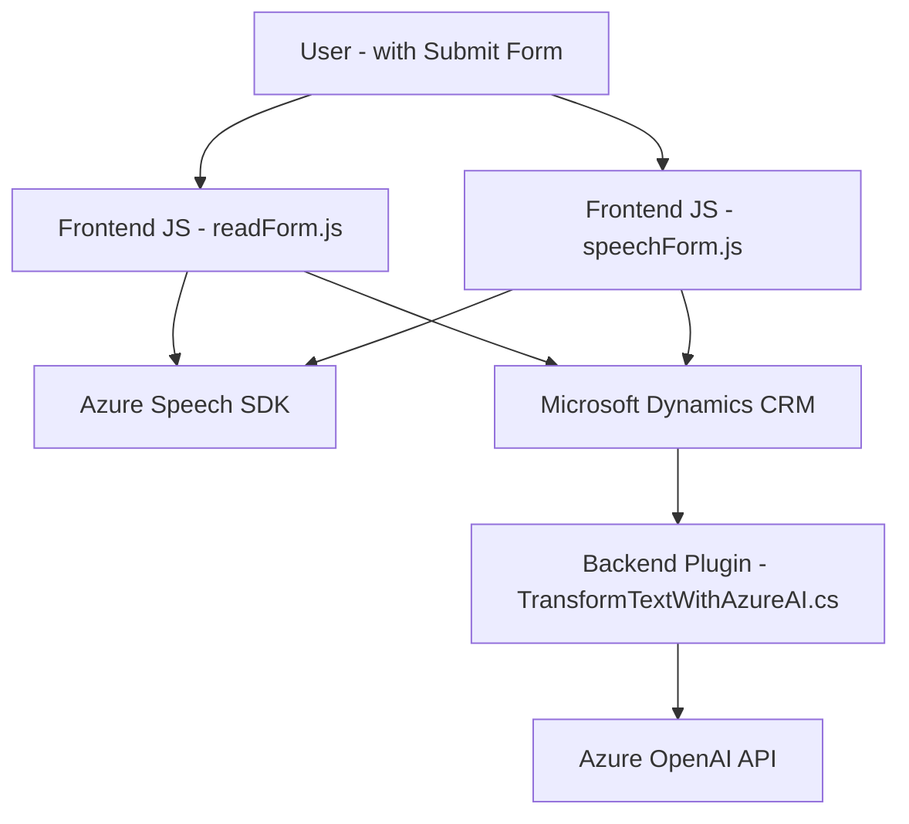

### Breve resumen técnico
El repositorio describe funcionalidad relacionada con la integración de servicios de Microsoft Dynamics CRM con capacidades de Azure AI y Azure Speech SDK para el manejo avanzado de formularios en un entorno front-end y back-end. Estos módulos parecen estar diseñados para una solución B2B que se utiliza en escenarios de entrada y salida de datos basados en voz y texto, principalmente centrados en los formularios de Dynamics.

---

### Descripción de arquitectura
La estructura del código sugiere una arquitectura de tipo **n-capas**, donde las responsabilidades están separadas entre:
1. **Frontend**: `readForm.js` y `speechForm.js`, encargados de gestionar la interacción del usuario con formularios y convertir voz en texto (entrada) o texto en voz (salida) utilizando el SDK de Azure Speech.
2. **Backend**: `TransformTextWithAzureAI.cs` funciona como un plugin de Dynamics CRM, donde se realiza el procesamiento del texto mediante la API de Azure OpenAI.
   
Adicionalmente, utiliza un **patrón de microfrontend modular** para organizar las funcionalidades del cliente en un entorno más segmentado. En el backend, se sigue una **arquitectura de plugin** que facilita la extensión en sistemas como Dynamics CRM por eventos.

---

### Tecnologías usadas
1. **Frontend**:
   - **JavaScript**
   - **Azure Speech SDK** para síntesis y transcripción de voz.
   - `Xrm.WebApi` para interactuar con el modelo de datos de Dynamics CRM.
   - **Modularización de código**: Separación de las funciones con responsabilidades específicas.

2. **Backend**:
   - **C#**
   - **Microsoft Dynamics CRM SDK** para desarrollo de plugins.
   - **Azure OpenAI API** para la integración con modelos basados en GPT y ChatGPT.
   - **Newtonsoft.Json** y **System.Text.Json** para el manejo de datos en JSON.
   - API REST usando **HttpClient**.

3. **Patrones clave**:
   - **Callback y Promesas (frontend)** para trabajar con SDKs externos de Azure y APIs.
   - **Integración de SDK:** Uso de servicios externos (Azure Speech y Azure OpenAI APIs).
   - **Plugin Architecture:** Utilizado en el lado del backend para extender funcionalidades en Microsoft Dynamics CRM.
   - **Dependency Injection (backend):** Servicios inyectados por Microsoft Dynamics.

---

### Diagrama Mermaid

---

### Conclusión final
El repositorio muestra una solución orientada a la gestión automatizada de formularios en aplicaciones empresariales como Dynamics CRM, con una integración avanzada de **Azure Speech** y **Azure OpenAI** para entrada y salida de datos con voz y texto. La arquitectura utiliza una separación clara de responsabilidades, con un backend orientado a plugins nativos de Dynamics y un frontend modular que emplea SDKs y APIs dinámicamente. Esto proporciona una solución escalable que aprovecha tanto el poder de la IA conversacional como las capacidades interactivas del manejo de voz, ideal para entornos B2B.