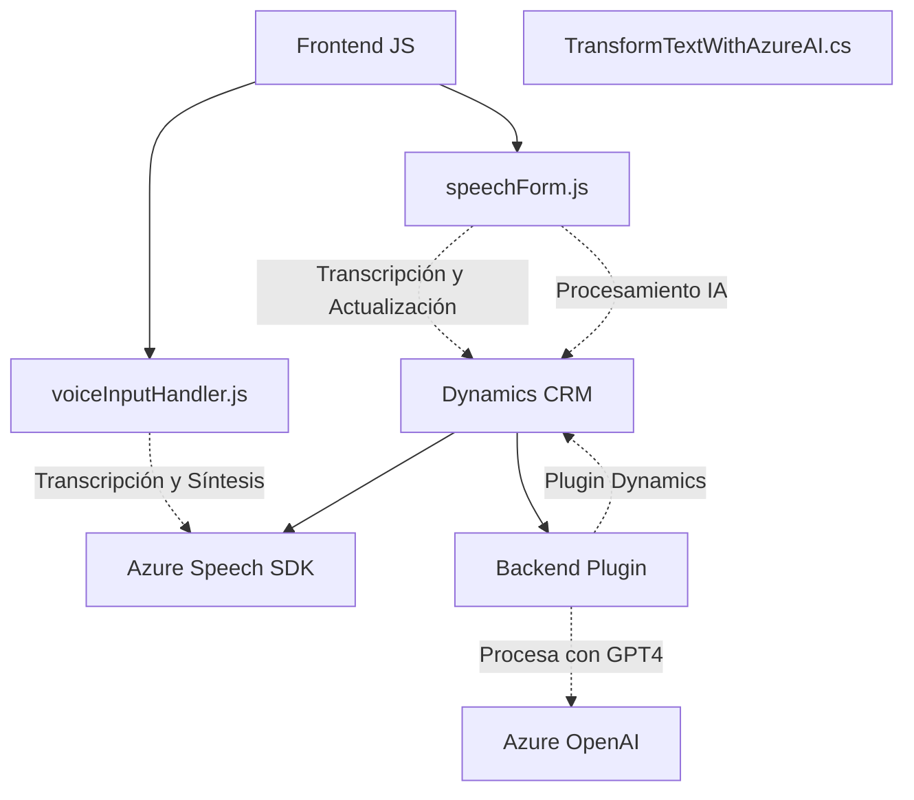

# **Análisis de Arquitectura y Diagrama**
---

## **Resumen Técnico**
El repositorio consta de tres módulos/interacciones clave:
- **Frontend (JS):** Maneja la lógica de síntesis y reconocimiento de voz con Azure Speech SDK para datos de formularios en aplicaciones CRM.
- **Backend (C# Plugin):** Implementa un plugin personalizado de Dynamics CRM que utiliza Azure OpenAI para transformar texto con reglas definidas.
- **Dependencias Externas:** Azure Speech SDK, Azure OpenAI, Dynamics CRM SDK. Estas facilitan la síntesis de voz, transcripción de comandos hablados y transformación de texto.

---

## **Descripción de Arquitectura**
La solución combina varias capas y tecnologías:
1. **Desarrollo multinivel:** Se observa una arquitectura orientada a n-capas. El frontend gestiona la interacción del usuario (UI y lógica cliente), mientras que el backend y los plugins actúan como capas de procesamiento lógico y servicio.
2. **Modularidad:** Cada archivo mantiene una única responsabilidad ("single responsibility principle") mediante funciones específicas. Las interdependencias están bien delimitadas: el frontend interactúa con sistemas web y SDK; el backend usa Dynamics CRM SDK y Azure OpenAI.
3. **Servicios externos:** La arquitectura se apoya en servicios externos SaaS (Serverless Speech SDK y Azure OpenAI), promoviendo bajo acoplamiento y escalabilidad.
4. **Integración API:** Existe un modelo de arquitectura **API-driven**, donde cada capa libera dependencias internas mediante interfaces o llamadas HTTP para interacciones con Dynamics CRM y Azure OpenAI.

---

## **Tecnologías Usadas**
1. **Transcripción/Síntesis de Voz:** Azure Speech SDK para convertir texto visible/transcripción en voz.
2. **IA y Procesamiento de Texto:** Azure OpenAI (GPT-4) para realizar transformaciones específicas del texto según reglas predefinidas.
3. **Frameworks Backend:** Dynamics CRM SDK y Microsoft .NET Framework.
4. **Frontend:** Javascript para integraciones dinámicas, manipulación de DOM y carga/distribución de datos interactivos en formularios HTML.
5. **Serialización de Datos:** `Newtonsoft.Json` y `System.Text.Json` para el manejo de JSON estructurado.

---

## **Diagrama Mermaid**

---

## **Conclusión**
La solución está orientada a mejorar la experiencia de usuario y automatizar la administración de información en sistemas CRM:
1. **Frontend:** Modulariza la interacción del usuario mediante síntesis/transcripción de voz y manipulación de formularios con APIs externas (Azure Speech SDK).
2. **Backend:** Extiende Dynamics CRM a través de un plugin diseñado para transformar texto/mensajes contextuales con IA basada en Azure OpenAI.
3. **Patrón de Integración:** El diseño sigue una arquitectura n-capas con comunicaciones API y carga dinámica (_lazy-loading_), ideal para aplicaciones híbridas escalables y modulables.

