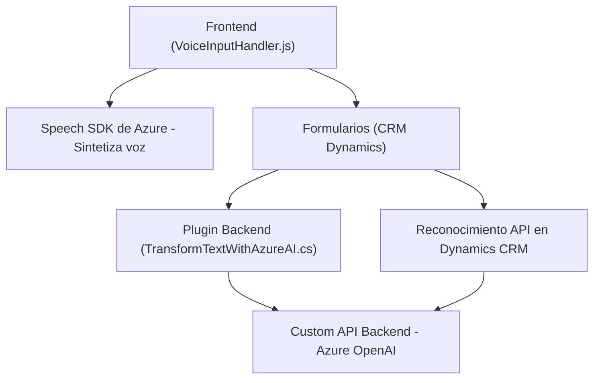

### Breve resumen técnico:
El repositorio cubre múltiples aspectos enfocados en la integración entre servicios de **Azure**, la generación automática de texto estructurado, la síntesis de voz, y la interacción con formularios en ingenierías CRM (Dynamics). Los componentes son modulares y trabajan de manera interoperable mediante APIs con dependencias externas como Azure Speech SDK y Azure OpenAI.

---

### Descripción de arquitectura:
La solución tiene elementos claramente separados que siguen una **arquitectura modular** basada en capas:
- **Frontend:** Interacción con formularios de CRM, reconocimiento de voz, carga de SDKs externos dinámicamente y mapeo de campos.
- **Logica del Backend:** Integración con **Dynamics CRM** usando plugins para extender funcionalidades mediante Azure OpenAI. Estos plugins se encargan de transformar texto bruto en JSON estructurado, siguiendo normas específicas.
- **Comunicación API:** Dependencias externas como Azure OpenAI y Azure Speech SDK son activadas mediante solicitudes HTTP.

El patrón arquitectónico global se aproxima a un modelo **n-capas** con integración de APIs externas como Azure Speech y OpenAI. Aunque los componentes están conectados, no se manifiesta una arquitectura de **microservicios** como tal.

---

### Tecnologías usadas:
1. **Frontend:**
   - **JavaScript (ES6+):** Base para manejar la interacción con formularios y cargar SDKs.
   - **Azure Speech SDK:** Para síntesis y reconocimiento de voz.
   - **Dynamics CRM SDK:** Para manipulación dinámica de datos del formulario.
2. **Backend:**
   - **C# (.NET):** Uso de plugins en Dynamics CRM extendidos con `IPlugin`.
   - **Azure OpenAI Service:** Integración con el modelo GPT-4 para procesamiento de texto.
3. **Librerías:**
   - Newtonsoft.Json para manipulación JSON en el plugin de C#.
   - System.Net.Http para llamadas HTTP al servicio Azure.

---

### Dependencias o componentes externos:
1. **Azure Speech SDK:** Manejo de voz (síntesis y reconocimiento).
2. **Azure OpenAI Service:** Procesamiento avanzado de texto con el modelo GPT.
3. **CRM Dynamics SDK:** Plugin de extensibilidad y operación de los datos en formularios.
4. **JavaScript dinámico:** Cargado desde Azure para manejo de síntesis de voz y reconocimiento.
5. **Interacción REST:** Integraciones basadas en API con Dynamics y servicios externos.

---

### Diagrama Mermaid (100% compatible con GitHub Markdown):

---

### Conclusión final:
Esta solución implementa un sistema potente y extensible para facilitar la interacción entre formularios CRM y servicios avanzados de voz y texto usando Azure. La arquitectura es modular y utiliza patrones n-capas que garantizan la separación de responsabilidades y la interoperabilidad con servicios externos. Aunque no fue diseñada para microservicios, es escalable y está pensada para su uso en entornos dinámicos como Dynamics CRM.