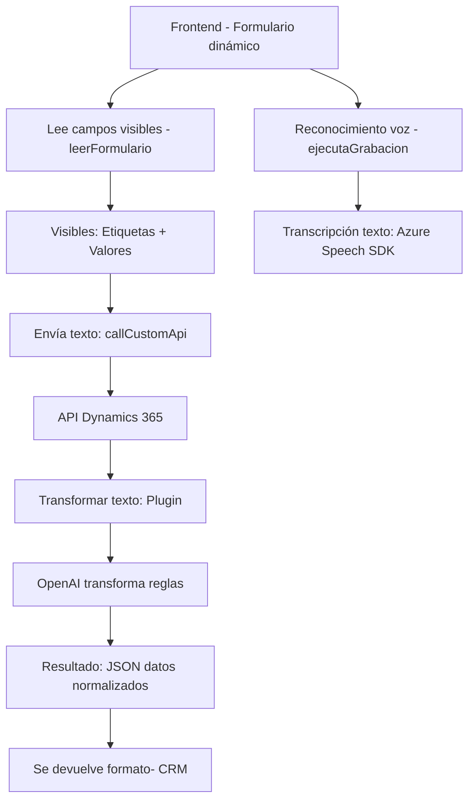

### **Análisis del Repositorio y Resumen Técnico**

El repositorio contiene tres archivos clave que trabajan en sincronía para interactuar con formularios de usuario en Dynamics 365, procesar texto y voz mediante integraciones con servicios en la nube de Microsoft Azure (Speech SDK y OpenAI). 

Los archivos tienen propósitos específicos:  
- **Frontend/JS**: Implementa funcionalidades de voz y conversión de datos en formularios dinámicos.  
- **Plugins/.cs**: Define la integración entre Dynamics CRM y Azure OpenAI para procesar texto basado en normas.  

Modulo a través de ambos layers (frontend y plugin), el repositorio muestra dependencia significativa de servicios en la nube como Speech SDK y OpenAI, además de interfaces estándar proporcionadas por Dynamics CRM.

---

### **1. Tipo de Solución**
- La solución es una **aplicación híbrida** para integración de voz y texto, con extensión a servicios de nube y datos dinámicos.
- Incluye:
  - **Frontend:** Interacción con formularios, reconocimiento de voz, y síntesis de texto.
  - **Backend (Plugin):** Transformación de texto con Azure OpenAI mediante un enfoque orientado a eventos.

---

### **2. Tecnologías, Frameworks y Patrones Usados**
#### **Frontend (JS):**
- **Azure Speech SDK:** Reconocimiento de voz, síntesis de texto a voz.  
- **Microsoft Dynamics 365 APIs:** Manipulación de formularios y datos en Dynamics 365.  
- **Patrones Aplicados:**
  - Modularidad.
  - Delegación (cargar SDK, procesar datos por funciones específicas).
  - Integración con APIs externas (Speech SDK, Xrm.WebApi).

#### **Backend (Plugin):**
- **C# Framework:** Manejo de eventos y lógica dentro de Dynamics CRM.  
- **Azure OpenAI Service:** Procesamiento de texto con normativas predefinidas.  
- **Patrones Aplicados:**
  - Encapsulación (separación clara entre manipulación CRM y lógica externa).
  - Event-Driven Architecture (reacción a eventos del sistema CRM).
  - Microservicio API (llamada REST para texto).

---

### **3. Arquitectura General**
La solución presenta una arquitectura **híbrida de capas**, con separación clara entre Frontend (interacción usuario) y Backend (procesamiento dinámico):
- **Frontend:** **Cliente dinámico ligerísimo**, basado en formularios y Azure Speech SDK.  
- **Backend:** **Plugin orientado a eventos en Dynamics CRM**, que procesa texto con un enfoque modular a través de REST APIs.  
- **Integración:** Servicios externos como Dynamics CRM REST API, Azure Speech SDK y Azure OpenAI Service. 

**Arquitectura Final:** Proporciona un modelo **n-capas** con comunicación externa basada en APIs para la interacción con módulos de inteligencia artificial y voz.

---

### **4. Dependencias y Componentes Externos**
#### **Explotación de APIs y Servicios**
- **Azure Speech SDK:** Para la interacción de voz.  
- **Azure OpenAI Service:** Procesamiento de texto con inteligencia artificial.  
- **Dynamics 365 APIs (Xrm.WebApi)**: Operaciones en formularios dinámicos y entidades CRM.  

#### **Otras dependencias técnicas**
- **Newtonsoft.Json** y **System.Text.Json**: Procesamiento de JSON.  
- **System.Net.Http:** Realización de solicitudes REST.
  
---

### **5. Diagrama Mermaid**

---

### **6. Conclusión Final**
El repositorio implementa una funcionalidad avanzada de interacción entre usuario y datos dinámicos en un sistema basado en Dynamics 365. Utiliza un enfoque modular, servicios externos de alta escalabilidad como Azure Speech SDK y OpenAI, y una arquitectura n-capas, ofreciendo un diseño robusto para gestión de formularios con capacidades de voz y texto. La solución es efectiva en entornos corporativos que dependen de sistemas CRM avanzados con integración cloud.