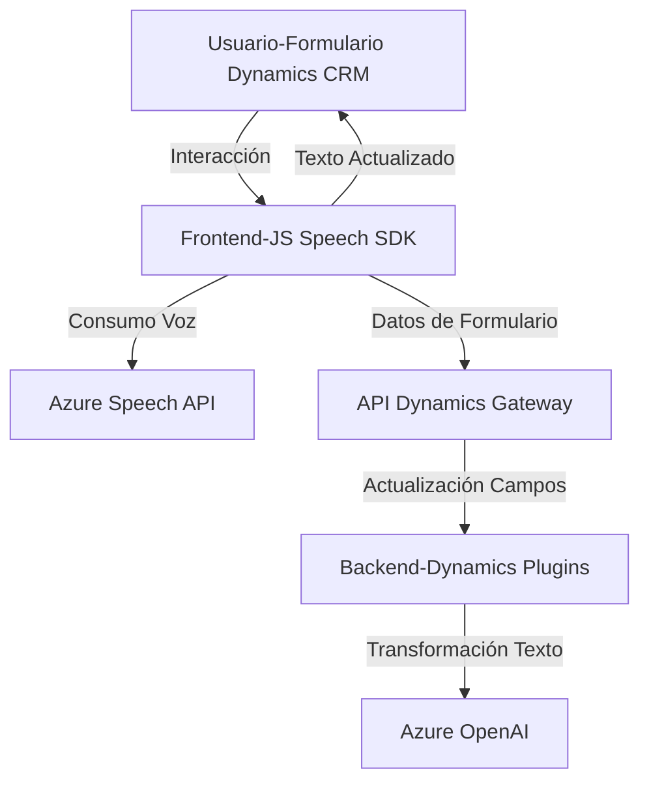

### Breve Resumen Técnico
El conjunto de archivos describe un sistema integrado que combina la interacción con formularios en Dynamics CRM (gestión empresarial), la utilización de capacidades de inteligencia artificial (Azure OpenAI) y un SDK de síntesis/reconocimiento de voz (Azure Speech). Es una solución híbrida que mezcla frontend en JavaScript con lógica de plugin en C#, diseñada para mejorar la accesibilidad mediante lectura de texto en voz alta y entrada de datos hablados.

---

### Descripción de Arquitectura
La solución puede clasificarse como una **arquitectura basada en eventos**, con un diseño de **n Capas** que divide las responsabilidades por niveles funcionales:
1. **Frontend (JS)**: Interacción directa con el usuario a través de formularios en Dynamics, usando Azure Speech SDK para aportarle capacidades de reconocimiento y síntesis de voz. Programado como módulos funcionales organizados.
2. **Backend (C#)**: Plugin en Dynamics 365 que extiende la funcionalidad para procesar datos utilizando Azure OpenAI en formato estructurado (JSON). Comunica texto procesado al frontend.
3. **Integración**: Comunicación entre capas frontend y backend mediante el API `Xrm.WebApi` (Gateway de Dynamics CRM), además de llamando a servicios externos (Azure Speech y OpenAI).

La arquitectura fusiona un modelo cliente-servidor (Dynamics CRM con extensiones frontend/backend) y componentes de nube (Azure), generando un híbrido que provee herramientas accesibles para usuarios.

---

### Tecnologías y Frameworks Usados
1. **JavaScript (Frontend)**:
   - Modularidad funcional con Promesas.
   - Azure Speech SDK (https://aka.ms/csspeech/jsbrowserpackageraw).
   - Dinámica de carga del SDK mediante DOM.
    
2. **Net Core / C# (Backend)**:
   - Dynamics CRM `IPlugin` (integración con el ecosistema Dynamics).
   - Azure OpenAI API (integración de servicios GPT).
   - JSON Parsing (Newtonsoft.Json).
   - HTTP REST (HttpClient para solicitudes externas).

3. **Tecnologías externas**:
   - **Azure Speech SDK**: Reconocimiento de voz/síntesis de voz.
   - **Azure OpenAI Service**: Transformación de texto usando inteligencia artificial.

---

### Componentes externos y dependencias
1. **Azure SDKs**: Utilizados tanto para reconocimiento/síntesis de voz como para procesamiento de texto por IA (OpenAI).
2. **Dynamics Plugins y APIs**:
   - `Xrm.WebApi.online.execute`: Puente entre el frontend y el CRM para datos de formularios.
3. **Librerías y paquetes**:
   - `Microsoft.Xrm.Sdk`: Funcionalidades para extender Dynamics 365.
   - `Newtonsoft.Json & System.Net.Http`: Serialización/deserialización y manejo HTTP hacia servicios externos.

---

### Diagrama Mermaid

---

### Conclusión Final
El sistema presenta una solución eficiente y moderna para mejorar la accesibilidad de datos en entornos CRM, utilizando tecnologías de nube como Azure Speech y Azure OpenAI. La arquitectura modular con capas separadas favorece la extensibilidad y escalabilidad, aunque ciertos puntos críticos como el manejo de credenciales y seguridad durante la configuración podrían mejorarse. Adicionalmente, el enfoque basado en eventos al integrar la síntesis y reconocimiento de voz permite una experiencia fluida para el usuario final. Es ideal para organizaciones que desean automatizar interacciones de usuarios mediante voz e inteligencia artificial.