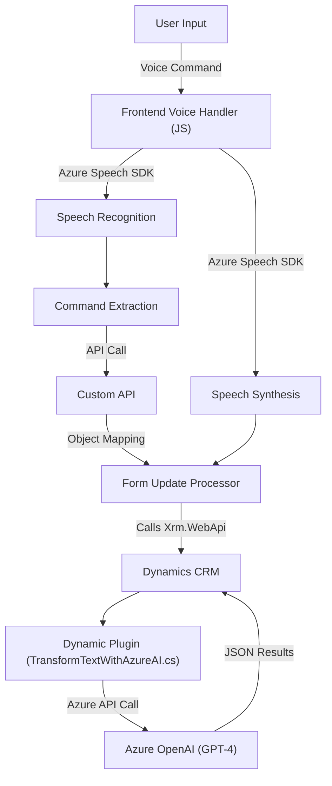

#### Breve resumen técnico:
Este repositorio contiene tres módulos principales que interactúan con servicios en la nube de Microsoft Azure: un **frontend en JavaScript** y un plugin desarrollado en **C# para Dynamics CRM**. El propósito general es integrar funcionalidad de síntesis y reconocimiento de voz con servicios como **Azure Speech SDK** y **Azure OpenAI**, así como procesar y trasladar datos entre formularios, APIs y CRM. 

---

### 1. Descripción de arquitectura
**Arquitectura modular con integración a servicios externos**
1. **Frontend (JavaScript):**
   - Modularización en funciones específicas para la interacción entre formularios web y los servicios de Azure Speech SDK.
   - Implementa patrones de separación de responsabilidades para extracción de datos, síntesis de voz y procesamiento de transcripciones.
   - Es parte de un sistema más amplio donde los eventos (como input de usuario o reconocimiento de voz) desencadenan flujos de procesamiento.

2. **Backend (C#, Plugin de Dynamics CRM):**
   - Plugins construidos alrededor de las interfaces nativas de Dynamics CRM (IPlugin) con un enfoque hacia la extensibilidad. 
   - Integración de APIs por medio de patrones síncronos y asincrónicos.
   - Procesamiento usando **Azure OpenAI** para transformar texto en estructuras JSON que pueden ser interpretadas dentro del sistema CRM.

**Estilo arquitectónico:** 
- Combina disgregación funcional con integración de servicios de terceros.
- Diseñado para **n capas**, donde las funcionalidades se dividen claramente entre capa cliente (Frontend) y servidor (backend integrado a Dynamics CRM). 

---

### 2. Tecnologías usadas
1. **Frontend:**
   - **Lenguaje:** JavaScript.
   - **Azure Speech SDK:** Para síntesis y reconocimiento de voz.
   - Manejo dinámico de formularios HTML con estructuras específicas (ej. los controles `.data.entity.attributes`).

2. **Backend:**
   - **Lenguaje:** C#.
   - **Microsoft Dynamics CRM SDK:** Para la ejecución y extensión mediante plugins que interactúan directamente con el modelo de datos del CRM.
   - **Azure OpenAI API (GPT-4):** Para procesamiento avanzado de textos.
   - **Newtonsoft.Json:** Library para manipular datos en JSON.
   - **System.Net.Http:** Para realizar solicitudes HTTP.

3. **Patrones arquitectónicos:**
   - **Separación por capas:** Lógica claramente distribuida entre presentación, procesamiento y comunicación con API externas.
   - **Modularidad funcional:** Cada archivo cumple una única responsabilidad eficiente.
   - **Integración con APIs:** Uso extensivo de APIs de Microsoft Azure (Speech SDK y OpenAI).

---

### 3. Dependencias externas 
1. Azure Cloud Services:
   - **Azure Speech SDK:** Synthesis y recognition en lenguaje natural.
   - **Azure OpenAI (GPT-4):** Modelo de IA para transformar texto en objetos JSON personalizados.

2. Microsoft Dynamics CRM:
   - Extensión del CRM mediante plugins `IPlugin`.

3. API Management:
   - **Xrm.WebApi:** Comunicación entre formularios y entidades en Dynamics.
   - **Custom APIs adicionales:** Para interacción externa desde código de frontend o backend.

---

### 4. Diagrama Mermaid (GitHub Markdown compatible):

---

### Conclusión final:
Este repositorio implementa una solución **modular basada en servicios** que integra funcionalidad de **reconocimiento y síntesis de voz** junto con **procesamiento avanzado de texto mediante IA**. Se utiliza una arquitectura de **n capas** que organiza claramente los roles de cada módulo: el frontend se ocupa de la captura y representación de datos y la interfaz con los SDK externos, mientras que el backend maneja la extensión del sistema CRM y la lógica avanzada de procesamiento con OpenAI.

La solución destaca por su buen uso de patrones como la **separación de responsabilidades** y la **integración API**, asegurando escalabilidad y mantenibilidad. Sin embargo, se podría mejorar la extensibilidad del módulo de frontend proporcionando configuraciones dinámicas en lugar de valores predefinidos y estáticos.