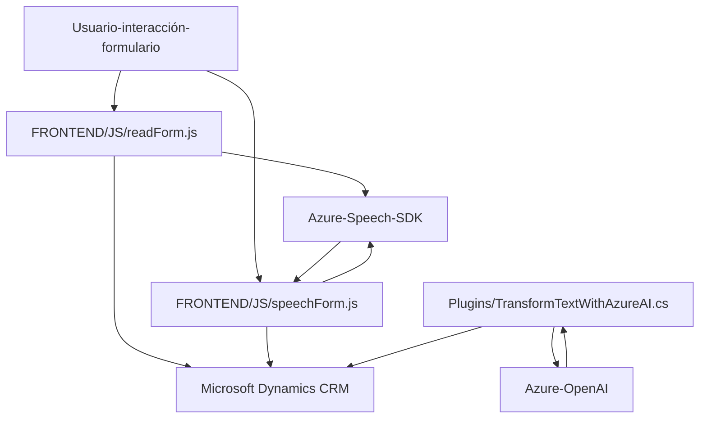

### Breve resumen técnico
El repositorio contiene tres archivos principales cuya funcionalidad se centra en la interacción con formularios en una plataforma CRM (Microsoft Dynamics), utilizando tecnologías avanzadas como Azure Speech SDK para síntesis y reconocimiento de voz, junto con Azure OpenAI para el procesamiento y estructuración de datos. Estas características están dirigidas a mejorar la experiencia del usuario mediante interfaces de voz, automatización y análisis basado en inteligencia artificial.

---

### Descripción de arquitectura
La solución parece estar diseñada como un **Modular Monolith** debido a la consolidación de funcionalidades en módulos que interactúan con un núcleo centralizado, en este caso, el entorno de Dynamics CRM. Sin embargo, la interacción con servicios externos (Azure Speech y Azure OpenAI) refleja una arquitectura **event-driven**, donde los procesos de captura de voz y transformación textual se desencadenan por eventos concretos como la interacción con los formularios.

Además, los archivos evidencian una implementación inspirada en el patrón **n capas**:
1. **Capa de presentación** (Frontend): Las funciones para extracción y síntesis de datos en voz desde la interfaz del usuario mediante JavaScript.
2. **Capa lógica de negocio**: Lógica definida en los métodos del plugin y en los scripts del frontend.
3. **Capa de acceso a datos**: Interacciones con Microsoft Dynamics usando `executionContext`, `Xrm.WebApi`, y otros elementos propios del SDK.

---

### Tecnologías usadas
1. **Microsoft Dynamics CRM**:
   - API `Xrm.WebApi` para la interacción con entidades y formularios.
   - Contexto de ejecución del usuario (`executionContext`).

2. **Azure Speech SDK**:
   - Carga dinámica del SDK para reconocimiento y síntesis de voz.
   - Integración directa con JavaScript para captura de entrada de voz y generación de salida de texto hablado.

3. **Azure OpenAI**:
   - Procesamiento de texto basado en IA utilizando el endpoint de Azure OpenAI.
   - Transformación de datos según reglas predefinidas en JSON estructurado.

4. **.NET Framework**:
   - Plugins diseñados en C# para la lógica extendida del CRM.
   - Uso de servicios propios de Dynamics mediante `IPluginExecutionContext` y `IOrganizationService`.

5. **JavaScript**:
   - Scripts frontend para capturar las acciones de usuario (voz, comandos).
   - Modularidad y ejecución basada en eventos.

6. **Patrones**:
   - **Servicio**: En los scripts JavaScript para encapsular funciones específicas.
   - **Plugin Design Pattern**: En el archivo de C# (`TransformTextWithAzureAI`) para extender la funcionalidad de Dynamics CRM.
   - **Event-Driven Architecture**: Procesos desencadenados por acciones del usuario (ejemplo: inicio de reconocimiento de voz).

---

### Diagrama Mermaid válido para GitHub

---

### Conclusión final
La solución presenta un diseño modular y bien estructurado que integra tecnologías avanzadas en interacción usuario-sistema, especialmente mediante la síntesis de voz y el procesamiento de datos utilizando IA. El uso de Microsoft Dynamics CRM como núcleo central permite gestionar datos empresariales mientras se expande su funcionalidad utilizando plugins en C# y scripts en JavaScript. El diagrama refleja la interacción entre los componentes clave del sistema, dejando clara la integración directa con servicios externos como Azure Speech y Azure OpenAI.

Aunque la solución está bien diseñada, sería beneficioso incorporar mejoras como:
1. Externalización de configuraciones sensibles, como claves de acceso, para evitar problemas de seguridad.
2. Validación adicional del estado de los servicios externos para manejar casos de latencia o indisponibilidad.

Este repositorio es una solución avanzada, orientada a mejorar la productividad y optimizar la experiencia del usuario en dinámicos entornos empresariales.