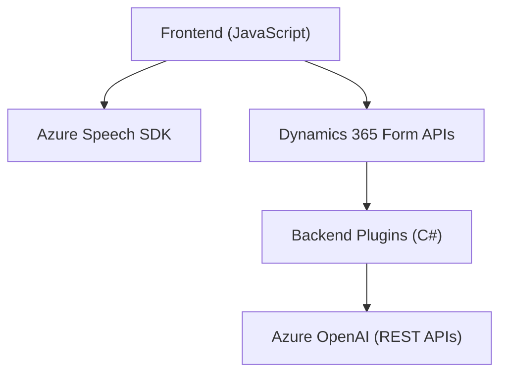

### Breve resumen técnico
El repositorio parece ser una solución orientada a accesibilidad y automatización integrada con **Dynamics 365 CRM**. Está compuesto por scripts frontend (JavaScript) que usan el **Azure Speech SDK** para reconocer y sintetizar voz, junto con plugins backend en C# para realizar transformaciones con **Azure OpenAI**. La solución se enfoca en:
- Reconocimiento de voz y síntesis para formularios interactivos.
- Procesamiento y asignación de datos en formularios de Dynamics 365.
- Normalización y estructuración de datos mediante IA en el backend.

---

### Descripción de arquitectura
La solución utiliza una arquitectura **n-capas**, donde:
1. **Frontend**: Interactúa directamente con usuarios mediante DOM y recoge datos utilizando **Azure Speech SDK**.
2. **Backend**: Define lógica de transformación mediante plugins en **Dynamics 365**, que interactúan con el servicio **Azure OpenAI**.
3. **Servicios externos**: Servicios como Azure Speech y Azure OpenAI son utilizados para poder implementar accesibilidad por voz y procesamiento avanzado de datos.

Aunque hay presencia de integración con servicios externos (Azure), la arquitectura aún refleja un enfoque monolítico dentro de cada capa: tanto los scripts frontend como los plugins backend están diseñados para operar con una única instancia de CRM.

---

### Tecnologías usadas
1. **Frontend**:
   - Lenguaje: JavaScript.
   - Cloud SDK: Azure Speech SDK (para reconocimiento y síntesis de voz).
   - Frameworks y APIs: Dinámica interactiva con DOM, integración con Dynamics 365 mediante formularios.

2. **Backend**:
   - Lenguaje: C#.
   - CRM Framework: Dynamics 365 Plugin Framework.
   - Cloud SDK: Azure OpenAI (GPT models).
   - Librerías: 
     - Serialization: `Newtonsoft.Json` y `System.Text.Json`.
     - HTTP API: `System.Net.Http`.

3. **Servicios Externos**:
   - Azure Speech SDK (JavaScript).
   - Azure OpenAI Service (REST API interactuada mediante plugins).

4. **Patrones identificados**:
   - **Facade Pattern**: Funciones como `startVoiceInput` o `applyValueToField` simplifican el acceso a funcionalidades complejas como reconocimiento de voz e interacción con formularios.
   - **Callback Pattern**: Se utiliza para cargar dinámicamente el Speech SDK en frontend.
   - **Plugin Architecture**: Estructura típica de Dynamics 365 extensible mediante plugins (event-driven architecture).

---

### Diagrama Mermaid: Arquitectura del sistema
Este diagrama refleja la interacción entre las principales capas del sistema y los servicios externos.

--- 

### Conclusión final
La solución que forma este repositorio integra accesibilidad (reconocimiento y síntesis de voz) y automatización (transformaciones con IA) con un enfoque modular de **n-capas**, aunque mantiene características de arquitectura **monolítica** dentro de cada capa. Es idónea para sistemas CRM como **Dynamics 365**, en tanto que aprovecha tecnologías cloud, como **Azure Speech SDK** y **Azure OpenAI**, para resolver problemas empresariales complejos en tiempo real.