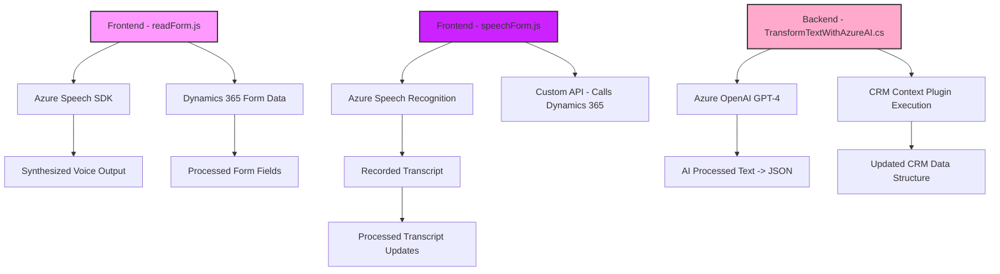

### Breve resumen técnico
El repositorio examinado es una solución diseñada para integrar reconocimiento y síntesis de voz con procesamiento textual asistido por inteligencia artificial (Azure OpenAI) y manipulación de datos en Dynamics CRM. Incorpora tanto componentes frontend (JavaScript) como backend (código C#) para lograr funcionalidades avanzadas como interacción por voz y enriquecimiento de datos mediante IA.

---

### Descripción de arquitectura
La arquitectura del sistema parece estar organizada en capas claramente definidas:
1. **Frontend (JS):**
   - Encargado de capturar datos y manejar interacción con el usuario.
   - Maneja reconocimiento/síntesis de voz mediante Azure Speech SDK.
   - Procesa formularios en Dynamics CRM directamente desde el navegador.
2. **Backend (C# Plugins):**
   - Transformación de datos textual usando Azure OpenAI (GPT-4) en el contexto del CRM.
   - Implementado como plugins para Dynamics CRM que responden a eventos específicos.
3. **Integración con APIs externas:**
   - Azure Speech SDK para voz (frontend y backend).
   - Azure OpenAI para procesamiento de texto estructurado en el plugin del backend.

La solución está orientada a una arquitectura **n-capas**:
- **Frontend:** Interfaz de usuario en Dynamics CRM.
- **Backend:** Lógica de procesamiento vía plugins y APIs.
- **Servicio externo:** Utilización de servicios en la nube como Azure Speech y OpenAI.

---

### Tecnologías usadas
1. **Frontend (JavaScript):**
   - Azure Speech SDK para interacción por voz y síntesis.
   - DOM API para manipulación de formularios de Dynamics 365.
2. **Backend (C#):**
   - Microsoft Dynamics SDK para operaciones relacionadas con CRM.
   - Azure OpenAI GPT-4 para transformación avanzada de texto.
   - Librerías estándar de C# para manejo de JSON (`System.Text.Json`).
3. **Dependencias comunes:**
   - HTTPClient para integración REST con servicios externos.
   - Compatibilidad con Dynamics CRM mediante `IPlugin`.
4. **Patrones usados:**
   - **Event-driven programming**: Monitoreo de eventos dentro del CRM y funciones callback.
   - **Mapper pattern:** Traducción entre nombres visuales del formulario y atributos de CRM.
   - **SDK integration pattern:** Integración con Azure Speech y OpenAI.

---

### Diagrama Mermaid válido para GitHub

---

### Conclusión final
La solución utiliza una arquitectura modular basada en **n-capas**, combinando frontend y backend para ofrecer interacción por voz y procesamiento avanzado de datos en Dynamics CRM. Las dependencias clave son Azure Speech SDK y Azure OpenAI (GPT-4), integradas de forma eficiente mediante JavaScript y C#. La elección de estas tecnologías asegura dinámicas modernas como reconocimiento de voz y generación de datos enriquecidos. Además, la integración con Dynamics CRM permite extender la funcionalidad del sistema según los requisitos de negocio.