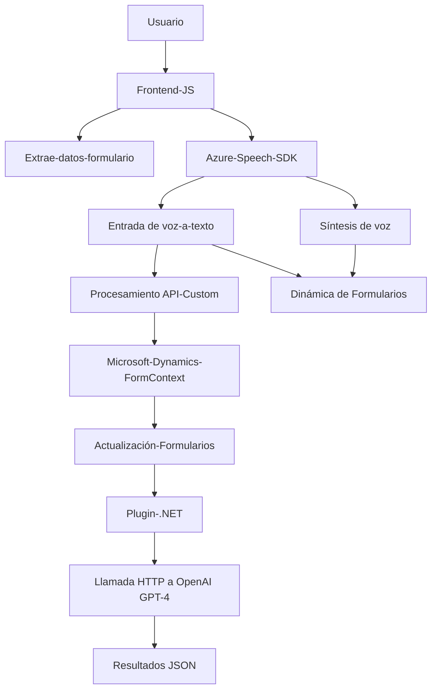

### Análisis Técnico

#### Breve Resumen Técnico:
El análisis de los archivos indica que este repositorio contiene código relacionado con el uso de entradas por voz, transcripción de texto, síntesis de voz y procesamiento de texto mediante servicios de Azure y Microsoft Dynamics CRM. La solución es una integración entre un front-end que interactúa con formularios y sistemas de reconocimiento/síntesis de voz (Azure Speech SDK y OpenAI API) y un plugin para Dynamics CRM que utiliza Azure OpenAI Service para aplicar transformaciones avanzadas de texto.

---

### Descripción de la Arquitectura:
La arquitectura de este repositorio parece estar distribuida y orientada a microservicios. Consta de una capa de cliente (Frontend) que interactúa con dos servicios externos clave: **Azure Speech SDK** y **Microsoft Dynamics CRM**. Además, existe una capa integrada en Dynamics CRM mediante un Plugin (backend en .NET) que invoca microservicios de Azure (OpenAI API). A pesar de no estar explícitamente mencionada, se utiliza una arquitectura de capa lógica dividida en:
1. **Frontend Layer:** Interacción con el usuario mediante formularios. Manejo de síntesis y recogida de voz. Lógica de cliente.
2. **Processing Layer or Middleware:** Reconocimiento de voz y proxy para interacción con APIs.
3. **Backend Plugin Layer:** Procesamiento y transformación de texto mediante reglas en Dynamics CRM.

---

### Tecnologías usadas:
1. **Frontend:**
   - **JavaScript**: Para crear lógica de cliente.
   - **Azure Speech SDK**: Procesamiento de síntesis y transcripción de voz en tiempo real. Lenguaje Español especificado.
   - **Dynamics API (Xrm.WebApi)**: Integración directa con estructuras de formularios de Microsoft Dynamics CRM.

2. **Backend Plugins:**
   - **.NET Framework (C#)**: Desarrollo del plugin.
   - **Azure OpenAI GPT-4 API**: Servicio de inteligencia artificial para transformar texto.
   - **Newtonsoft.Json**, **System.Text.Json**: Procesamiento JSON.
   - **HttpClient (.NET)**: Comunicación HTTP asíncrona.

---

### Dependencias y Componentes Externos:
1. **Azure Speech SDK**: Para síntesis y transcripción de voz.
2. **Azure OpenAI Service**: Para transformación avanzada de texto con IA.
3. **Microsoft Dynamics API (Xrm.WebApi)**: Permite manipular entidades y formularios internos de Dynamics CRM.
4. **Librerías .NET**: JSON serialización/deserialización y comunicación web.
5. **Servicio HTTP**: Comunicación del plugin hacia Azure OpenAI.

---

### Diagrama Mermaid

---

### Conclusión Final:
Este repositorio despliega una solución avanzada para la interacción con formularios dinámicos en Microsoft Dynamics. Utiliza tecnologías de reconocimiento y síntesis de voz proporcionadas por Azure Speech SDK en el cliente, así como capacidades de procesamiento de texto mediante Azure OpenAI GPT-4 en el plugin backend, lo que confirma un diseño distribuido orientado a microservicios. La solución es muy modular, emplea buenas prácticas de programación (desacoplamiento, SRP) y demuestra un enfoque robusto para manejar tareas específicas como la gestión por voz y la integración con APIs externas.