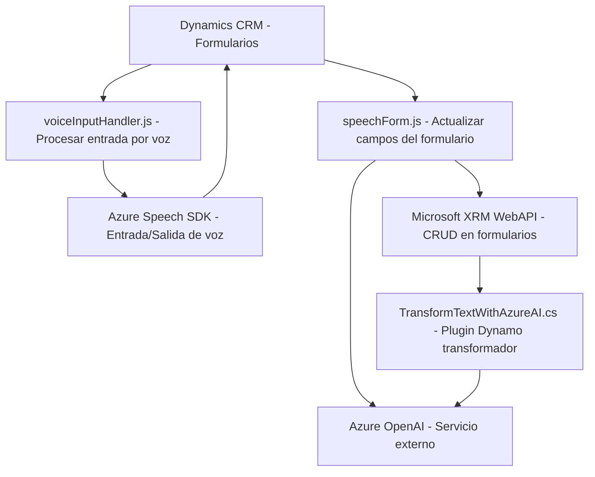

### Breve resumen técnico:
El proyecto parece estar orientado al desarrollo de funcionalidades extendidas para un sistema CRM Dynamics 365. Los archivos analizados implementan soluciones para integrar la capacidad de reconocimiento de voz y síntesis de texto a voz con la ayuda de Azure Speech SDK. Además, el plugin en C# utiliza Azure OpenAI para transformar datos textuales según reglas específicas. En conjunto, es una solución que combina frontend JavaScript con funcionalidades de backend CRM.

---

### Descripción de arquitectura:
1. **Arquitectura general**:
   - La solución se integra en Dynamics 365 como un conjunto de extensiones que ejecutan funcionalidades personalizadas para gestionar formularios, ingreso de datos y procesamiento automatizado mediante texto y voz.
   - Combina aspectos de una arquitectura de **n capas**, en la que se destacan:
     - **Capa de presentación**: Representada por las interfaces de formularios CRM que los usuarios interactúan con los scripts de frontend (como `speechForm.js` y `voiceInputHandler.js`).
     - **Capa de lógica de negocio**: Implementada dentro de plugins como `TransformTextWithAzureAI.cs`, que contienen la lógica principal de las extensiones del sistema.
     - **Capa de integración**: utiliza servicios externos como Azure Speech SDK y Azure OpenAI.

2. **Patrones arquitectónicos**:
   - **Cliente-servidor**: Interacción entre el navegador y los servicios de Azure Speech y OpenAI en el backend.
   - **Plugin architecture**: En Dynamics CRM, los plugins extienden la funcionalidad base del sistema. Uno de los archivos muestra un típico plugin que ejecuta lógica desencadenada por eventos internos.
   - **Event-driven programming**: En los scripts JavaScript se utiliza un enfoque basado en eventos (como el inicio de entrada de voz o actualización de campos).
   - **Integración con servicios externos**: Mediante REST APIs, se comunica con el Azure OpenAI y el Speech SDK.

---

### Tecnologías usadas:
1. **Plataforma/Entorno**:
   - **Dynamics 365 Microsoft CRM**: Aquí opera todo el proyecto (contexto del formulario, APIs de Dynamics).
2. **Frontend**:
   - **JavaScript**: Para manejar eventos, trabajar con formularios dinámicos y cargar el SDK de Azure Speech.
   - **Azure Speech SDK**: Para síntesis de texto a voz y reconocimiento de voz.
3. **Backend**:
   - **C# (.NET Framework)**: Desarrollo del plugin para integración con Azure OpenAI.
   - **Azure OpenAI Service**: Para transformación de texto según reglas predefinidas.
   - **Microsoft XRM SDK**: Para interactuar con el modelo de datos del CRM (entidades, formularios, y APIs).
4. **Dependencias adicionales**:
   - **REST APIs**: Para el consumo de servicios como Azure OpenAI y Speech SDK.
   - **Newtonsoft.Json** y **System.Text.Json**: Bibliotecas de manejo JSON en C#.

---

### Diagrama Mermaid:
El diagrama describe las interacciones entre las capas y los componentes del proyecto.

---

### Conclusión final:
La solución representa una combinación de varias tecnologías que permiten automatizar la interacción entre usuarios y herramientas de CRM mediante reconocimiento de voz y AI basada en texto. Está pensada para mejorar la experiencia del usuario en formularios dinámicos, agregando funcionalidad avanzada con el uso de Azure Speech SDK y OpenAI. La arquitectura de n capas y la integración con servicios externos asegura modularidad y escalabilidad dentro de un entorno sofisticado como Microsoft Dynamics. 