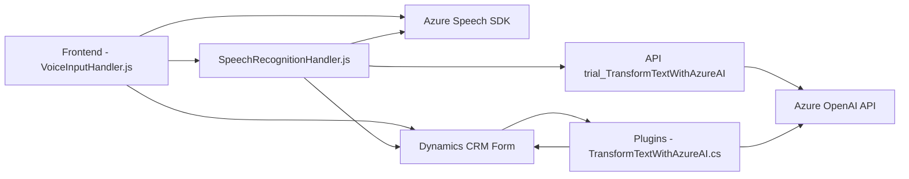

### Breve resumen técnico:  
Este repositorio implementa una solución centrada en la interacción de voz y procesamiento natural de lenguaje mediante servicios de Azure y su integración profunda con Microsoft Dynamics CRM. Compuesto por tres elementos principales:  
- **Frontend (JavaScript)**: Módulos para interacción con formularios mediante voz (entrada y síntesis).  
- **Plugin (C#)**: Extensión en Dynamics CRM para transformar texto con Azure OpenAI.  
- **Azure Services**: Uso del Azure Speech SDK y Azure OpenAI API.  

---

### Descripción de arquitectura:  
La solución sigue una **arquitectura de cliente-servidor** basada en interacción con servicios externos. La parte cliente (JavaScript) implementa funcionalidades de reconocimiento y síntesis de voz, y el servidor (Dynamics CRM y plugins) centraliza la lógica pesada de procesamiento utilizando un modelo basado en **event-driven architecture** (plugins de CRM).  

- **Arquitectura por capas funcionales**: El frontend maneja la interacción y delega al backend el manejo de datos y reglas mediante APIs estándar.  
- **External API Integration**: Múltiples puntos de integración con APIs externas como Azure Speech SDK y Azure OpenAI.  
- **Modularidad**: Funcionalidades independientes en el cliente y el plugin.  

---

### Tecnologías usadas:  
1. **Frontend**:  
   - **JavaScript**: Herramienta principal para la interacción de cliente.  
   - **Azure Speech SDK (https://aka.ms/csspeech/jsbrowserpackageraw)**: API para reconocimiento y síntesis de voz.  
   - **Dynamics CRM SDK**: Para acceso a datos del formulario y su manipulación.  

2. **Backend**:  
   - **C# (.NET Framework)**: Para desarrollar plugins en Dynamics.  
   - **Azure OpenAI API**: Para procesamiento avanzado de lenguaje natural.  
   - **Microsoft.Xrm.Sdk**: Framework de desarrollo para integración con Dynamics CRM.  
   - **Newtonsoft.Json**: Manejo de datos JSON.  

---

### Diagrama Mermaid válido para GitHub:  

---

### Conclusión final:  
Este repositorio constituye una solución robusta de integración entre usuarios que interactúan por voz y su procesamiento en Microsoft Dynamics CRM utilizando servicios avanzados de Azure. La arquitectura asegura modularidad, soporte para servicios externos y extensibilidad mediante la correcta implementación de plugins en CRM. Pese a su alta funcionalidad, sería ideal considerar mejoras en la gestión de claves API, como la utilización de variables de ambiente y servicios de administración segura de secretos.