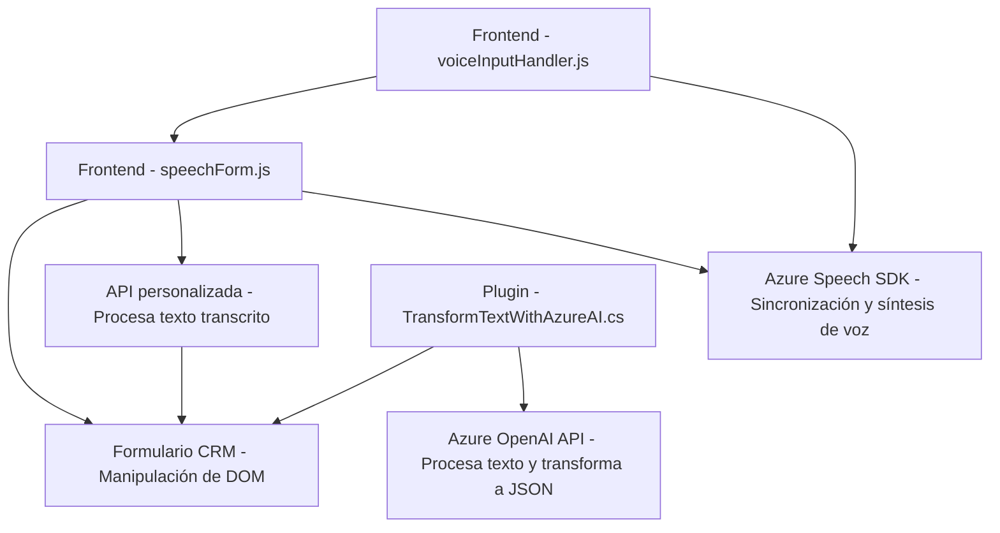

### Breve resumen técnico:
El repositorio que has compartido parece estar relacionado específicamente con una solución que integra capacidades de voz y procesamiento de texto para formularios dentro de una plataforma CRM basada en Dynamics 365. Consta de tres principales componentes:

1. **Frontend**: JavaScript archivos (`voiceInputHandler.js`, `speechForm.js`) encargados de manejar la entrada y salida de voz mediante el uso del SDK de Azure Speech, interactuando con los formularios.
2. **Backend Plugin**: `.NET` clase (`TransformTextWithAzureAI.cs`) diseñada como un plugin de Dynamics CRM que utiliza la API de Azure OpenAI para transformar texto en formato JSON estructurado.
3. **Dependencies from External Services**: servicios en la nube de Azure (Speech y OpenAI).

---

### Descripción de arquitectura:
La arquitectura general a nivel del sistema combina una arquitectura de **n capas** con elementos de **microservicios en la nube**. Los archivos del frontend corresponden a la capa de presentación (Frontend), mientras que el plugin funciona como parte de la capa de lógica de negocio del CRM al interactuar con servicios externos. Adicionalmente, las llamadas a APIs externas para la síntesis de voz con Azure Speech y el procesamiento de texto estructurado mediante Azure OpenAI posicionan esta solución como una arquitectura distribuida que opera con servicios en la nube.

---

### Tecnologías usadas:
1. **Frontend**:
   - Lenguaje: JavaScript.
   - SDK: Azure Speech SDK cargado dinámicamente desde las URLs proporcionadas.
   - Manipulación de DOM: Interacción con formularios CRM para obtener datos visibles y asignar valores.
2. **Backend Plugin**:
   - Lenguaje: C# (.NET Framework).
   - Framework: Dynamics CRM SDK (aplicación estilo Plugin Pattern con `IPlugin`).
   - API: Azure OpenAI para estructura de texto en JSON.
   - Librerías: `System.Net.Http`, `System.Text.Json`, `Newtonsoft.Json.Linq`.
3. **Servicios Externos**:
   - **Azure Speech SDK**: Reconocimiento y síntesis de voz.
   - **Azure OpenAI API**: Procesamiento avanzado de texto.
4. **Patrones de Diseño**:
   - **Facade para integración SDK**: Abstracta la interacción con SDKs (Speech y APIs internas).
   - **Plugin Pattern** (para Dynamics CRM).
   - Modularidad: Separación de responsabilidades en funciones y clases.

---

### Diagrama **Mermaid** válido para GitHub Markdown:

---

### Conclusión Final:
El repositorio implementa una solución híbrida centrada en la interacción con formularios de Dynamics CRM, mediante capacidades avanzadas de síntesis y reconocimiento de voz, junto con procesamiento inteligente de texto en la nube. Combina arquitecturas de **n capas** y **servicios distribuidos**, teniendo una buena separación modular en funciones específicas y aprovechando servicios de Azure (Speech y OpenAI) para potenciar la funcionalidad del sistema. Es una solución adecuada para escenarios empresariales que requieren accesibilidad mediante voz y procesamiento avanzado de información textual.