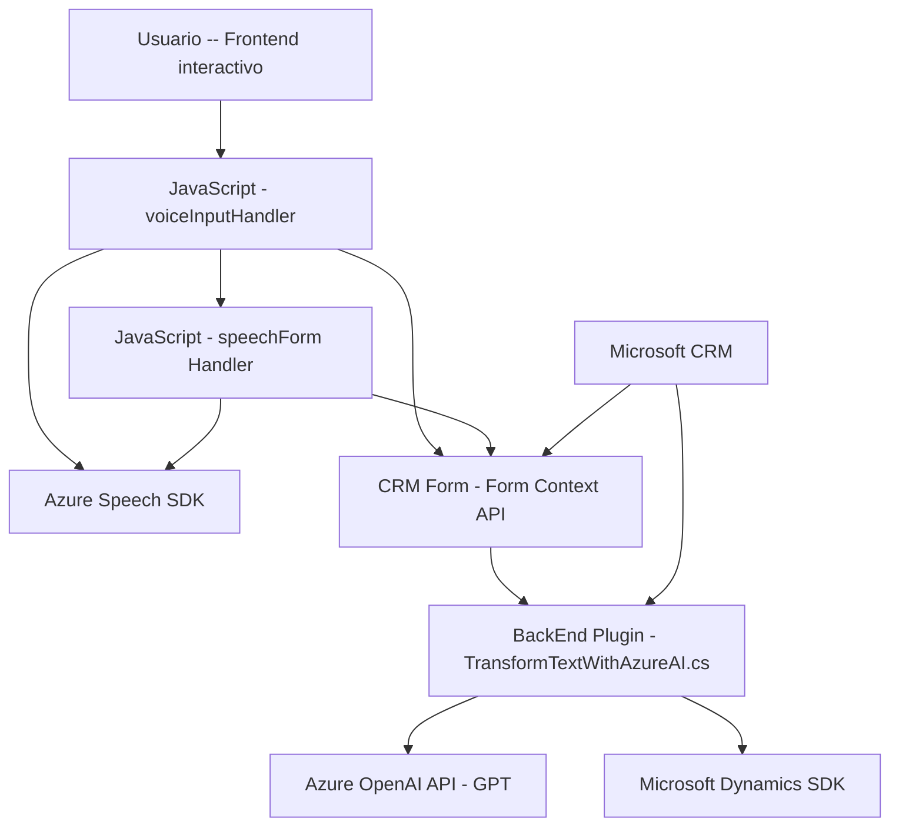

### Breve resumen técnico
El repositorio parece ser una solución híbrida diseñada para integrar funcionalidades avanzadas de entrada de voz y procesamiento de texto mediante servicios especializados en Microsoft Dynamics CRM. La solución cuenta con una mezcla de componentes frontend desarrollados en JavaScript y una integración backend con un plugin en C# que utiliza el SDK de Microsoft Dynamics y consume Azure OpenAI para el procesamiento de texto.

---

### Descripción de arquitectura

#### Tipo de solución
La solución puede clasificarse como **API y frontend modular**, dedicada a integrar servicios externos como el **Azure Speech SDK** para síntesis y reconocimiento de voz, así como una integración con la **Azure OpenAI API** en el backend para procesamiento inteligente de texto.

#### Tipo de arquitectura
1. **Frontend**: Modular y parcialmente construida sobre un patrón basado en componentes funcionales para capturar y procesar datos desde el contexto del CRM/Dynamics 365.
2. **Backend**: Arquitectura de **plugins** de Dynamics CRM que emplea un enfoque de **event-driven architecture** combinado con llamadas remotas (RPC) para procesar datos en tiempo de ejecución.
3. **Global architecture**: Aplicación híbrida, alineada con el paradigma de **sistemas distribuidos** donde diferentes servicios colaboran mediante comunicación API para prestar funciones específicas (voz, texto).

---

### Tecnologías usadas
1. **Frontend (JavaScript):**
   - **Azure Speech SDK**:
     - Reconocimiento de voz y síntesis de texto.
     - Carga condicional del SDK a través de una URL (`https://aka.ms/csspeech/jsbrowserpackageraw`).
   - **Form Context API** (Dynamics 365):
     - Interacción con formularios empresariales en CRM.
   - Mapeo dinámico y transformación de datos visible en el formulario.

2. **Backend (C# Plugin):**
   - **Azure OpenAI**:
     - Procesamiento inteligente del texto ingresado mediante modelos de lenguaje GPT.
   - **Microsoft Dynamics SDK (`Microsoft.Xrm.Sdk`)**:
     - Integración con contextos de ejecución del plugin en Dynamics CRM.
   - **System.Net.Http**:
     - Para consumir servicios remotos mediante solicitudes HTTP.
   - **JSON Manipulation Libraries (Newtonsoft.Json & System.Text.Json)**:
     - Serialización y deserialización.

3. **Patrones aplicados**:
   - **Lazy Loading**: Condicional para cargar el SDK de Azure Speech.
   - **Modularización funcional**: Separación clara de responsabilidades en el frontend, con funciones dedicadas.
   - **Dependency Injection**: Uso de `IServiceProvider` en el plugin para resolución dinámica de dependencias.
   - **Event-driven architecture** (Plugins): Manejo de acciones a través del contexto del CRM y el evento desencadenador.
   - **Integration with external services**: Interacción vía HTTP con servicios externos como Azure OpenAI.

---

### Dependencias o componentes externos
- **Azure Speech SDK**: Procesamiento de voz (reconocimiento y síntesis).
- **Azure OpenAI API**: Procesamiento de texto basado en GPT-4 (OpenAI en Azure).
- **Microsoft Dynamics SDK**: Para crear extensiones (plugins) en un entorno CRM.
- **Form APIs**: Funcionalidades de CRM como lectura y mapeo de campos visibles.
- **Newtonsoft.Json/System.Text.Json**: Estándares ampliamente usados para manejar datos JSON.
- **System.Net.Http**: Biblioteca esencial para invocar APIs externas.

---

### Diagrama Mermaid

---

### Conclusión final
La solución presentada combina funcionalidades avanzadas de entrada de voz y procesamiento de texto utilizando tecnología de Microsoft Azure y Dynamics CRM. En el frontend, las funciones están orientadas a modularidad, aprovechando frameworks como Azure Speech SDK y APIs de formularios CRM. El backend utiliza una arquitectura basada en plugins, donde se ejecuta lógica en el ciclo de vida de eventos de Dynamics CRM, complementada con servicios externos como **Azure OpenAI**.

El diseño global es adecuado para sistemas empresariales centrados en la automatización de datos y representa un ejemplo práctico de cómo mezclar tecnologías de **SaaS** y arquitecturas distribuidas para cumplir necesidades específicas.