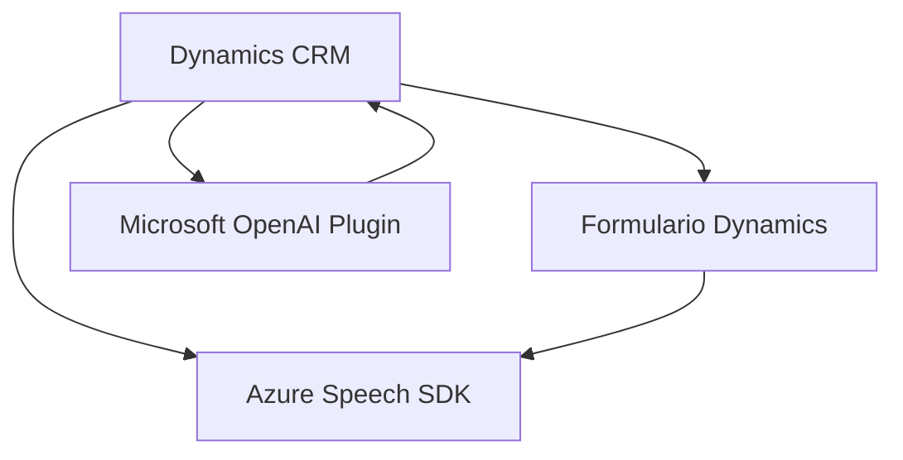

### Breve resumen técnico
Este repositorio contiene módulos implementados en JavaScript y C# para integrar Microsoft Dynamics CRM con servicios avanzados de inteligencia artificial de Microsoft Azure, incluyendo Azure Speech SDK y Azure OpenAI. Las soluciones proporcionadas se orientan a la interacción mediante voz, el reconocimiento de habla y la transformación de texto mediante inteligencia artificial.

---

### Descripción de arquitectura
La implementación emplea una arquitectura híbrida:
1. **Multicapa:**
   - En el frontend, los archivos JavaScript están organizados para separar las responsabilidades de interacción con el usuario, procesamiento de datos y comunicación con servicios externos (e.g., Azure Speech SDK y APIs personalizadas).
   - En el backend, los procesos están encapsulados en plugins para Dynamics CRM, siguiendo el patrón típico de **Plugin-based Architecture**.

2. **Service-Oriented Architecture (SOA):**
   - Se utiliza Azure OpenAI y Azure Speech SDK como servicios externos bajo modelos desacoplados.
   - La interacción con servicios externos como Dynamics API y Azure AI está basada en protocolos estándar (REST API).

---

### Tecnologías usadas
1. **Frontend (JavaScript):**
   - Azure Speech SDK para síntesis y transcripción de voz.
   - Interacciones con formularios y eventos de Dynamics CRM (integración con `executionContext`).
   - Asynchronous programming con `async/await` para manejo de operaciones como llamadas a APIs externas.

2. **Backend (C#):**
   - Plugin estándar de Dynamics CRM utilizando la interfaz `IPlugin`.
   - **Azure OpenAI** para transformación del texto implementado mediante solicitudes HTTP y manejo de JSON.
   - Uso de librerías como `Newtonsoft.Json` y `System.Net.Http` para el procesamiento y comunicación con servicios externos.

---

### Diagrama Mermaid válido para GitHub

---

### Conclusión final
El repositorio presenta una solución para integrar servicios de inteligencia artificial y reconocimiento de voz en Microsoft Dynamics CRM, utilizando códigos modularizados y desacoplados combinados con arquitecturas multicapa y SOA. Las tecnologías (Javascript y C#) permiten tanto interacciones dinámicas en el frontend como un procesamiento avanzado de datos en el backend, destacándose el uso de SDKs y APIs de Azure que proporcionan capacidades de síntesis de voz y transformación de lenguaje natural mediante AI.