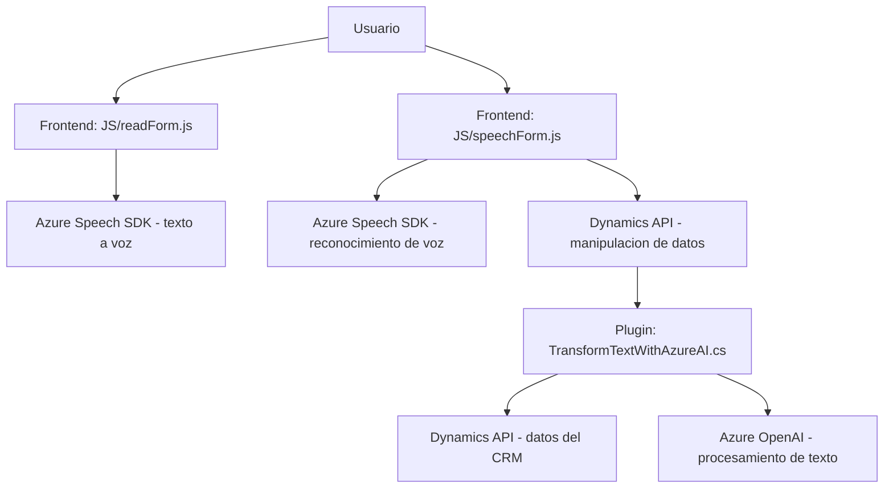

### Breve resumen técnico

La estructura del repositorio muestra una solución orientada a la interacción de voz y texto para formularios en una plataforma integrada con Azure. Principalmente, se observan tres tipos de componentes:
- Archivos JavaScript (*frontend*) que implementan funciones relacionadas con el reconocimiento de voz y síntesis en formularios.
- Un archivo C# que define un plugin para extender Microsoft Dynamics CRM utilizando Azure OpenAI para el procesamiento de lenguaje natural.

### Descripción de arquitectura

La solución parece seguir una arquitectura híbrida con las siguientes características:
1. **N-capas**: Se divide en una capa de presentación (scripts en JavaScript para interacción con formularios y usuarios) y una capa de lógica de negocio (plug-in en C# que maneja solicitudes a Azure OpenAI y Dynamics CRM).
2. **Integración con servicios externos**: La solución está estrechamente vinculada al ecosistema de Microsoft Azure, utilizando el Speech SDK y OpenAI para realizar reconocimiento y síntesis de voz, así como generación de texto.
3. **Event-driven architecture**: Los módulos JavaScript parecen responder a eventos del interfaz de usuario o del navegador (como al iniciar una acción por voz). El plugin también responde a eventos de ejecución dentro de Dynamics CRM.

La comunicación entre las capas se realiza mediante APIs y dependencias de Dynamics CRM como `Microsoft.Xrm.Sdk` y `Xrm.WebApi.online`.

### Tecnologías usadas
1. **Frontend (JavaScript)**
   - **Azure Cognitive Services, Speech SDK**: Para reconocimiento de voz y síntesis de texto en voz.
   - **JavaScript**: Para la interactividad y procesamiento de formularios.
   - **Dynamics 365 (Form Context API)**: Para interactuar con los datos de los formularios en la plataforma de CRM.
2. **Backend (C# Plugin)**
   - **Microsoft Dynamics CRM SDK**: Para extender la funcionalidad de CRM con plugins.
   - **Azure OpenAI**: Para transformación avanzada de texto y generación de contenido estructurado.
   - **HTTP Client**: Para consumir APIs externas.
   - **Newtonsoft.Json**: Manejo de JSON.

### Componentes externos y dependencias
1. **Azure Speech SDK**: Utilizado para síntesis y reconocimiento de voz.
2. **Azure OpenAI API**: Servicio externo para procesamiento de lenguaje natural.
3. **Microsoft Dynamics CRM SDK**: Framework para extensibilidad en CRM.
4. **Newtonsoft.Json y System.Text.Json**: Bibliotecas para trabajar con JSON.
5. **Xrm.WebApi.online**: API interna de Dynamics 365 para realizar llamadas relacionadas con datos del CRM.

---

### Diagrama Mermaid

---

### Conclusión final
Este repositorio implementa una solución orientada a la interacción por voz y generación de texto para formularios conectados a un CRM basado en Dynamics 365. Utiliza componentes frontend en JavaScript para la interfaz de usuario y un plugin en C# para extender la lógica de negocio en el backend. La solución aprovecha servicios externos como Azure Cognitive Services para síntesis y reconocimiento de voz, y Azure OpenAI para transformar texto según reglas específicas. La arquitectura sigue un modelo híbrido, con una capa de presentación (frontend) y una capa de negocio (backend), integrando APIs y servicios externos mediante dependencias dinámicas y altamente configurables.