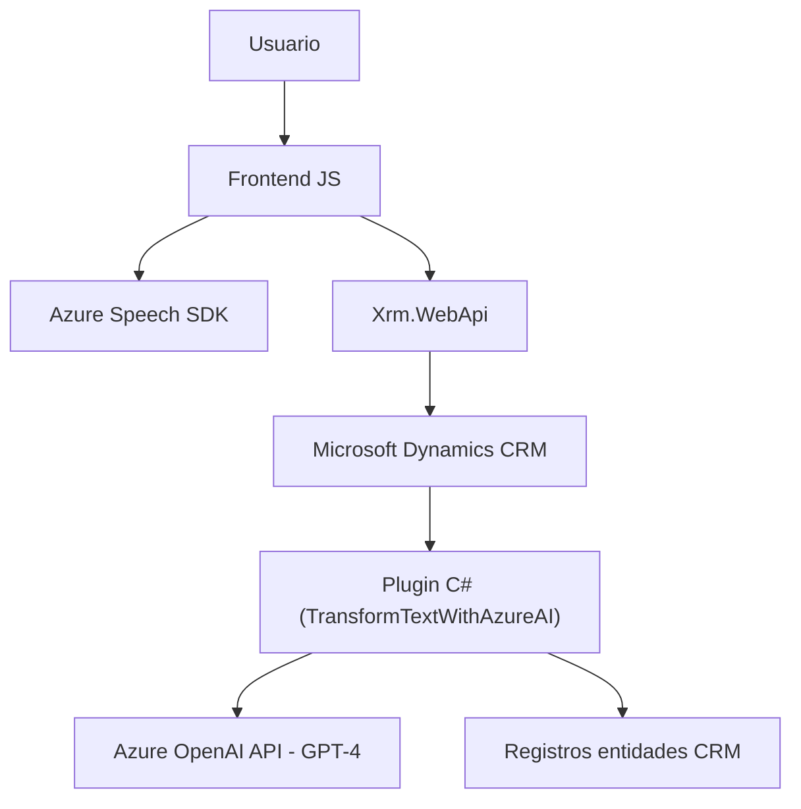

### Breve resumen técnico

El repositorio implementa una solución orientada a procesamiento de voz y texto integrando múltiples tecnologías, especialmente centrada en accesibilidad y automatización dentro de un entorno de Microsoft Dynamics CRM. Su principal enfoque reside en:
- Procesamiento de voz y síntesis de audio con **Azure Speech SDK**.
- Manipulación de datos visuales en formularios dinámicos de CRM.
- Integración con **Azure OpenAI API** para transformar texto con IA.

La solución combina un front-end preparado para interacción con voz (modularizado en JavaScript) y un plugin en C# especializado en procesamiento avanzado con OpenAI.

---

### Descripción de arquitectura

La arquitectura es híbrida con dos componentes principales:
1. **Frontend**, basado en JavaScript: Facilita la interacción directa con el usuario mediante voz para completar formularios y procesar entradas.
2. **Backend/plugin**, implementado en C# y ejecutado en Microsoft Dynamics CRM: Transformación avanzada de texto con Azure OpenAI.

El diseño general puede clasificarse como arquitectura de **n capas**:
- **Capa de presentación:** Funcionalidades basadas en JS (frontend).
- **Capa de aplicación:** Plugin en C# integrado con Dynamics CRM.
- **Capa de servicios externos:** Dependencias a Azure Speech SDK y Azure OpenAI API.

---

### Tecnologías utilizadas
1. **Frontend:**
   - **JavaScript** (modular): Integración con Azure Speech SDK.
   - **Xrm.WebApi:** Manipulación de datos en Microsoft Dynamics CRM.
   - Comunicación asíncrona vía APIs.
2. **Backend/Plugins:**
   - **C#**: Desarrollo del plugin para Dynamics CRM.
   - **Microsoft.Xrm.Sdk**: Framework para desarrollo de complementos en Dynamics CRM.
   - **Azure OpenAI API**: Para procesamiento de texto mediante IA.
3. **Servicios externos:** 
   - **Azure Speech SDK**: Para reconocimiento y síntesis de voz.
   - **Azure OpenAI API**: Procesamiento inteligente de texto.

---

### Dependencias o componentes externos presentes
1. **Azure Speech SDK:** Para síntesis de voz y reconocimiento.
2. **Azure OpenAI API:** Transformación avanzada de texto usando inteligencia artificial.
3. **Microsoft Dynamics CRM framework:** Para integración con registros y entidades del sistema.
4. **Custom API**: Lógica personalizada en Dynamics CRM (`trial_TransformTextWithAzureAI`).
5. **JavaScript runtime:** Entrega dinámica mediante interacción con navegador.
6. **HttpClient (C#):** Realización de llamadas al servicio de OpenAI.

---

### Diagrama Mermaid válido para GitHub

---

### Conclusión final
El proyecto construye una solución de acceso mejorada para usuarios mediante voz e inteligencia artificial en Microsoft Dynamics CRM. Aunque la arquitectura sigue el patrón clásico de **n capas**, se beneficia de integración con servicios de nube externos (Azure Speech y OpenAI) para enriquecer la experiencia. Es una implementación modular y extensible, con áreas claras para mejoras de seguridad, como la gestión de claves y credenciales.