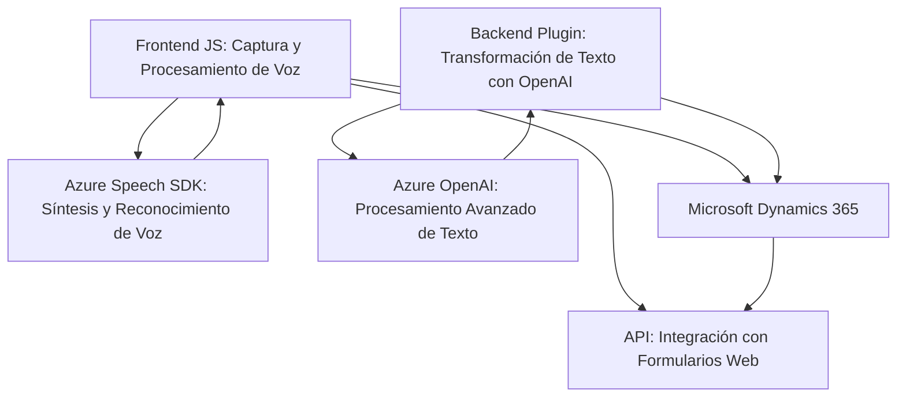

### Breve resumen técnico

El repositorio parece contener una solución que integra servicios de voz y procesamiento de lenguaje natural con formularios web interactivos y Microsoft Dynamics 365. Se basa en el Azure Speech SDK para reconocimiento y síntesis de voz, así como en Azure OpenAI para procesamiento avanzado de texto. La solución incluye archivos para el frontend en JavaScript y un backend en C#, con integración directa al API de Dynamics CRM.

---

### Descripción de la arquitectura

1. **Arquitectura general**: La solución tiene una arquitectura de integración multiplataforma entre el frontend en JavaScript y el backend que utiliza plugins en C#. Parece combinar elementos de una arquitectura en capas (con frontend y backend diferenciados) junto con un enfoque modular en ambos lados para tareas específicas.
2. **Componentes principales**:
   - **Frontend (modular, funciones específicas)**: Implementa captura de voz, síntesis de voz, y manipulación dinámica de formularios web con Azure Speech SDK.
   - **Backend (plugin-based)**: Extiende Dynamics CRM mediante plugins que integran Azure OpenAI para transformar texto según reglas específicas.
3. **Patrones identificados**:
   - **Integración con APIs externas**: Uso de Azure Speech SDK y Azure OpenAI para funcionalidades críticas.
   - **Controladores dinámicos** (frontend): Manipulación de datos de formularios a través de funciones que procesan valores dependientes de un contexto.
   - **Plugin en CRM** (backend): Uso del patrón plugin para extender capacidades de Dynamics 365 con lógica basada en IA.

---

### Tecnologías usadas

1. **Frontend**:
   - **JavaScript**: Lenguaje principal para el procesamiento de formularios y síntesis de voz.
   - **Azure Speech SDK**: Usado para reconocimiento y síntesis de voz.
   - **Dynamics 365 Web API**: Integración directa para manipulación dinámica de formularios.

2. **Backend**:
   - **C#**: Lenguaje utilizado para implementar plugins de Dynamics CRM.
   - **Azure OpenAI**: Usado para generar transformaciones de texto basadas en IA.
   - **Microsoft Dynamics CRM SDK**: SDK oficial para interacción con el contexto y datos del CRM.

3. **Dependencias externas**:
   - **System.Net.Http**: Para realizar solicitudes HTTP al servicio Azure OpenAI.
   - **System.Text.Json y Newtonsoft.Json**: Para serialización/deserialización de datos JSON.
   - **Xrm.WebApi**: Para interactuar con Dynamics CRM.

---

### Diagrama Mermaid (válido para GitHub Markdown)

---

### Conclusión final

La solución del repositorio tiene una integración bien orquestada entre frontend, backend y servicios externos, enfocándose en manipulación dinámica y procesamiento avanzado de datos de formularios en entornos de Dynamics CRM. Utiliza servicios de Azure (Speech SDK y OpenAI) como pilares tecnológicos clave para habilitar reconocimiento de voz, síntesis y transformación de texto. La arquitectura combina modularidad con patrones de integración API, lo que permite escalar la funcionalidad y adaptarse a requisitos empresariales más amplios.