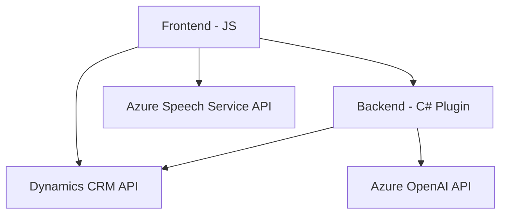

### Breve Resumen Técnico
El repositorio parece estar diseñado para gestionar formularios de Dynamics CRM con capacidades avanzadas de entrada y salida de voz (integración con **Azure Speech SDK**) y transformación de texto mediante **Azure OpenAI**. Utiliza un enfoque modular y combina procesamiento en el cliente y en el servidor mediante plugins en C# para extender las funcionalidades del entorno CRM.

---

### Descripción de Arquitectura
El diseño general del proyecto tiene las siguientes características clave:
1. **Arquitectura híbrida**:
   - **Frontend** (arquitectura modular basada en JavaScript) para la interacción directa del usuario mediante voz.
   - **Backend** (arquitectura basada en plugins y comunicación con APIs remotas) para ejecutar tareas complejas como transformación de texto con IA.
2. **Integración de servicios externos**:
   - El núcleo de la funcionalidad del proyecto reside en la integración con **Azure Speech SDK** para entrada de voz y síntesis de audio, así como **Azure OpenAI** para procesar y transformar datos de texto.
3. **Patrones de diseño comunes**:
   - Modularización y separación de responsabilidades para funciones individuales.
   - Carga dinámica de dependencias para optimizar el desempeño.
   - Uso de un plugin específico en Dynamics CRM para operaciones del lado del servidor.

Dado esto, se puede concluir que la solución sigue una **arquitectura desacoplada** uniendo un frontend netamente modular con un backend basado en plugins, mientras aprovecha una **estructura n-capas** en Dynamics CRM (cliente-servidor).

---

### Tecnologías Usadas
1. **Frontend**:
   - **JavaScript** como lenguaje principal.
   - **Azure Speech SDK** para interacción por voz.
   - Utilización de **DOM dinámico** para carga de scripts.

2. **Backend**:
   - **C# (.NET Framework)** para desarrollar el plugin del lado del servidor.
   - **Microsoft Dynamics CRM SDK** para interacción con entornos CRM.
   - **Azure OpenAI API** con modelos GPT como núcleo de procesamiento textual.
   - **JSON serialization** (usando libraries como Newtonsoft.Json y System.Text.Json).

3. **APIs externas y servicios**:
   - **Azure Speech Service API** para reconocimiento y síntesis de voz.
   - **Azure OpenAI text transformation API** para analizar y estructurar texto.

---

### Diagrama Mermaid

---

### Conclusión Final
La solución representa una integración avanzada de tecnologías para facilitar la interacción de usuarios con formularios en un entorno empresarial como Dynamics CRM. Combina la modularidad del frontend con la extensibilidad del backend en una configuración n-capas. El código incluye buenas prácticas de modularización, pero puede beneficiarse de técnicas más avanzadas de seguridad, como la gestión de secretos.