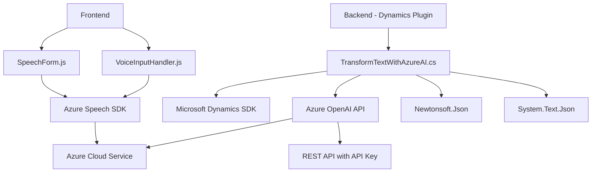

### Breve resumen técnico:
El repositorio parece estar orientado a la integración de una solución CRM (Dynamics 365) con características avanzadas como reconocimiento de voz (mediante el Azure Speech SDK) y procesamiento semántico de texto mediante inteligencia artificial (Azure OpenAI API). El sistema incluye archivos orientados a extender formularios frontend del CRM, así como un plugin para procesar texto dinámico y estructurado en la parte backend.

### Descripción de arquitectura:
La solución se basa en una **arquitectura de "n capas distribuida" híbrida** que integra:
1. Una capa **frontend** basada en JavaScript, que interactúa con formularios en la interfaz de Dynamics 365.
2. Una capa de **lógica empresarial** representada por un plugin en C# que implementa la interfaz de Dynamics CRM `IPlugin`. 
3. **Servicios externos** que añaden capacidades enriquecidas:
   - **Azure Speech SDK** para convertir texto en voz o voz en texto en el frontend.
   - **Azure OpenAI** en el backend para mejorar la transformación semántica de datos.

La principal interacción ocurre dentro de la plataforma de Dynamics CRM, lo que hace que la solución se asocie a principios de **arquitectura dirigida por eventos (EDA)** debido al uso de plugins y la respuesta en contextos específicos de ejecución.

### Tecnologías usadas:
1. **Frontend (JavaScript):**
   - **Azure Speech SDK**: Procesamiento de voz (texto a voz o viceversa).
   - **Dynamics CRM Javascript APIs**: Manejo de formularios, datos y eventos (`Xrm.WebApi`, `executionContext`).
   
2. **Backend (C#, Dynamics 365 plugin):**
   - **Microsoft Xrm SDK**: Interacción con el entorno de Dynamics 365.
   - **Newtonsoft.Json** y `System.Text.Json`: Manipulación avanzada de datos JSON.
   - **HttpClient** para comunicaciones con Azure OpenAI API.
   - **Azure OpenAI API**: Inteligencia artificial para transformar datos semánticos.

3. **Dependencias externas:**
   - **Azure Speech SDK** para procesamiento de voz.
   - **Azure OpenAI API** para inteligencia artificial y transformación de textos.
   - **RESTful APIs** (ej. Custom APIs de Dynamics CRM e integración con servicios Azure).

### Diagrama Mermaid

### Conclusión final:
Este repositorio implementa una solución que complementa la plataforma Dynamics CRM añadiendo capacidades avanzadas de síntesis y análisis de voz y texto mediante servicios de Azure. Destaca por su modularidad, el uso adecuado de las APIs externas y la integración funcional en un entorno empresarial. Aunque la arquitectura cumple con los requisitos de orientación a servicios y extensibilidad, podría beneficiarse de una optimización en la separación de capas para una mayor claridad entre la lógica del negocio, la interfaz y los servicios externos. Su potencial reside en ampliar las capacidades del CRM aprovechando herramientas modernas de computación en la nube y machine learning.