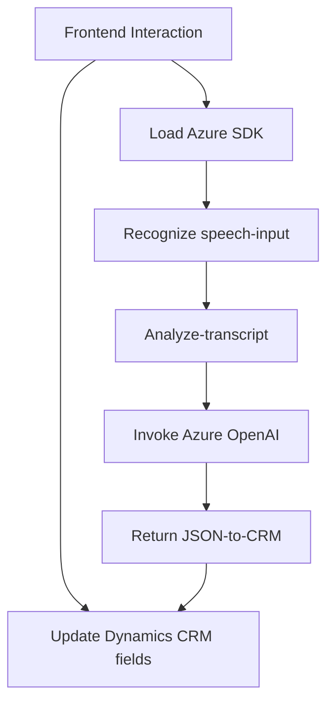

### Breve resumen técnico
Este repositorio contiene archivo de frontend en JavaScript y un plugin en C# para Dynamics CRM que implementan funcionalidades relacionadas con interacción de voz y enriquecimiento de texto. Utilizan Azure Cognitive Speech SDK y Azure OpenAI API para síntesis de voz, reconocimiento de habla y transformación de texto en objetos JSON estructurados. La solución está diseñada para proporcionar interacción avanzada con formularios CRM mediante comandos de voz y enriquecimiento basado en inteligencia artificial.

---

### Descripción de arquitectura
1. **Tipo de solución**: La solución combina elementos de frontend para interacción con el usuario (voz y texto) y componentes backend como plugins en Dynamics CRM. Se enfoca en mejorar la accesibilidad mediante voz y datos estructurados.
2. **Arquitectura**: N-capas híbrida con integración de microservicios:
   - **Frontend**: Modular y Event-Driven, operando como una capa de presentación interactiva.
   - **Backend**: Plugins en Dynamics CRM cumplen con una arquitectura basada en microservicios al delegar la lógica a servicios de Azure OpenAI.
   - **Integración de API Externa**: Componentes frontend y backend interactúan con servicios de Azure para síntesis de voz y datos de IA.

---

### Tecnologías usadas
1. **Frontend**:
   - JavaScript ES6.
   - **Azure Cognitive Speech SDK** (Carga dinámica mediante URLs específicas de Microsoft).
   - Dynamics CRM API (`Xrm.WebApi`).
2. **Backend**:
   - C# (.NET Framework para Dynamics CRM).
   - HTTP Client (`System.Net.Http`).
   - Azure OpenAI API.
   - Utility libraries como `System.Text.Json`, `Newtonsoft.Json.Linq`.
3. **Patrones arquitectónicos**:
   - **Event-driven Design**: En frontend mediante callbacks y eventos para la carga de SDKs y ejecución de lógica de voz.
   - **Proxy HTTP**: Uso de API externas para lógica avanzada.
   - **Adapter Pattern**: Traducir datos de voz en procesos reconocibles por formularios de Dynamics CRM.
   - **Component-Based Design**: Separación explícita entre extracción, síntesis y actualización de datos en funciones y clases.

---

### Dependencias o componentes externos
1. **Microsoft Azure Speech SDK**: Entrenamiento de modelos y síntesis de voz.
2. **Dynamics CRM API**: Contexto y acceso a datos en formularios.
3. **Azure OpenAI API**: Enriquecimiento y transformación avanzada de texto.
4. Librerías para manipulación HTTP y JSON:
   - `Newtonsoft.Json.Linq`.
   - `System.Text.Json`.
5. **External lookup services**: API personalizada dentro de Dynamics CRM para búsqueda de registros relacionados.

---

### Diagrama Mermaid

---

### Conclusión final
La solución refleja una integración moderna para una experiencia enriquecida en la gestión de datos en Dynamics CRM. Combina tecnologías avanzadas como IA y servicios de nube para proporcionar acceso mediante voz y transformar entradas en estructuras inteligentes. La arquitectura híbrida de N-capas con microservicios externos de Azure es flexible, escalable y centrada en la accesibilidad del usuario final.