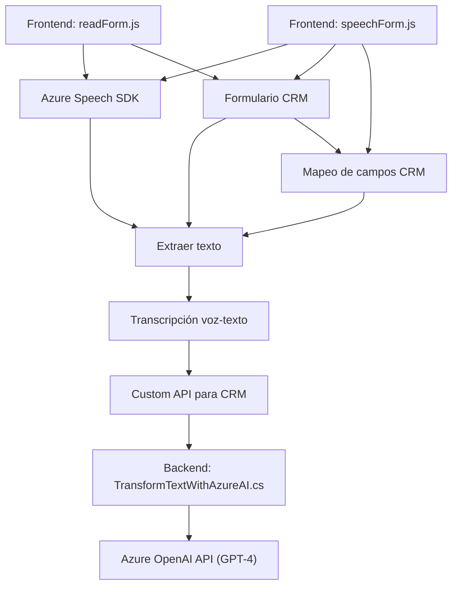

### Breve resumen técnico

El repositorio contiene tres archivos (`readForm.js`, `speechForm.js`, `TransformTextWithAzureAI.cs`) que implementan soluciones para integrar capacidades de conversación por voz y procesamiento de texto en un entorno Dynamics CRM mediante el uso de **Microsoft Azure SDKs** y servicios **Azure OpenAI**. Los archivos adoptan un enfoque modular y estructurado hacia la interacción entre interfaces de usuario, recogida y procesamiento de datos formales, reconocimiento de voz, y mapeo a campos predefinidos.

### Descripción de arquitectura

1. **Arquitectura predominante**:
   - La aplicación tiene características de una **n-capas**, donde cada archivo realiza tareas específicas separadas del resto:
     - El frontend (`readForm.js` y `speechForm.js`) maneja la interfaz de usuario y la comunicación con SDKs basados en JavaScript.
     - El entorno del servidor (`TransformTextWithAzureAI.cs`) funciona como un plugin dentro del modelo **extensible** de Dynamics CRM, generando transformaciones con inteligencia artificial.
   - Las comunicaciones con el backend, basado en servicios distribuidos (Azure Speech/Azure OpenAI), también sugieren una aproximación híbrida con elementos de arquitectura de **microservicios**.

### Tecnologías usadas

1. **Frontend**:
   - Tecnología: **JavaScript**.
   - Frameworks/SDKs: **Azure Speech SDK** (procesos de síntesis de voz y transcripción de voz a texto).
   - CRM Cliente: **Microsoft Dynamics CRM SDK**.

2. **Backend**:
   - Tecnología: **C#**, .NET Framework/SDK específico para Dynamics CRM.
   - Integración AI: **Azure OpenAI API** (modelo GPT-4 para transformación de texto).

3. **Dependencia compartida**:
   - **REST API:** Comunicación dinámica utilizando endpoints (Azure Speech y Azure OpenAI).
   - JavaScript SDK de Azure Speech importado dinámicamente desde la URL oficial.

4. **Patrones observados**:
   - **Modularidad**: Cada archivo responde a un propósito único (lectura sintetizada, entrada de voz, transformación con Azure AI).
   - **Encapsulamiento**: Los SDKs y APIs están correctamente integrados con abstracción para manejo dinámico en CRM.
   - **CQS (Command Query Separation)**: El proceso incluye comandos (escrituras automatizadas en formularios CRM) y consultas (búsqueda de entidades y mapeo).
   - **SDK-Driven Development**: Extensa utilización de APIs y SDKs de Microsoft Azure.

### Dependencias o componentes externos presentes
- **Azure Speech SDK**:
  - Usado para síntesis de voz y transcripción.
  - Autenticación requerida (`azureKey` y `azureRegion`).

- **Azure OpenAI API**:
  - Permite invocación asociada a servicios GPT-4 para transformación de texto.

- **Dynamics CRM SDK**:
  - API de manipulación y extensibilidad específica del entorno Microsoft Dynamics CRM.

### Diagrama Mermaid

### Conclusión final

El sistema presenta una arquitectura híbrida, compuesta por elementos de n-capas y microservicios. Utiliza una integración efectiva entre Azure Speech, OpenAI y Dynamics CRM para proporcionar una solución completa de entrada, procesamiento y salida de datos. Los archivos están diseñados para garantizar un alto nivel de encapsulación y modularidad, permitiendo escalabilidad y extensibilidad en futuros desarrollos.