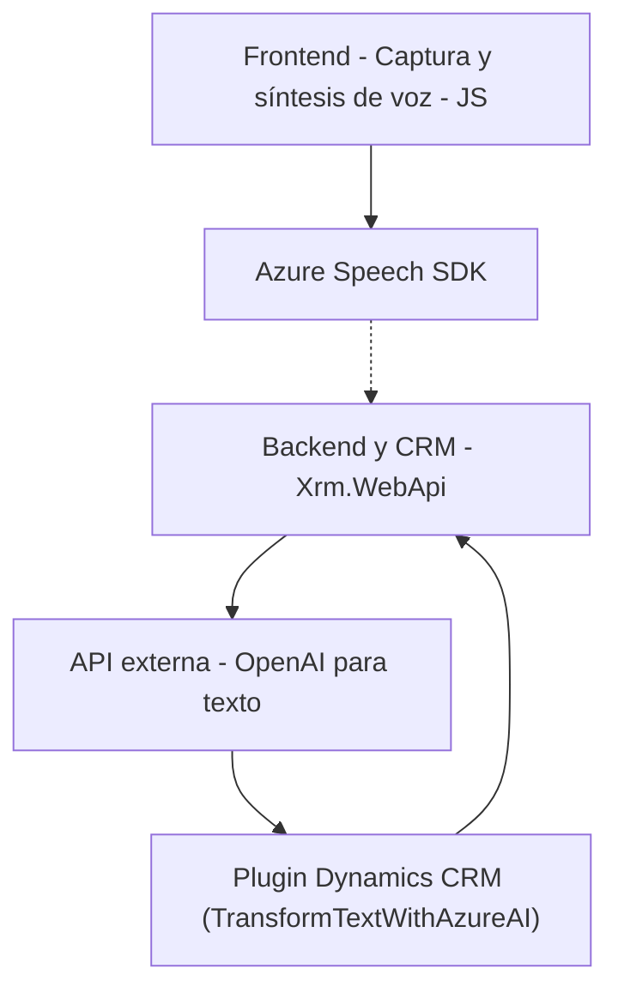

### Breve resumen técnico

El repositorio define la funcionalidad de reconocimiento y síntesis de voz en aplicaciones frontend y CRM utilizando el **Azure Speech SDK** y la API OpenAI de Azure. Incluye archivos para la captura de voz, transcripciones, actualizaciones automáticas en formularios, y un plugin que transforma texto basado en normas específicas con **Azure GPT-4**.

---

### Descripción de arquitectura

Esta solución tiene una arquitectura **híbrida con integración de capas**:
- **Frontend**:
  - Maneja captura y síntesis de voz utilizando **Azure Speech SDK**.
  - Emplea principios de modularización y separación de tareas en funciones independientes.
  - La lógica principal reside en la capa de integración que conecta el SDK de voz con funciones específicas para manipular formularios (CRM).
  
- **Backend**:
  - Plugin basado en **Dynamics CRM** y construido sobre el modelo **IPlugin** para extender funcionalidad con procesamiento de texto usando la API de OpenAI.
  - La arquitectura del plugin sigue el patrón de integración de servicios externos (cliente HTTP) y transformación de datos.

Por lo tanto, la arquitectura general puede describirse como **n capas orientada a plugins**, donde cada capa está diseñada para una tarea específica:
1. **Interfaz y lógica frontend** (captura y síntesis de voz).
2. **Lógica en CRM y backend** (transformaciones de texto, integración con API Azure).

---

### Tecnologías usadas

#### Frontend:
- **JavaScript**:
  - Funciones específicas para captura y síntesis de voz.
  - SDK externo: **Azure Speech SDK**.
- **Dynamics CRM API**:
  - Integrado vía `Xrm.WebApi`.

#### Backend/Plugins:
- **.NET Framework**:
  - Construcción de plugins usando la **Microsoft.Xrm.Sdk** (modelo de extensibilidad de Dynamics CRM).
  - Serialización de datos emplea `System.Text.Json`.
- **Azure OpenAI**:
  - Transformación de texto con **GPT-4**.
- **HTTP Client** (`System.Net.Http`):
  - Para realizar solicitudes a la API externa de Azure OpenAI.
- **Regular Expressions** (`System.Text.RegularExpressions`):
  - Referenciado aunque no utilizado en los ejemplos analizados.

#### Patrones observados:
- **Responsabilidad Única (SRP)**: Modularizan funciones para tareas específicas como síntesis, captura, búsqueda en formularios y transformación.
- **Event-driven**: Uso de eventos y callbacks para control de flujo (e.g., después de cargar el SDK de Azure).
- **Client API/Adapter**: Llamadas a APIs externas (Azure Speech y OpenAI) encapsuladas.

---

### Diagrama Mermaid válido para GitHub

Este diagrama muestra las capas principales de la solución y la comunicación entre componentes:

---

### Conclusión final

La solución definida en el repositorio integra múltiples tecnologías para crear una experiencia robusta de voz interactiva en una aplicación CRM. Utiliza **Azure Speech SDK** para síntesis de voz y transcripción, mientras que emplea plugins de **Dynamics CRM** y **Azure GPT-4** para transformar texto según reglas definidas. La arquitectura modular y basada en responsabilidades únicas permite un sistema escalable y extensible.

#### Potenciales mejoras recomendadas:
1. **Manejo de errores más sólido**:
   - Validar escenarios donde las APIs de Azure OpenAI o Speech SDK puedan fallar.
   
2. **Seguridad**:
   - Parametrizar tokens de acceso o credenciales mediante configuraciones externas.

3. **Documentación más específica en los archivos**:
   - Mejorar comentarios sobre entradas/salidas en funciones clave.

Si la aplicación se escalara más allá de un único CRM o frontend, un diseño basado en **microservicios** sería ideal para desacoplar aún más las responsabilidades en componentes independientes y desplegables.