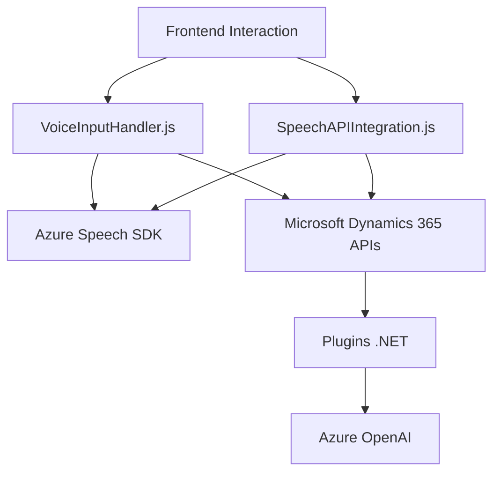

# Análisis y Resumen Técnico

Este repositorio es una solución que integra funcionalidades de frontend y backend para interactuar con formularios de Microsoft Dynamics 365, Azure Speech SDK y Azure OpenAI. Su enfoque principal es mejorar la interacción del usuario con formularios mediante reconocimiento de voz, síntesis de texto a audio y transformación de datos con inteligencia artificial.

---

## Descripción de la Arquitectura

### Tipo de Solución
La solución se estructura principalmente como un **integrador entre componentes de frontend y backend**, dirigido a sistemas CRM (Customer Relationship Management). Es una combinación de:
1. **Frontend basado en JavaScript**: Funcionalidades orientadas al reconocimiento de voz y síntesis de texto a audio mediante Azure Speech SDK.
2. **Backend basado en plugins (.NET)**: Interactúa con Microsoft Dynamics CRM para realizar transformaciones de datos utilizando Azure OpenAI.

### Tecnologías Utilizadas
1. **Frontend**:
   - Lenguaje: **JavaScript**.
   - Frameworks o SDKs:
     - *Azure Speech SDK* para reconocimiento de voz y síntesis de texto a audio.
     - APIs de Microsoft Dynamics 365 (`Xrm.WebApi`) para manejo de datos en formularios.
   - Librerías de ayuda: No especificadas, pero se puede inferir uso de técnicas DOM estándar.
2. **Backend**:
   - Lenguaje: **C#**.
   - Frameworks:
     - *Microsoft.Xrm.Sdk* para creación de plugins de Dynamics CRM.
     - *Azure OpenAI*.
     - *System.Net.Http* para realizar solicitudes HTTP al API Azure OpenAI.
     - *Newtonsoft.Json* para manipulación y generación de estructuras JSON.

### Arquitectura
La solución sigue una arquitectura **híbrida basada en capas**, combinando:
1. **Frontend**: Funciones modulares que encapsulan reconocimiento de voz, procesamiento de datos de formularios y síntesis de voz.
2. **Backend**: Plugins que actúan como middleware entre Dynamics CRM y Azure OpenAI.
3. **Servicios externos**: Integración con Azure Speech SDK y Azure OpenAI como componentes remotos en la nube.

#### Patrones de Diseño
- **Encapsulación Modular**: Las operaciones en frontend están separadas en funciones específicas para distintos pasos del flujo de procesamiento.
- **Plugin Pattern**: El componente .NET emplea el clásico plugin para Dynamics CRM.
- **Repository Pattern**: Las operaciones con datos de formularios y entidades del CRM usan métodos específicos para acceder y procesar información.
- **Service-Oriented Integration**: Interactúa con servicios externos como Azure Speech SDK y OpenAI mediante HTTP/REST.

---

## Dependencias o Componentes Externos
1. **Azure Speech SDK**: Imprescindible para el reconocimiento de voz y síntesis de texto a audio. Se configura dinámicamente con claves y regiones de Azure.
2. **Azure OpenAI**: Utilizado para la transformación de texto en un formato estructurado JSON.
3. **Microsoft Dynamics CRM APIs**: Para interactuar con formularios y entidades en el CRM.
4. **Bibliotecas JSON**: Newtonsoft.Json (backend) y System.Text.Json (frontend/backend).

---

## Diagrama **Mermaid** para GitHub

---

## Conclusión Final

La solución presentada combina una integración efectiva de frontend y backend para mejorar la interacción en formularios dentro de un entorno CRM (Microsoft Dynamics 365). Con capacidades como síntesis de voz y reconocimiento de audio, la solución se posiciona como una herramienta útil para automatización y mejora de la experiencia del usuario.

La arquitectura es híbrida, con modularidad en frontend y un sistema plugin en backend que actúa como middleware entre Dynamics CRM y Azure OpenAI. Aunque la solución está bien estructurada, tiene oportunidades de optimización, como refactorizar y organizar mejor los métodos extensos, evaluar potenciales pruebas unitarias y continuar con controles de errors más robustos.