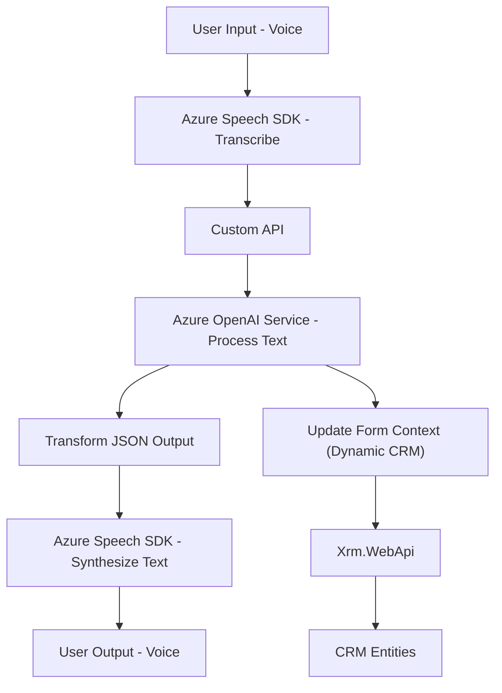

### Breve resumen técnico
Este conjunto de archivos sugiere una solución moderna que integra funcionalidades avanzadas de reconocimiento y síntesis de voz utilizando el **Azure Speech SDK**, además de integración con APIs personalizadas y plugins de Microsoft Dynamics CRM que interactúan con **Azure OpenAI Service**. La solución parece ser diseñada para enriquecer formularios dinámicos en CRM con entrada y salida basada en voz, y procesamiento inteligente con IA.

---

### Descripción de arquitectura
1. **Arquitectura predominante:**
   - **N-Capas (Multi-layered architecture):** La solución tiene una separación evidente de responsabilidades:
     * **Frontend:** Manejo de entrada y salida de voz. Procesa la interacción con el SDK de Azure Speech y mapea datos al formulario.  
     * **Backend:** Plugins para Dynamics CRM dan soporte a transformaciones avanzadas con Azure OpenAI Service y gestionan la comunicación con entidades CRM.
   - Los módulos siguen una **estructura modular**, lo que facilita su mantenimiento y pruebas.

2. **Aspectos señalados:**
   - **Integración de SDK:** Se utiliza el SDK de reconocimiento de voz y síntesis de texto (Azure Speech).
   - **Dependencia con APIs externas:** Integración con Azure OpenAI para transformar texto y generar JSON estructurado.
   - **Integración intrínseca con Dynamics CRM:** Los plugins extienden funciones del CRM mediante su API estándar (Xrm SDK).

---

### Tecnologías y frameworks usados
1. **Frontend (JavaScript):**
   - **Azure Speech SDK:** Procesamiento de datos de voz y síntesis de texto a voz.
   - **MVC Pattern:** Procesamiento, mapeo entre modelos y actualización de interfaz (formularios CRM).
   - **Promesas y asincronía:** Para manejar carga dinámica del SDK y comunicación con APIs.

2. **Backend (C#):**
   - **Microsoft Dynamics SDK:** Extensión de funcionalidades del CRM mediante plugins (herramienta: `Microsoft.Xrm.Sdk`).
   - **Azure OpenAI Service:** Uso de modelos GPT para transformar texto en formatos estructurados.
   - **Newtonsoft.Json y System.Text.Json:** Manejo de datos en formato JSON.
   - **HttpClient:** Comunicación segura con Azure OpenAI mediante APIs HTTP.

3. **Patrones identificados:**
   - **Delegate Callback Pattern:** Carga dinámica del SDK de Azure Speech y ejecución posterior de funciones.
   - **Adapter Pattern:** Abstrae diferencias entre APIs externas y el proceso interno de la aplicación.
   - **Plugin Pattern:** Sistema extensible de Microsoft Dynamics CRM, en el que los plugins transforman y manipulan datos.

---

### Dependencias o componentes externos
- **Azure Speech SDK**
- **Azure OpenAI Service**
- **Dynamics CRM SDK (`Xrm.WebApi`)**
- **APIs personalizadas:** Para procesamiento adicional de datos.
- **Libraries:** Newtonsoft.Json (C#), System.Text.Json (C#).

---

### Diagrama Mermaid
El siguiente diagrama captura la relación entre componentes y flujos de datos:

**Leyenda:**
- **A-B:** El usuario proporciona entrada por voz, procesada por el **Azure Speech SDK**.
- **B-C:** El texto transcrito es enviado a una **API personalizada** para procesamiento posterior.
- **C-D:** La API invoca **Azure OpenAI Service** para extracción y transformación de información inteligente a formato JSON estructurado.
- **D-F:** El JSON transformado actualiza un formulario dinámico en **CRM**.
- **F-G-H:** Los datos son almacenados/recuperados en las entidades CRM mediante APIs estándar (Xrm.WebApi).
- **E-I-J:** El texto generado por AI puede ser sintetizado por el SDK y reproducido como voz para el usuario.

---

### Conclusión final
Este repositorio tiene como objetivo proporcionar una solución completa de interacción con formularios dinámicos en Microsoft Dynamics CRM mediante entrada y salida basadas en voz, enriquecida por inteligencia artificial. Su diseño mezcla una **arquitectura N-capas** con patrones de integración como delegado y adaptadores para procesar datos desde APIs externas.

El sistema está bien estructurado, con claras separaciones entre lógica del frontend y funcionalidad del backend. Es altamente dependiente de servicios externos de Microsoft Azure, lo que lo hace ideal para empresas que ya están dentro del ecosistema de Microsoft y desean mejorar la automatización y experiencial UX.