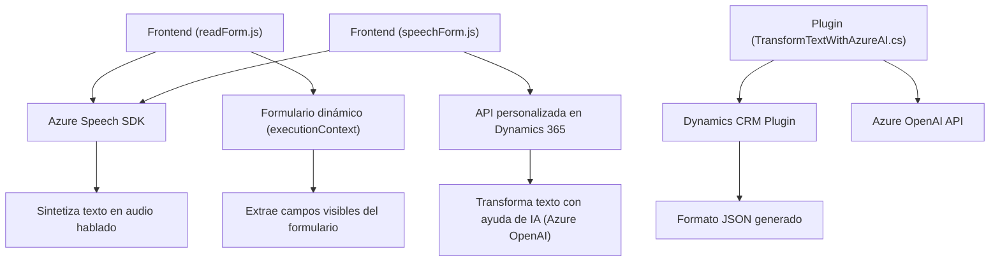

### Breve resumen técnico

El repositorio combina varios componentes para integrar tecnologías de reconocimiento y síntesis de voz (Azure Speech SDK) con formularios dinámicos en aplicaciones web y con APIs y plugins en Dynamics CRM. Cada archivo implementa funcionalidades específicas descritas en el análisis detallado.

---

### Descripción de arquitectura

**Tipo de solución:**  
Principalmente un sistema híbrido enfocado en la integración del frontend (mediante JavaScript y Azure Speech SDK), APIs RESTful (para consumir servicios de OpenAI), y plugins (.NET) en Dynamics CRM. Se trata de una arquitectura de **n capas** con una clara separación entre componentes:  
1. **Frontend (readForm.js y speechForm.js)**: Genera interacción con los usuarios y sirve como puente entre los datos del formulario y el reconocimiento/síntesis de voz.
2. **API externa integrada (.cs)**: Conecta Dynamics 365 con Azure OpenAI para externalizar el procesamiento avanzado de texto.  

**Patrones empleados:**  
- **Event-driven Architecture**: Uso de eventos para iniciar procesos como reconocimiento/síntesis de voz mediante SDKs o transcripción interactiva.
- **Integración basada en APIs**: Usa la arquitectura cliente-servidor para interactuar con Azure Speech API y OpenAI API.
- **Single Responsibility Principle (SRP):** Cada archivo o clase maneja tareas específicas y desacopladas.

---

### Tecnologías usadas

1. **Frontend (readForm.js y speechForm.js)**:
   - **Lenguaje**: JavaScript (ES6+).
   - **Frameworks/librerías externas**: Azure Speech SDK.
   - **Tecnologías adicionales**: Dynamics 365 Web API.

2. **Backend plugin (TransformTextWithAzureAI.cs)**:
   - **Lenguaje**: C# (.NET Framework).
   - **Frameworks/librerías externas**:
     - Microsoft Dynamics SDK (CRM).
     - Azure OpenAI API.
     - System.Text.Json (serialización/deserialización).
     - System.Net.Http (manejo de solicitudes HTTP).

**Servicios externos usados**:
- **Azure Speech SDK**: Implementa reconocimiento de voz y síntesis.
- **Azure OpenAI API**: Transformación de texto en formato JSON mediante IA.
- **Dynamics 365 Web API**: CRUD dinámico basado en el contexto de un formulario.

---

### Diagrama Mermaid válido para GitHub

---

### Conclusión final

El repositorio implementa una solución extensible y modular orientada a la integración de tecnología de voz y procesamiento avanzado de texto mediante inteligencia artificial. La arquitectura es híbrida, basada en **n capas** y diseñada para escalar mediante APIs externas (Azure Speech SDK, Dynamics CRM Web API, y Azure OpenAI). Destaca por su clara separación de responsabilidades y una combinación eficiente entre frontend, backend, y servicios externos, permitiendo que cada componente se pueda mantener y actualizar de manera independiente.