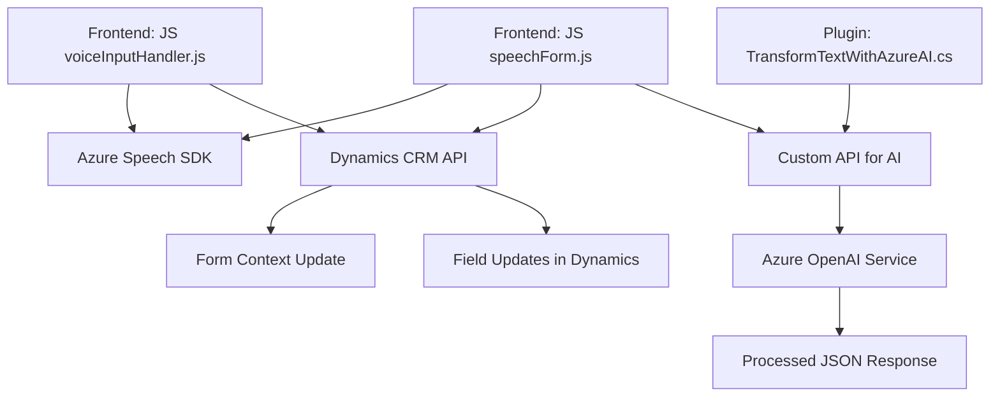

### Breve resumen técnico

El repositorio parece centrarse en una solución compleja que integra varias piezas tecnológicas relacionadas con **Microsoft Dynamics CRM**, **Microsoft Azure Speech SDK** y **Azure OpenAI Service**. Incluye componentes para formularios, plugins, y manejo de voz y transcripciones, lo que indica un software orientado a enriquecer los procesos interactivos de un sistema CRM mediante IA y servicios en la nube.

---

### Descripción de arquitectura

1. **Tipo de solución**: Software que combina funcionalidades de frontend, plugins backend y APIs para una interacción enriquecida con formularios. Es probable que sea parte de una infraestructura basada en CRM como **Dynamics**, donde los plugins y scripts ofrecen una interfaz expandida y funcionalidades IA.

2. **Arquitectura**: Está compuesto por una arquitectura de **n-capas**:
   - **Capa de presentación**: Scripts frontend para interacción (Azure Speech SDK y lógica para datos de formularios).
   - **Capa de negocio** (backend): Plugins desarrollados en C# (.NET Core), que realizan tareas pesadas como ejecución de lógica de IA y transformación de texto mediante OpenAI.
   - **Capa de datos**: Consumo de servicios propios del contexto CRM y las APIs externas (Azure).

3. **Patrones involucrados**:
   - **Lazy Loading**: Para la carga dinámica del Azure Speech SDK desde el frontend.
   - **Facade Pattern**: Simplificación inicial del manejo de flujo procedimental en la capa frontend.
   - **Plugin Design Pattern**: Extensión de Dynamics CRM mediante el diseño de plugins que encapsulan lógica específica.
   - **Modularización funcional y arquitectónica**: Scripts claramente organizados por tareas específicas (voz-interacción, transcripción y procesamiento avanzado con IA).
   - **Integración API-First**: Uso intensivo de SDK externos y APIs como entrada principal al sistema.

---

### Tecnologías usadas

1. **Frontend**:
   - **JavaScript**: Lenguaje principal para scripts enriquecidos en formularios.
   - **Azure Speech SDK**: Manejo de síntesis y reconocimiento de voz.
   - **Dynamic 365 API**: Para integraciones y actualización de formularios.

2. **Backend**:
   - **C# (.NET Framework)**: Desarrollo de plugins bajo el SDK de Dynamics CRM.
   - **Azure OpenAI Service**: Procesamiento textual avanzando con modelos como GPT.

3. **Dependencias externas**:
   - **Azure Speech SDK**: Configuración para interacción por voz desde la interfaz.
   - **Azure OpenAI**: Para la AI en la transformación de texto.
   - **Newtonsoft.Json** y **System.Net.Http**: Manejo avanzado de JSON y comunicación HTTP desde los plugins.

---

### Diagrama **Mermaid**

---

### Conclusión final

El repositorio implementa una solución de **n-capas** con integración entre **frontend, backend y servicios en la nube**. Su enfoque está diseñado para ampliar la funcionalidad de **Microsoft Dynamics CRM**, proporcionando experiencias enriquecidas basadas en IA y voz mediante servicios de Azure Speech SDK y OpenAI. Tiene patrones bien identificados, como la modularización funcional, diseño de plugins y uso de APIs. Aunque funcional, podría beneficiarse de refactorización hacia una arquitectura más escalable como **hexagonal** para desacoplar diferentes dependencias.