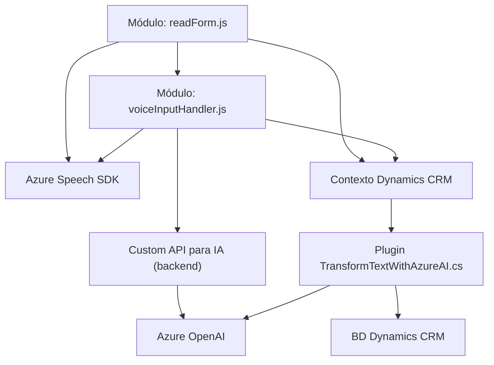

### Análisis Técnico Detallado

#### Breve Resumen Técnico
El repositorio describe una solución enfocada en la interacción entre Dynamics CRM y tecnologías de Azure (Speech SDK y OpenAI). Se implementa un sistema que integra entrada de voz, síntesis de voz, y procesamiento avanzado de texto mediante inteligencia artificial. Consta de módulos frontend que interactúan con los formularios CRM, complementados por un plugin backend en C# que realiza transformaciones basadas en Azure AI.

---

#### Descripción de Arquitectura
La arquitectura de la solución es híbrida, con componentes distribuidos que incluyen:
1. **Frontend**:
   - Módulos JavaScript basados en eventos que interactúan con los formularios en Dynamics CRM.
   - Integración dinámica del Azure Speech SDK para funciones como entrada y síntesis de voz.
   - Procesamiento local y comunicación con APIs de Azure.
   
2. **Backend**:
   - Un plugin instalado en el CRM que implementa lógica específica utilizando el framework estándar de Dynamics CRM.
   - La arquitectura del backend puede considerarse **orientada a servicios** (SOA) dado su dependencia del servicio Azure OpenAI.
   
**Conclusión:** Podría clasificarse como una arquitectura **modular de capas híbridas**, dado que se segmenta en frontend y backend, cada uno cumpliendo su propósito específico mientras interactúa con servicios externos.

---

#### Tecnologías Usadas
1. **Frontend**:
   - **JavaScript**: Lenguaje base de los módulos FRONTEND.
   - **Azure Speech SDK**: Para reconocimiento y síntesis de voz.
   - **Contexto Dynamics CRM** (Xrm.WebApi): API integrada para manipulación de datos del CRM.
   
2. **Backend/Plugin**:
   - **C# (.NET Framework)**: Lenguaje base del plugin.
   - **Microsoft Dynamics SDK**: Framework para desarrollar extensiones de Dynamics CRM.
   - **Azure OpenAI (ChatGPT con reglas personalizadas)**: Servicio de transformación de texto.
   - **Newtonsoft.Json**: Manipulación de JSON en el plugin.

---

#### Dependencias y Componentes Externos
1. **Servicios Externos**:
   - Azure Speech SDK (para voz) y Azure OpenAI (procesamiento avanzado de texto).
   - Dynamics CRM API (`Xrm.WebApi`) como punto de interacción con datos del CRM.

2. **Librerías en el Plugin**:
   - Newtonsoft.Json, System.Net.Http y otras nativas de .NET para consumos REST y manipulación de JSON.
   - Dependencias estándar de Dynamics SDK.

3. **Integraciones**:
   - Las dependencias externas se integran tanto en los módulos frontend (carga dinámica del Speech SDK) como en el plugin backend con llamadas REST hacia servicios de Azure.

---

#### Diagrama Mermaid (100 % Compatible con GitHub Markdown)

---

### Conclusión Final
La solución descrita es un sistema modular y distribuido que integra interacción dinámica con Dynamics CRM y servicios externos avanzados (Azure Speech SDK y OpenAI). Cada componente está diseñado para cumplir una función específica, como entrada de voz, síntesis de texto y procesamiento con IA, lo que habilita funcionalidades inteligentes y personalizables. Su arquitectura híbrida permite flexibilidad y escalabilidad, pero podría beneficiarse de una mayor estandarización en el flujo entre frontend y backend.