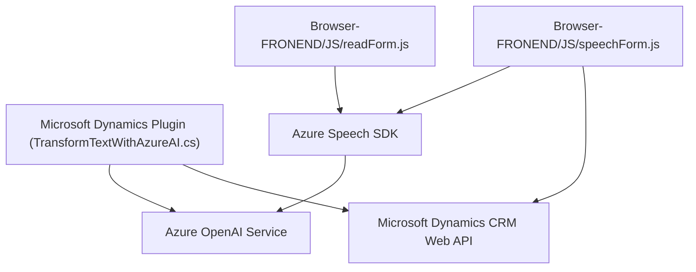

### Breve Resumen Técnico
Este repositorio es una solución orientada al uso de **Azure Speech SDK** y una integración personalizada con **Microsoft Dynamics 365 CRM**. La funcionalidad principal radica en procesar datos de entradas y salidas del formulario mediante voz e inteligencia artificial; la solución también abarca el uso de un plugin que extiende el CRM con capacidades de procesamiento en Azure OpenAI.

---

### Descripción de la Arquitectura
La arquitectura se divide en:
1. **Frontend**: Implementado como una aplicación modular que utiliza **Azure Speech SDK** para la síntesis y el reconocimiento de voz, interactuando con formularios de Dynamics 365.
2. **Backend**: Consta de un plugin para Dynamics CRM configurado bajo el **Plugin Pattern**, que consume la API de Azure OpenAI para transformar texto en estructuras JSON según normas definidas.

La solución aplica un diseño de **n capas**, donde:
- La primera capa se encuentra en el frontend (procesamiento local en el navegador).
- La segunda capa está en el backend (Microsoft Dynamics 365 CRM API y plugin).
- La tercera capa está integrada con servicios en la nube de Azure, como Speech SDK y OpenAI.

---

### Tecnologías Usadas
1. **Frontend**:
   - **JavaScript** (sintaxis moderna ES6+).
   - **Azure Speech SDK**.
   - Manejo asincrónico (`async/await`) para procesamiento de eventos dinámicos.
   - Integración directa con formularios de Dynamics 365 (objetos `executionContext`, `formContext`).
   
2. **Backend**:
   - **C#** (NET Framework para plugins de Dynamics CRM).
   - **Microsoft Dynamics SDK**.
   - **Azure OpenAI Service** (mediante llamadas HTTP a GPT-4).

3. **Patrones**:
   - Modularización, delegación y asincronía en frontend.
   - Plugin Pattern y External API Integration en backend.

---

### Dependencias o Componentes Externos
1. **Azure Speech SDK**
   - Para síntesis de texto a voz y reconocimiento en frontend.

2. **Azure OpenAI API**
   - Para procesamiento avanzado de texto en el plugin backend.

3. **Microsoft Dynamics 365 APIs**
   - Funcionalidad interna del CRM para manejar formularios y registros.

4. **Librerías adicionales del plugin**:
   - `System.Net.Http`: Para llamadas HTTP al servicio OpenAI.
   - `Newtonsoft.Json`: Para manipulación de estructuras JSON.

---

### Diagrama Mermaid

---

### Conclusión Final
Este repositorio aborda la integración de inteligencia artificial en el contexto de Microsoft Dynamics 365 mediante tecnologías de Azure. La solución usa diseño modular para el frontend y gestión de plugins en el backend. Gracias a la comunicación entre el Speech SDK, Dynamics 365 API y el Azure OpenAI Service, esta arquitectura ofrece un flujo fluido y escalable para optimizar la interacción con formularios mediante comandos de voz.

Recomendación: Se podría evaluar un enfoque hexagonal para mejorar la separación de responsabilidades y habilitar mayor facilidad de pruebas, además de reforzar la configuración dinámica de dependencias en el plugin para facilitar despliegues en múltiples entornos.