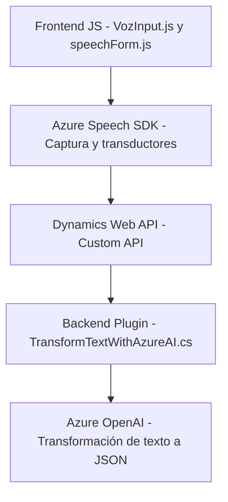

### Breve Resumen Técnico:
Este repositorio contiene componentes enfocados en integrar funcionalidades de voz, reconocimiento y transformación avanzada de texto dentro del ecosistema de **Dynamics 365 CRM**. Las tecnologías principales incluyen **Azure Speech SDK** para síntesis y reconocimiento de voz, junto con un **plugin CRM** que se conecta a **Azure OpenAI** para transformar texto en JSON estructurado.

---

### Descripción de Arquitectura:
La solución adopta una arquitectura de **integración modular** que combina un **frontend** en JavaScript para capturar y procesar comandos de voz, una fase intermedia que utiliza **Dynamics Web API** y un **plugin backend** conectado al servicio **Azure OpenAI**. El modelo sigue principios de diseño desacoplado, permitiendo la flexibilidad al integrar componentes externos como SDKs y APIs. Se utilizan patrones como **Data Mapper** y **Plugin Design Pattern** para gestionar datos y extender el comportamiento del CRM.

---

### Tecnologías Usadas:
- **Azure Speech SDK**: Para síntesis y reconocimiento de voz (frontend), cargado dinámicamente desde un CDN.
- **Dynamics Web API**: Comunicación con la **Custom API** y entidades del CRM.
- **Azure OpenAI Service**: Para procesamiento e interpretación avanzada de texto, retornando datos en formato JSON estructurado.
- **JavaScript (Frontend)**: Implementación de la lógica del cliente que captura datos formulados y realiza llamadas a APIs externas.
- **C# (Backend Plugin)**: Transformación de texto y lógica extendida implementada para Dynamics CRM con el SDK oficial.
- **JSON/REST**: Comunicación entre sistemas internos y externos mediante un diseño basado en HTTP.

---

### Diagrama Mermaid Válido para GitHub:

---

### Conclusión Final:
La solución presentada en este repositorio está diseñada para integrar una experiencia **interactiva y avanzada de voz** en el entorno de **Dynamics 365 CRM**, aprovechando servicios como **Azure Speech SDK** y **Azure OpenAI**. Siguiendo una arquitectura modular, facilita la adaptabilidad y escala frente a nuevas demandas de funcionalidad. Adicionalmente, el uso de **Custom APIs** y patrones como **Plugin Design** asegura una extensibilidad eficiente y desacoplamiento del backend respecto al CRM.