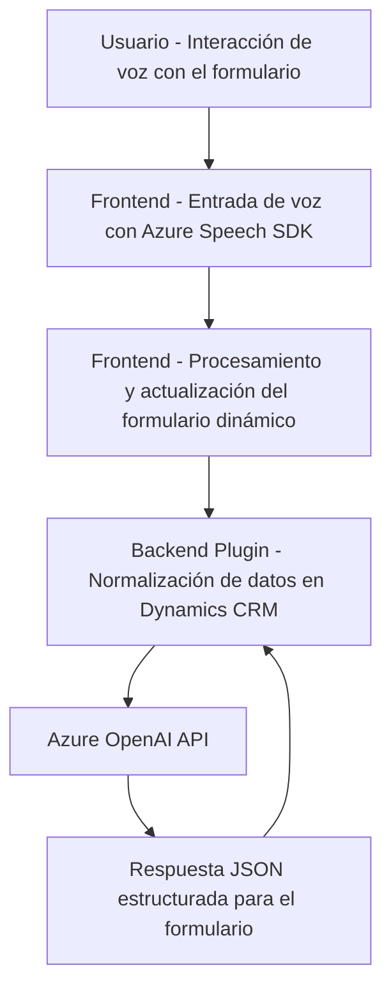

### Breve resumen técnico
Los archivos proporcionados implementan una solución basada en interacción de voz y procesamiento de formularios utilizando Microsoft Azure Speech SDK y OpenAI API. La arquitectura combina procesamiento en frontend (JavaScript) y backend (Plugin en C#) para integrar tecnologías avanzadas de reconocimiento de voz, síntesis de texto y análisis semántico con la plataforma Dynamics CRM.

---

### Descripción de arquitectura
La solución tiene una arquitectura **multi-capa híbrida**:
- **Frontend:** Scripts JavaScript que interactúan directamente con formularios en el navegador. Utilizan SDK para funciones como entrada de voz y síntesis de texto vocal.
- **Backend:** Un plugin en Dynamics CRM basado en Azure OpenAI que se encarga de transformar texto en JSON estructurado según reglas específicas.
- El paradigma aplicado responde a una **arquitectura modular**, donde cada componente tiene responsabilidades bien definidas. Internamente, los scripts usan patrones como **Adapter** y **Orquestación** para el manejo de formularios, mientras el plugin aplica **Integración basada en SDK** y consumo de una API externa para transformación avanzada.

---

### Tecnologías usadas
1. **Frontend:**
   - Lenguaje: JavaScript.
   - SDK: Azure Speech SDK para reconocimiento y síntesis de voz.
   - Plataforma: Formularios dinámicos en Dynamics CRM.

2. **Backend:**
   - Lenguaje: C#.
   - Framework: Dynamics CRM SDK (`IPlugin`).
   - Comunicación: REST API (Azure OpenAI), uso de `System.Net.Http`.
   - Librerías JSON: `Newtonsoft.Json`, `System.Text.Json`.

3. **Servicios externos:**
   - **Azure Speech SDK:** Procesamiento avanzado de voz en tiempo real.
   - **Azure OpenAI:** Uso de modelos GPT para análisis y transformación de texto.
   - **Dynamics CRM:** Contexto y extensión en el nivel plugin.

---

### Diagrama **Mermaid** válido para GitHub Markdown

---

### Conclusión final
La solución presentada exhibe un diseño modular y extensible que integra tecnologías avanzadas como reconocimiento de voz y análisis semántico inteligente. Su arquitectura combina procesamiento en frontend y backend, con una fuerte dependencia de servicios de Azure (Speech SDK y OpenAI). La forma en que se organizan los componentes proporciona una experiencia fluida para el usuario que interactúa mediante voz, los datos procesados por el sistema son transformados y actualizados dinámicamente en formularios CRM.