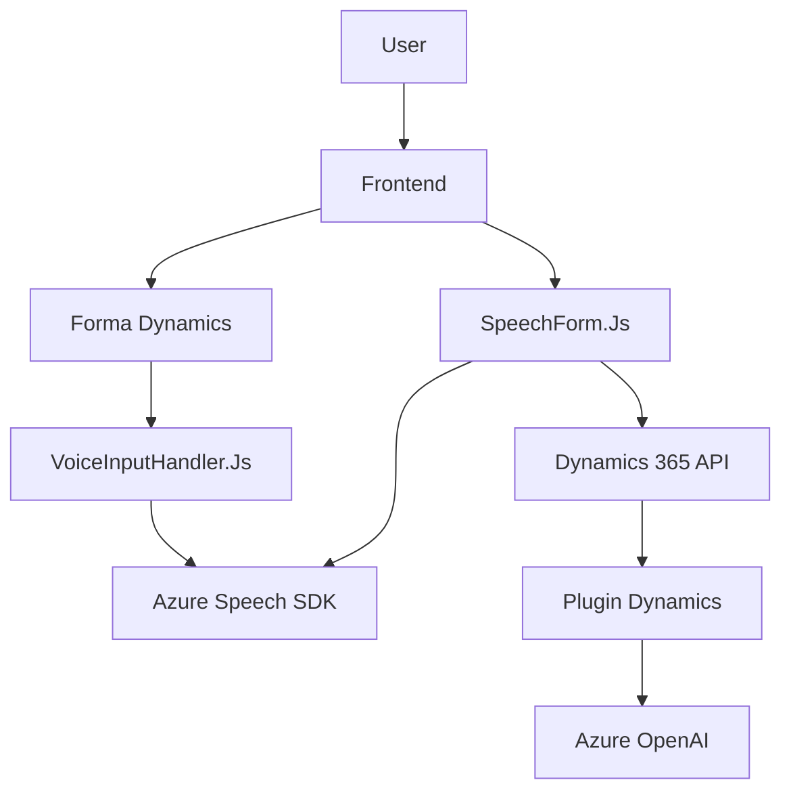

### Breve Resumen Técnico
El repositorio define una solución integrada que utiliza entrada y salida de voz, formularios dinámicos de **Dynamics 365**, y servicios de **Azure** (Speech y OpenAI). Está centrada en enriquecer la experiencia del usuario mediante el uso de tecnologías modernas de inteligencia artificial y procesamiento de voz, complementando funcionalidades con plugins personales para la plataforma Dynamics CRM.

---

### Descripción de Arquitectura
La solución presenta las siguientes características arquitectónicas:
1. **Capa de Presentación:** Se implementa mediante scripts en JavaScript que interactúan con la interfaz de usuario de Dynamics 365, permitiendo capturar datos y reproducir texto mediante síntesis.
2. **Logica de Negocio:** Reside parcialmente en los scripts de frontend y se refuerza con los servicios del plugin `TransformTextWithAzureAI.cs`, que ejecuta lógica basada en reglas específicas utilizando el servicio **Azure OpenAI**.
3. **Capa de Integración:** A través del patrón de integración con servicios externos, se usan tanto el SDK de Azure Speech como APIs de Dynamics y Azure OpenAI para el procesamiento avanzado.

La arquitectura es una combinación de **n-capas** (para la lógica interna del sistema) y **orientación a eventos** (los scripts actúan en respuesta a situaciones específicas en los formularios). Asimismo, hay evidencias de prácticas para desacoplar componentes y facilitar la integración con servicios externos, aunque algunos aspectos están acoplados directamente, como las credenciales de Azure manejadas en el código fuente del plugin.

---

### Tecnologías Usadas
1. **Frontend (JavaScript):**
   - Azure Speech SDK: Procesamiento de voz (reconocimiento y síntesis).
   - Dynamics 365 Form API: Manipulación de formularios interactivos.
   - XRM WebApi: Acceso a entidades y datos de Dynamics 365.

2. **Backend (.NET Framework):**
   - Dynamics CRM SDK (`IPlugin` interface): Desarrollo de plugins para extensiones personalizadas.
   - Azure OpenAI API: Integración con modelos de IA avanzados para transformar texto.
   - Newtonsoft.Json: Manejo de datos JSON.

3. **Servicios Externos:**
   - **Microsoft Azure Speech Services:** Reconocimiento y síntesis de voz.
   - **Microsoft Azure OpenAI:** Texto avanzado e inteligencia artificial para generación de respuestas.

---

### Diagrama **Mermaid** válido para GitHub

---

### Conclusión Final
La solución tiene como objetivo fomentar la interacción con formularios dinámicos de **Dynamics 365**, aumentando la accesibilidad mediante el aprovechamiento de las capacidades de síntesis y reconocimiento de voz de **Azure Speech SDK**. La integración con **Azure OpenAI** permite ampliar la funcionalidad de la lógica de negocio, procesando y transformando texto según reglas predefinidas.

Esta solución **prioriza la modularidad** y la interacción con servicios externos, aunque su diseño tiene puntos de mejora como:
- Externalizar configuraciones sensibles (API keys, endpoints) para mejorar seguridad y portabilidad.
- Estandarizar la gestión de dependencias para evitar acoplamiento rígido con plataformas específicas.

La arquitectura está dividida efectivamente en capas y aprovecha los patrones de integración y extensibilidad, lo cual lo hace óptimo para su propósito dentro de la plataforma Dynamics.