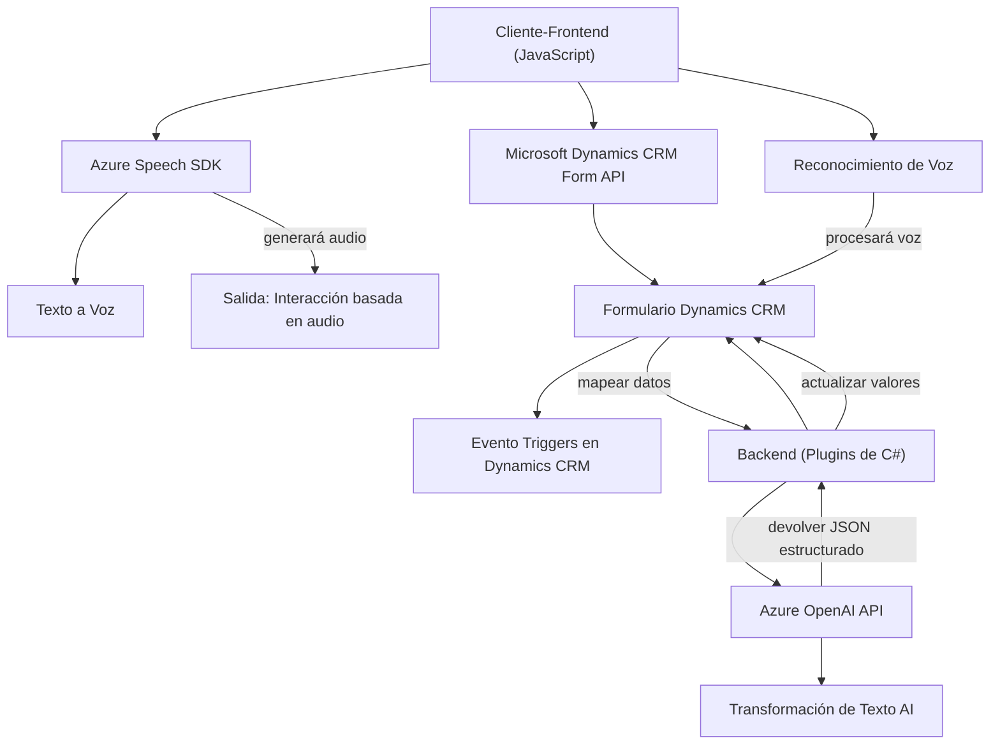

### Breve Resumen Técnico:

El repositorio parece estar enfocado en proporcionar funcionalidad avanzada de accesibilidad y procesamiento de formularios para aplicaciones basadas en Microsoft Dynamics CRM. Integra síntesis de voz, reconocimiento de voz y transformación de texto mediante tecnologías de Azure, como Azure Speech SDK y Azure OpenAI. Este enfoque apunta a mejorar la interacción humano-computadora mediante accesibilidad y automatización.

---

### Descripción de Arquitectura:

La arquitectura observada combina distintos patrones para lograr modularidad y reutilización:

1. **Frontend**:
   - El lado cliente implementa módulos en JavaScript para interactuar con formularios en Dynamics CRM, ofreciendo funcionalidades como síntesis de texto a voz y reconocimiento de voz.
   - **Patrón Modular**: El código está dividido en funciones reutilizables que se organizan por funcionalidad.
   - **Patrón Cliente-Servidor**: El navegador actúa como cliente que consume servicios externos como Azure Speech SDK y APIs CRM.

2. **Backend (Plugins)**:
   - Los plugins en C# actúan como extensiones de Dynamics CRM y se ejecutan en eventos definidos, transformando texto mediante Azure OpenAI.
   - **Arquitectura basada en eventos**: Los plugins responden automáticamente a eventos del sistema CRM para realizar procesamiento asincrónico.
   - **Patrón Microservicio Externo**: Gran parte de la lógica (transformación de texto) se delega al servicio Azure OpenAI.

3. **Integración**:
   - **APIs RESTful**: Tanto los módulos de JavaScript como los plugins usan APIs externas para interactuar con Azure y Dynamics CRM, promoviendo desacoplamiento.
   - **Carga de SDKs dinámicos**: La carga del Azure Speech SDK en el cliente es asincrónica y dinámica, lo cual mejora el rendimiento.

En conjunto, la solución tiene una arquitectura **multicapas desacoplada**, donde cada parte se encarga de funcionalidades específicas:
- Cliente (JavaScript): Provee interacción directa con el usuario.
- Servidor (Plugins): Ejecuta lógica avanzada y delega trabajo a microservicios externos.

---

### Tecnologías Usadas:

1. **Frontend**:
   - **Azure Speech SDK**: Para síntesis y reconocimiento de voz.
   - **JavaScript**: Implementa funcionalidad interactiva en el navegador.
   - **Dynamics CRM Client API** (`executionContext`): Acceso y manipulación de formularios.

2. **Backend**:
   - **Azure OpenAI**: Transformación avanzada de texto mediante IA.
   - **Microsoft Dynamics CRM SDK**: Interacción directa con datos y eventos del sistema CRM.
   - **C# y .NET**: Desarrollo de plugins siguiendo el patrón de extensibilidad de Dynamics CRM.
   - **HTTP Client**: Comunicación con servicios externos (Azure).

3. **Dependencias adicionales**:
   - **Newtonsoft.Json**: Manipulación avanzada de JSON en los plugins.
   - **System.Text.Json**: Manejo de JSON estándar.

---

### Diagrama Mermaid:

---

### Conclusión Final:

Este repositorio forma parte de una solución moderna basada en tecnologías de Azure y Dynamics CRM, con un enfoque en accesibilidad y automatización. La arquitectura es claramente modular y se basa en patrones como desacoplamiento entre cliente y servidor, integración de APIs REST, y separación de responsabilidades.

**Características destacadas:**
- Uso de servicios avanzados de Azure (Speech SDK y OpenAI) para enriquecimiento funcional.
- Modularidad y reusabilidad en la implementación tanto del cliente como del servidor.
- Extensibilidad mediante plugins de Dynamics CRM y API personalizadas.

Esta solución sería ideal para aplicaciones empresariales que necesiten interacción más accesible y enriquecida mediante tecnologías de voz e inteligencia artificial.